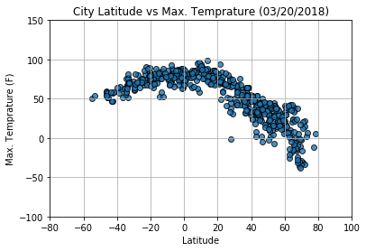
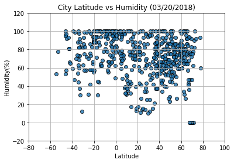
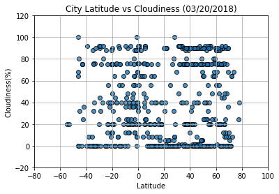
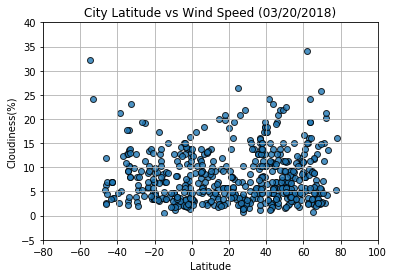

```python
#import libraries

import requests
import json
from citipy import citipy
import random
import pandas as pd
from config import api_key
import time
import matplotlib.pyplot as plt
```


```python
#create a list for cities, country, latitude and longitude to hold the values from citypy

city_list = []
country_list = []
latitude = []
longitude = [] 
count = 0

#Randomly generate the lalitude and longitudes to obtain 600 cities

while count <= 600:
    
    lat, long = uniform(-90,90), uniform(-180, 180)
    
    city = citipy.nearest_city(lat, long)
    country = city.country_code
    city = city.city_name
    
#If the city already exists in the list skip it and move to the next row

    if  (city in city_list and country in country_list):
        lat, long = 0, 0
    else:
        city_list.append(city)
        country_list.append(country)
        latitude.append(lat)
        longitude.append(long)
        count = count + 1

city_df = pd.DataFrame({"city":city_list,"country":country_list,"latitude":latitude,"longitude":longitude})

print("Nbr of Cities " + str(city_df["city"].count()))

Ccity_df.head()
```

    Nbr of Cities 601
    


<div>
<style>
    .dataframe thead tr:only-child th {
        text-align: right;
    }

    .dataframe thead th {
        text-align: left;
    }

    .dataframe tbody tr th {
        vertical-align: top;
    }
</style>
<table border="1" class="dataframe">
  <thead>
    <tr style="text-align: right;">
      <th></th>
      <th>city</th>
      <th>country</th>
      <th>latitude</th>
      <th>longitude</th>
    </tr>
  </thead>
  <tbody>
    <tr>
      <th>0</th>
      <td>longyearbyen</td>
      <td>sj</td>
      <td>78.774600</td>
      <td>16.643534</td>
    </tr>
    <tr>
      <th>1</th>
      <td>naze</td>
      <td>jp</td>
      <td>27.221331</td>
      <td>132.764412</td>
    </tr>
    <tr>
      <th>2</th>
      <td>shache</td>
      <td>cn</td>
      <td>38.788065</td>
      <td>78.376550</td>
    </tr>
    <tr>
      <th>3</th>
      <td>atuona</td>
      <td>pf</td>
      <td>-4.690829</td>
      <td>-135.968921</td>
    </tr>
    <tr>
      <th>4</th>
      <td>upernavik</td>
      <td>gl</td>
      <td>74.764817</td>
      <td>-60.487663</td>
    </tr>
  </tbody>
</table>
</div>


```python
#Call the API and retreive the city weather. When calling the API add a delay of 1 second 

base = "http://api.openweathermap.org/data/2.5/weather"
count = 0
weather_data = pd.DataFrame(columns=['City','Country','Latitude','Longitude','Max Temp','Cloudiness',
                                     'Humidity','Date','Wind Speed'])


for city in city_df["city"]:
    
    count = count + 1
    
    if count % 20 == 0:
        print(f"{count} nbr of records processed")
    
    params ={"appid":api_key, "q":city, "units":"imperial"}
    
    time.sleep(1)
    response=requests.get(base,params=params)
    print(f"{city}: {response.url}")
    response=response.json()    
    
    try:
        city_name = response["name"]
        clouds = response["clouds"]["all"]
        humidity= response["main"]['humidity']
        dt = response["dt"]
        latitude = response["coord"]['lat']
        longitude = response["coord"]['lon']
        temp = response["main"]['temp_max']
        speed= response["wind"]['speed']
        country = response["sys"]["country"]
        
        weather_data = weather_data.append({'City':city_name,'Cloudiness': clouds, 'Humidity': humidity, 'Date': dt,
                                            'Latitude':latitude,'Longitude':longitude,
                                            'Country':country,'Max Temp':temp,'Wind Speed':speed},ignore_index=True)
    except (ConnectionError, TimeoutError, KeyError) as err:
            message = response["message"] 
            print(f"Error Key {err} and Message is: {message} : {city}")
            
weather_data
```

    LONGYEARBYEN: http://api.openweathermap.org/data/2.5/weather?appid=b83314894854b82a8ee7bc76ff0fb21c&q=longyearbyen&units=imperial
    NAZE: http://api.openweathermap.org/data/2.5/weather?appid=b83314894854b82a8ee7bc76ff0fb21c&q=naze&units=imperial
    SHACHE: http://api.openweathermap.org/data/2.5/weather?appid=b83314894854b82a8ee7bc76ff0fb21c&q=shache&units=imperial
    ATUONA: http://api.openweathermap.org/data/2.5/weather?appid=b83314894854b82a8ee7bc76ff0fb21c&q=atuona&units=imperial
    UPERNAVIK: http://api.openweathermap.org/data/2.5/weather?appid=b83314894854b82a8ee7bc76ff0fb21c&q=upernavik&units=imperial
    RIKITEA: http://api.openweathermap.org/data/2.5/weather?appid=b83314894854b82a8ee7bc76ff0fb21c&q=rikitea&units=imperial
    PROVIDENIYA: http://api.openweathermap.org/data/2.5/weather?appid=b83314894854b82a8ee7bc76ff0fb21c&q=provideniya&units=imperial
    SAMPIT: http://api.openweathermap.org/data/2.5/weather?appid=b83314894854b82a8ee7bc76ff0fb21c&q=sampit&units=imperial
    BELAYA GORA: http://api.openweathermap.org/data/2.5/weather?appid=b83314894854b82a8ee7bc76ff0fb21c&q=belaya+gora&units=imperial
    AVARUA: http://api.openweathermap.org/data/2.5/weather?appid=b83314894854b82a8ee7bc76ff0fb21c&q=avarua&units=imperial
    BENGKULU: http://api.openweathermap.org/data/2.5/weather?appid=b83314894854b82a8ee7bc76ff0fb21c&q=bengkulu&units=imperial
    Error Key 'name' and Message is: city not found : bengkulu
    MATAURA: http://api.openweathermap.org/data/2.5/weather?appid=b83314894854b82a8ee7bc76ff0fb21c&q=mataura&units=imperial
    CHOKURDAKH: http://api.openweathermap.org/data/2.5/weather?appid=b83314894854b82a8ee7bc76ff0fb21c&q=chokurdakh&units=imperial
    WAJIR: http://api.openweathermap.org/data/2.5/weather?appid=b83314894854b82a8ee7bc76ff0fb21c&q=wajir&units=imperial
    LASA: http://api.openweathermap.org/data/2.5/weather?appid=b83314894854b82a8ee7bc76ff0fb21c&q=lasa&units=imperial
    IGRIM: http://api.openweathermap.org/data/2.5/weather?appid=b83314894854b82a8ee7bc76ff0fb21c&q=igrim&units=imperial
    HERMANUS: http://api.openweathermap.org/data/2.5/weather?appid=b83314894854b82a8ee7bc76ff0fb21c&q=hermanus&units=imperial
    USHUAIA: http://api.openweathermap.org/data/2.5/weather?appid=b83314894854b82a8ee7bc76ff0fb21c&q=ushuaia&units=imperial
    BREVES: http://api.openweathermap.org/data/2.5/weather?appid=b83314894854b82a8ee7bc76ff0fb21c&q=breves&units=imperial
    20 nbr of records processed
    SAINT-PHILIPPE: http://api.openweathermap.org/data/2.5/weather?appid=b83314894854b82a8ee7bc76ff0fb21c&q=saint-philippe&units=imperial
    ESPERANCE: http://api.openweathermap.org/data/2.5/weather?appid=b83314894854b82a8ee7bc76ff0fb21c&q=esperance&units=imperial
    UCHKENT: http://api.openweathermap.org/data/2.5/weather?appid=b83314894854b82a8ee7bc76ff0fb21c&q=uchkent&units=imperial
    EAST LONDON: http://api.openweathermap.org/data/2.5/weather?appid=b83314894854b82a8ee7bc76ff0fb21c&q=east+london&units=imperial
    SOLOK: http://api.openweathermap.org/data/2.5/weather?appid=b83314894854b82a8ee7bc76ff0fb21c&q=solok&units=imperial
    PUNTA ARENAS: http://api.openweathermap.org/data/2.5/weather?appid=b83314894854b82a8ee7bc76ff0fb21c&q=punta+arenas&units=imperial
    BUTARITARI: http://api.openweathermap.org/data/2.5/weather?appid=b83314894854b82a8ee7bc76ff0fb21c&q=butaritari&units=imperial
    PRAXEDIS GUERRERO: http://api.openweathermap.org/data/2.5/weather?appid=b83314894854b82a8ee7bc76ff0fb21c&q=praxedis+guerrero&units=imperial
    SAO FRANCISCO DE PAULA: http://api.openweathermap.org/data/2.5/weather?appid=b83314894854b82a8ee7bc76ff0fb21c&q=sao+francisco+de+paula&units=imperial
    CONSTITUCION: http://api.openweathermap.org/data/2.5/weather?appid=b83314894854b82a8ee7bc76ff0fb21c&q=constitucion&units=imperial
    BLUFF: http://api.openweathermap.org/data/2.5/weather?appid=b83314894854b82a8ee7bc76ff0fb21c&q=bluff&units=imperial
    KHONUU: http://api.openweathermap.org/data/2.5/weather?appid=b83314894854b82a8ee7bc76ff0fb21c&q=khonuu&units=imperial
    Error Key 'name' and Message is: city not found : khonuu
    HAINES JUNCTION: http://api.openweathermap.org/data/2.5/weather?appid=b83314894854b82a8ee7bc76ff0fb21c&q=haines+junction&units=imperial
    ZONGULDAK: http://api.openweathermap.org/data/2.5/weather?appid=b83314894854b82a8ee7bc76ff0fb21c&q=zonguldak&units=imperial
    SAINT JOSEPH: http://api.openweathermap.org/data/2.5/weather?appid=b83314894854b82a8ee7bc76ff0fb21c&q=saint+joseph&units=imperial
    FAIRBANKS: http://api.openweathermap.org/data/2.5/weather?appid=b83314894854b82a8ee7bc76ff0fb21c&q=fairbanks&units=imperial
    GRAND RIVER SOUTH EAST: http://api.openweathermap.org/data/2.5/weather?appid=b83314894854b82a8ee7bc76ff0fb21c&q=grand+river+south+east&units=imperial
    Error Key 'name' and Message is: city not found : grand river south east
    VAINI: http://api.openweathermap.org/data/2.5/weather?appid=b83314894854b82a8ee7bc76ff0fb21c&q=vaini&units=imperial
    LOMPOC: http://api.openweathermap.org/data/2.5/weather?appid=b83314894854b82a8ee7bc76ff0fb21c&q=lompoc&units=imperial
    PORTLAND: http://api.openweathermap.org/data/2.5/weather?appid=b83314894854b82a8ee7bc76ff0fb21c&q=portland&units=imperial
    40 nbr of records processed
    MOGADISHU: http://api.openweathermap.org/data/2.5/weather?appid=b83314894854b82a8ee7bc76ff0fb21c&q=mogadishu&units=imperial
    KUPANG: http://api.openweathermap.org/data/2.5/weather?appid=b83314894854b82a8ee7bc76ff0fb21c&q=kupang&units=imperial
    PUERTO CABEZAS: http://api.openweathermap.org/data/2.5/weather?appid=b83314894854b82a8ee7bc76ff0fb21c&q=puerto+cabezas&units=imperial
    CASTRO: http://api.openweathermap.org/data/2.5/weather?appid=b83314894854b82a8ee7bc76ff0fb21c&q=castro&units=imperial
    LAI: http://api.openweathermap.org/data/2.5/weather?appid=b83314894854b82a8ee7bc76ff0fb21c&q=lai&units=imperial
    CAPE TOWN: http://api.openweathermap.org/data/2.5/weather?appid=b83314894854b82a8ee7bc76ff0fb21c&q=cape+town&units=imperial
    SAO FILIPE: http://api.openweathermap.org/data/2.5/weather?appid=b83314894854b82a8ee7bc76ff0fb21c&q=sao+filipe&units=imperial
    SOUILLAC: http://api.openweathermap.org/data/2.5/weather?appid=b83314894854b82a8ee7bc76ff0fb21c&q=souillac&units=imperial
    HILO: http://api.openweathermap.org/data/2.5/weather?appid=b83314894854b82a8ee7bc76ff0fb21c&q=hilo&units=imperial
    THOMPSON: http://api.openweathermap.org/data/2.5/weather?appid=b83314894854b82a8ee7bc76ff0fb21c&q=thompson&units=imperial
    QAANAAQ: http://api.openweathermap.org/data/2.5/weather?appid=b83314894854b82a8ee7bc76ff0fb21c&q=qaanaaq&units=imperial
    ACARAU: http://api.openweathermap.org/data/2.5/weather?appid=b83314894854b82a8ee7bc76ff0fb21c&q=acarau&units=imperial
    Error Key 'name' and Message is: city not found : acarau
    YEPPOON: http://api.openweathermap.org/data/2.5/weather?appid=b83314894854b82a8ee7bc76ff0fb21c&q=yeppoon&units=imperial
    TOPPENISH: http://api.openweathermap.org/data/2.5/weather?appid=b83314894854b82a8ee7bc76ff0fb21c&q=toppenish&units=imperial
    RANONG: http://api.openweathermap.org/data/2.5/weather?appid=b83314894854b82a8ee7bc76ff0fb21c&q=ranong&units=imperial
    HOBART: http://api.openweathermap.org/data/2.5/weather?appid=b83314894854b82a8ee7bc76ff0fb21c&q=hobart&units=imperial
    OXFORD: http://api.openweathermap.org/data/2.5/weather?appid=b83314894854b82a8ee7bc76ff0fb21c&q=oxford&units=imperial
    SAINT-FRANCOIS: http://api.openweathermap.org/data/2.5/weather?appid=b83314894854b82a8ee7bc76ff0fb21c&q=saint-francois&units=imperial
    CARNARVON: http://api.openweathermap.org/data/2.5/weather?appid=b83314894854b82a8ee7bc76ff0fb21c&q=carnarvon&units=imperial
    CHUY: http://api.openweathermap.org/data/2.5/weather?appid=b83314894854b82a8ee7bc76ff0fb21c&q=chuy&units=imperial
    60 nbr of records processed
    TABOU: http://api.openweathermap.org/data/2.5/weather?appid=b83314894854b82a8ee7bc76ff0fb21c&q=tabou&units=imperial
    YELLOWKNIFE: http://api.openweathermap.org/data/2.5/weather?appid=b83314894854b82a8ee7bc76ff0fb21c&q=yellowknife&units=imperial
    KATSUURA: http://api.openweathermap.org/data/2.5/weather?appid=b83314894854b82a8ee7bc76ff0fb21c&q=katsuura&units=imperial
    NIKOLSKOYE: http://api.openweathermap.org/data/2.5/weather?appid=b83314894854b82a8ee7bc76ff0fb21c&q=nikolskoye&units=imperial
    FORTUNA: http://api.openweathermap.org/data/2.5/weather?appid=b83314894854b82a8ee7bc76ff0fb21c&q=fortuna&units=imperial
    KILINDONI: http://api.openweathermap.org/data/2.5/weather?appid=b83314894854b82a8ee7bc76ff0fb21c&q=kilindoni&units=imperial
    NOBEOKA: http://api.openweathermap.org/data/2.5/weather?appid=b83314894854b82a8ee7bc76ff0fb21c&q=nobeoka&units=imperial
    GIGMOTO: http://api.openweathermap.org/data/2.5/weather?appid=b83314894854b82a8ee7bc76ff0fb21c&q=gigmoto&units=imperial
    KAA-KHEM: http://api.openweathermap.org/data/2.5/weather?appid=b83314894854b82a8ee7bc76ff0fb21c&q=kaa-khem&units=imperial
    CIDREIRA: http://api.openweathermap.org/data/2.5/weather?appid=b83314894854b82a8ee7bc76ff0fb21c&q=cidreira&units=imperial
    SARANKHOLA: http://api.openweathermap.org/data/2.5/weather?appid=b83314894854b82a8ee7bc76ff0fb21c&q=sarankhola&units=imperial
    YULARA: http://api.openweathermap.org/data/2.5/weather?appid=b83314894854b82a8ee7bc76ff0fb21c&q=yulara&units=imperial
    RAGLAN: http://api.openweathermap.org/data/2.5/weather?appid=b83314894854b82a8ee7bc76ff0fb21c&q=raglan&units=imperial
    FULING: http://api.openweathermap.org/data/2.5/weather?appid=b83314894854b82a8ee7bc76ff0fb21c&q=fuling&units=imperial
    TIGRE: http://api.openweathermap.org/data/2.5/weather?appid=b83314894854b82a8ee7bc76ff0fb21c&q=tigre&units=imperial
    TASIILAQ: http://api.openweathermap.org/data/2.5/weather?appid=b83314894854b82a8ee7bc76ff0fb21c&q=tasiilaq&units=imperial
    PORT ALFRED: http://api.openweathermap.org/data/2.5/weather?appid=b83314894854b82a8ee7bc76ff0fb21c&q=port+alfred&units=imperial
    LERWICK: http://api.openweathermap.org/data/2.5/weather?appid=b83314894854b82a8ee7bc76ff0fb21c&q=lerwick&units=imperial
    MAR DEL PLATA: http://api.openweathermap.org/data/2.5/weather?appid=b83314894854b82a8ee7bc76ff0fb21c&q=mar+del+plata&units=imperial
    ATTAWAPISKAT: http://api.openweathermap.org/data/2.5/weather?appid=b83314894854b82a8ee7bc76ff0fb21c&q=attawapiskat&units=imperial
    Error Key 'name' and Message is: city not found : attawapiskat
    80 nbr of records processed
    WELIGAMA: http://api.openweathermap.org/data/2.5/weather?appid=b83314894854b82a8ee7bc76ff0fb21c&q=weligama&units=imperial
    JAMESTOWN: http://api.openweathermap.org/data/2.5/weather?appid=b83314894854b82a8ee7bc76ff0fb21c&q=jamestown&units=imperial
    BILIBINO: http://api.openweathermap.org/data/2.5/weather?appid=b83314894854b82a8ee7bc76ff0fb21c&q=bilibino&units=imperial
    KRUISFONTEIN: http://api.openweathermap.org/data/2.5/weather?appid=b83314894854b82a8ee7bc76ff0fb21c&q=kruisfontein&units=imperial
    KODIAK: http://api.openweathermap.org/data/2.5/weather?appid=b83314894854b82a8ee7bc76ff0fb21c&q=kodiak&units=imperial
    SENTYABRSKIY: http://api.openweathermap.org/data/2.5/weather?appid=b83314894854b82a8ee7bc76ff0fb21c&q=sentyabrskiy&units=imperial
    Error Key 'name' and Message is: city not found : sentyabrskiy
    KARAUZYAK: http://api.openweathermap.org/data/2.5/weather?appid=b83314894854b82a8ee7bc76ff0fb21c&q=karauzyak&units=imperial
    Error Key 'name' and Message is: city not found : karauzyak
    ALBANY: http://api.openweathermap.org/data/2.5/weather?appid=b83314894854b82a8ee7bc76ff0fb21c&q=albany&units=imperial
    GAZANJYK: http://api.openweathermap.org/data/2.5/weather?appid=b83314894854b82a8ee7bc76ff0fb21c&q=gazanjyk&units=imperial
    KHATANGA: http://api.openweathermap.org/data/2.5/weather?appid=b83314894854b82a8ee7bc76ff0fb21c&q=khatanga&units=imperial
    BUSSELTON: http://api.openweathermap.org/data/2.5/weather?appid=b83314894854b82a8ee7bc76ff0fb21c&q=busselton&units=imperial
    TAOUDENNI: http://api.openweathermap.org/data/2.5/weather?appid=b83314894854b82a8ee7bc76ff0fb21c&q=taoudenni&units=imperial
    SAO JOSE DE PIRANHAS: http://api.openweathermap.org/data/2.5/weather?appid=b83314894854b82a8ee7bc76ff0fb21c&q=sao+jose+de+piranhas&units=imperial
    DIKSON: http://api.openweathermap.org/data/2.5/weather?appid=b83314894854b82a8ee7bc76ff0fb21c&q=dikson&units=imperial
    VANIMO: http://api.openweathermap.org/data/2.5/weather?appid=b83314894854b82a8ee7bc76ff0fb21c&q=vanimo&units=imperial
    LUANGWA: http://api.openweathermap.org/data/2.5/weather?appid=b83314894854b82a8ee7bc76ff0fb21c&q=luangwa&units=imperial
    ILLOQQORTOORMIUT: http://api.openweathermap.org/data/2.5/weather?appid=b83314894854b82a8ee7bc76ff0fb21c&q=illoqqortoormiut&units=imperial
    Error Key 'name' and Message is: city not found : illoqqortoormiut
    SAO FELIX DO XINGU: http://api.openweathermap.org/data/2.5/weather?appid=b83314894854b82a8ee7bc76ff0fb21c&q=sao+felix+do+xingu&units=imperial
    MONROVIA: http://api.openweathermap.org/data/2.5/weather?appid=b83314894854b82a8ee7bc76ff0fb21c&q=monrovia&units=imperial
    PHEK: http://api.openweathermap.org/data/2.5/weather?appid=b83314894854b82a8ee7bc76ff0fb21c&q=phek&units=imperial
    100 nbr of records processed
    BRIGANTINE: http://api.openweathermap.org/data/2.5/weather?appid=b83314894854b82a8ee7bc76ff0fb21c&q=brigantine&units=imperial
    MAHON: http://api.openweathermap.org/data/2.5/weather?appid=b83314894854b82a8ee7bc76ff0fb21c&q=mahon&units=imperial
    SALEAULA: http://api.openweathermap.org/data/2.5/weather?appid=b83314894854b82a8ee7bc76ff0fb21c&q=saleaula&units=imperial
    Error Key 'name' and Message is: city not found : saleaula
    ADANA: http://api.openweathermap.org/data/2.5/weather?appid=b83314894854b82a8ee7bc76ff0fb21c&q=adana&units=imperial
    HITHADHOO: http://api.openweathermap.org/data/2.5/weather?appid=b83314894854b82a8ee7bc76ff0fb21c&q=hithadhoo&units=imperial
    JENNINGS: http://api.openweathermap.org/data/2.5/weather?appid=b83314894854b82a8ee7bc76ff0fb21c&q=jennings&units=imperial
    TAMANDARE: http://api.openweathermap.org/data/2.5/weather?appid=b83314894854b82a8ee7bc76ff0fb21c&q=tamandare&units=imperial
    HAMI: http://api.openweathermap.org/data/2.5/weather?appid=b83314894854b82a8ee7bc76ff0fb21c&q=hami&units=imperial
    BARROW: http://api.openweathermap.org/data/2.5/weather?appid=b83314894854b82a8ee7bc76ff0fb21c&q=barrow&units=imperial
    AMDERMA: http://api.openweathermap.org/data/2.5/weather?appid=b83314894854b82a8ee7bc76ff0fb21c&q=amderma&units=imperial
    Error Key 'name' and Message is: city not found : amderma
    MORRISTOWN: http://api.openweathermap.org/data/2.5/weather?appid=b83314894854b82a8ee7bc76ff0fb21c&q=morristown&units=imperial
    LATA: http://api.openweathermap.org/data/2.5/weather?appid=b83314894854b82a8ee7bc76ff0fb21c&q=lata&units=imperial
    HAMILTON: http://api.openweathermap.org/data/2.5/weather?appid=b83314894854b82a8ee7bc76ff0fb21c&q=hamilton&units=imperial
    MAUN: http://api.openweathermap.org/data/2.5/weather?appid=b83314894854b82a8ee7bc76ff0fb21c&q=maun&units=imperial
    WARQLA: http://api.openweathermap.org/data/2.5/weather?appid=b83314894854b82a8ee7bc76ff0fb21c&q=warqla&units=imperial
    Error Key 'name' and Message is: city not found : warqla
    AUXERRE: http://api.openweathermap.org/data/2.5/weather?appid=b83314894854b82a8ee7bc76ff0fb21c&q=auxerre&units=imperial
    RAWLINS: http://api.openweathermap.org/data/2.5/weather?appid=b83314894854b82a8ee7bc76ff0fb21c&q=rawlins&units=imperial
    INDIAN HEAD: http://api.openweathermap.org/data/2.5/weather?appid=b83314894854b82a8ee7bc76ff0fb21c&q=indian+head&units=imperial
    GEORGETOWN: http://api.openweathermap.org/data/2.5/weather?appid=b83314894854b82a8ee7bc76ff0fb21c&q=georgetown&units=imperial
    LEBU: http://api.openweathermap.org/data/2.5/weather?appid=b83314894854b82a8ee7bc76ff0fb21c&q=lebu&units=imperial
    120 nbr of records processed
    SAMBAVA: http://api.openweathermap.org/data/2.5/weather?appid=b83314894854b82a8ee7bc76ff0fb21c&q=sambava&units=imperial
    TAOLANARO: http://api.openweathermap.org/data/2.5/weather?appid=b83314894854b82a8ee7bc76ff0fb21c&q=taolanaro&units=imperial
    Error Key 'name' and Message is: city not found : taolanaro
    MUGUR-AKSY: http://api.openweathermap.org/data/2.5/weather?appid=b83314894854b82a8ee7bc76ff0fb21c&q=mugur-aksy&units=imperial
    TORBAY: http://api.openweathermap.org/data/2.5/weather?appid=b83314894854b82a8ee7bc76ff0fb21c&q=torbay&units=imperial
    NAMIBE: http://api.openweathermap.org/data/2.5/weather?appid=b83314894854b82a8ee7bc76ff0fb21c&q=namibe&units=imperial
    GERALDTON: http://api.openweathermap.org/data/2.5/weather?appid=b83314894854b82a8ee7bc76ff0fb21c&q=geraldton&units=imperial
    CARBALLO: http://api.openweathermap.org/data/2.5/weather?appid=b83314894854b82a8ee7bc76ff0fb21c&q=carballo&units=imperial
    OSTROVNOY: http://api.openweathermap.org/data/2.5/weather?appid=b83314894854b82a8ee7bc76ff0fb21c&q=ostrovnoy&units=imperial
    HAY RIVER: http://api.openweathermap.org/data/2.5/weather?appid=b83314894854b82a8ee7bc76ff0fb21c&q=hay+river&units=imperial
    BREDASDORP: http://api.openweathermap.org/data/2.5/weather?appid=b83314894854b82a8ee7bc76ff0fb21c&q=bredasdorp&units=imperial
    ILEBO: http://api.openweathermap.org/data/2.5/weather?appid=b83314894854b82a8ee7bc76ff0fb21c&q=ilebo&units=imperial
    NAUTLA: http://api.openweathermap.org/data/2.5/weather?appid=b83314894854b82a8ee7bc76ff0fb21c&q=nautla&units=imperial
    ANCUD: http://api.openweathermap.org/data/2.5/weather?appid=b83314894854b82a8ee7bc76ff0fb21c&q=ancud&units=imperial
    PALU: http://api.openweathermap.org/data/2.5/weather?appid=b83314894854b82a8ee7bc76ff0fb21c&q=palu&units=imperial
    UST-ILIMSK: http://api.openweathermap.org/data/2.5/weather?appid=b83314894854b82a8ee7bc76ff0fb21c&q=ust-ilimsk&units=imperial
    NOUAKCHOTT: http://api.openweathermap.org/data/2.5/weather?appid=b83314894854b82a8ee7bc76ff0fb21c&q=nouakchott&units=imperial
    VOSTOK: http://api.openweathermap.org/data/2.5/weather?appid=b83314894854b82a8ee7bc76ff0fb21c&q=vostok&units=imperial
    BARENTSBURG: http://api.openweathermap.org/data/2.5/weather?appid=b83314894854b82a8ee7bc76ff0fb21c&q=barentsburg&units=imperial
    Error Key 'name' and Message is: city not found : barentsburg
    BERINGOVSKIY: http://api.openweathermap.org/data/2.5/weather?appid=b83314894854b82a8ee7bc76ff0fb21c&q=beringovskiy&units=imperial
    PENICHE: http://api.openweathermap.org/data/2.5/weather?appid=b83314894854b82a8ee7bc76ff0fb21c&q=peniche&units=imperial
    140 nbr of records processed
    MAREEBA: http://api.openweathermap.org/data/2.5/weather?appid=b83314894854b82a8ee7bc76ff0fb21c&q=mareeba&units=imperial
    VAITUPU: http://api.openweathermap.org/data/2.5/weather?appid=b83314894854b82a8ee7bc76ff0fb21c&q=vaitupu&units=imperial
    Error Key 'name' and Message is: city not found : vaitupu
    PANGKALANBUUN: http://api.openweathermap.org/data/2.5/weather?appid=b83314894854b82a8ee7bc76ff0fb21c&q=pangkalanbuun&units=imperial
    KAMENKA: http://api.openweathermap.org/data/2.5/weather?appid=b83314894854b82a8ee7bc76ff0fb21c&q=kamenka&units=imperial
    UDDEVALLA: http://api.openweathermap.org/data/2.5/weather?appid=b83314894854b82a8ee7bc76ff0fb21c&q=uddevalla&units=imperial
    VARDO: http://api.openweathermap.org/data/2.5/weather?appid=b83314894854b82a8ee7bc76ff0fb21c&q=vardo&units=imperial
    KAITANGATA: http://api.openweathermap.org/data/2.5/weather?appid=b83314894854b82a8ee7bc76ff0fb21c&q=kaitangata&units=imperial
    OKHOTSK: http://api.openweathermap.org/data/2.5/weather?appid=b83314894854b82a8ee7bc76ff0fb21c&q=okhotsk&units=imperial
    AUKI: http://api.openweathermap.org/data/2.5/weather?appid=b83314894854b82a8ee7bc76ff0fb21c&q=auki&units=imperial
    PUERTO AYORA: http://api.openweathermap.org/data/2.5/weather?appid=b83314894854b82a8ee7bc76ff0fb21c&q=puerto+ayora&units=imperial
    ABONNEMA: http://api.openweathermap.org/data/2.5/weather?appid=b83314894854b82a8ee7bc76ff0fb21c&q=abonnema&units=imperial
    BRAHMAPURI: http://api.openweathermap.org/data/2.5/weather?appid=b83314894854b82a8ee7bc76ff0fb21c&q=brahmapuri&units=imperial
    Error Key 'name' and Message is: city not found : brahmapuri
    BINGA: http://api.openweathermap.org/data/2.5/weather?appid=b83314894854b82a8ee7bc76ff0fb21c&q=binga&units=imperial
    GRANDE-RIVIERE: http://api.openweathermap.org/data/2.5/weather?appid=b83314894854b82a8ee7bc76ff0fb21c&q=grande-riviere&units=imperial
    Error Key 'name' and Message is: city not found : grande-riviere
    PUQUIO: http://api.openweathermap.org/data/2.5/weather?appid=b83314894854b82a8ee7bc76ff0fb21c&q=puquio&units=imperial
    STARYY NADYM: http://api.openweathermap.org/data/2.5/weather?appid=b83314894854b82a8ee7bc76ff0fb21c&q=staryy+nadym&units=imperial
    MARIAKANI: http://api.openweathermap.org/data/2.5/weather?appid=b83314894854b82a8ee7bc76ff0fb21c&q=mariakani&units=imperial
    RURRENABAQUE: http://api.openweathermap.org/data/2.5/weather?appid=b83314894854b82a8ee7bc76ff0fb21c&q=rurrenabaque&units=imperial
    SAINT-LOUIS: http://api.openweathermap.org/data/2.5/weather?appid=b83314894854b82a8ee7bc76ff0fb21c&q=saint-louis&units=imperial
    LABUHAN: http://api.openweathermap.org/data/2.5/weather?appid=b83314894854b82a8ee7bc76ff0fb21c&q=labuhan&units=imperial
    160 nbr of records processed
    RUSAPE: http://api.openweathermap.org/data/2.5/weather?appid=b83314894854b82a8ee7bc76ff0fb21c&q=rusape&units=imperial
    WESTPORT: http://api.openweathermap.org/data/2.5/weather?appid=b83314894854b82a8ee7bc76ff0fb21c&q=westport&units=imperial
    NORTH BEND: http://api.openweathermap.org/data/2.5/weather?appid=b83314894854b82a8ee7bc76ff0fb21c&q=north+bend&units=imperial
    BETHEL: http://api.openweathermap.org/data/2.5/weather?appid=b83314894854b82a8ee7bc76ff0fb21c&q=bethel&units=imperial
    COIHAIQUE: http://api.openweathermap.org/data/2.5/weather?appid=b83314894854b82a8ee7bc76ff0fb21c&q=coihaique&units=imperial
    TRINDADE: http://api.openweathermap.org/data/2.5/weather?appid=b83314894854b82a8ee7bc76ff0fb21c&q=trindade&units=imperial
    CHICAMA: http://api.openweathermap.org/data/2.5/weather?appid=b83314894854b82a8ee7bc76ff0fb21c&q=chicama&units=imperial
    UJIIE: http://api.openweathermap.org/data/2.5/weather?appid=b83314894854b82a8ee7bc76ff0fb21c&q=ujiie&units=imperial
    BELUSHYA GUBA: http://api.openweathermap.org/data/2.5/weather?appid=b83314894854b82a8ee7bc76ff0fb21c&q=belushya+guba&units=imperial
    Error Key 'name' and Message is: city not found : belushya guba
    IRACOUBO: http://api.openweathermap.org/data/2.5/weather?appid=b83314894854b82a8ee7bc76ff0fb21c&q=iracoubo&units=imperial
    UCLUELET: http://api.openweathermap.org/data/2.5/weather?appid=b83314894854b82a8ee7bc76ff0fb21c&q=ucluelet&units=imperial
    MARCONA: http://api.openweathermap.org/data/2.5/weather?appid=b83314894854b82a8ee7bc76ff0fb21c&q=marcona&units=imperial
    Error Key 'name' and Message is: city not found : marcona
    OBIHIRO: http://api.openweathermap.org/data/2.5/weather?appid=b83314894854b82a8ee7bc76ff0fb21c&q=obihiro&units=imperial
    LUFILUFI: http://api.openweathermap.org/data/2.5/weather?appid=b83314894854b82a8ee7bc76ff0fb21c&q=lufilufi&units=imperial
    HASAKI: http://api.openweathermap.org/data/2.5/weather?appid=b83314894854b82a8ee7bc76ff0fb21c&q=hasaki&units=imperial
    DENIZLI: http://api.openweathermap.org/data/2.5/weather?appid=b83314894854b82a8ee7bc76ff0fb21c&q=denizli&units=imperial
    SAMALAEULU: http://api.openweathermap.org/data/2.5/weather?appid=b83314894854b82a8ee7bc76ff0fb21c&q=samalaeulu&units=imperial
    Error Key 'name' and Message is: city not found : samalaeulu
    CARTAGENA DEL CHAIRA: http://api.openweathermap.org/data/2.5/weather?appid=b83314894854b82a8ee7bc76ff0fb21c&q=cartagena+del+chaira&units=imperial
    KUMINSKIY: http://api.openweathermap.org/data/2.5/weather?appid=b83314894854b82a8ee7bc76ff0fb21c&q=kuminskiy&units=imperial
    BAGDARIN: http://api.openweathermap.org/data/2.5/weather?appid=b83314894854b82a8ee7bc76ff0fb21c&q=bagdarin&units=imperial
    180 nbr of records processed
    TESSALIT: http://api.openweathermap.org/data/2.5/weather?appid=b83314894854b82a8ee7bc76ff0fb21c&q=tessalit&units=imperial
    RAZOLE: http://api.openweathermap.org/data/2.5/weather?appid=b83314894854b82a8ee7bc76ff0fb21c&q=razole&units=imperial
    SASKYLAKH: http://api.openweathermap.org/data/2.5/weather?appid=b83314894854b82a8ee7bc76ff0fb21c&q=saskylakh&units=imperial
    NAMATANAI: http://api.openweathermap.org/data/2.5/weather?appid=b83314894854b82a8ee7bc76ff0fb21c&q=namatanai&units=imperial
    PATANCHERU: http://api.openweathermap.org/data/2.5/weather?appid=b83314894854b82a8ee7bc76ff0fb21c&q=patancheru&units=imperial
    NEW NORFOLK: http://api.openweathermap.org/data/2.5/weather?appid=b83314894854b82a8ee7bc76ff0fb21c&q=new+norfolk&units=imperial
    WAIROA: http://api.openweathermap.org/data/2.5/weather?appid=b83314894854b82a8ee7bc76ff0fb21c&q=wairoa&units=imperial
    ARRAIAL DO CABO: http://api.openweathermap.org/data/2.5/weather?appid=b83314894854b82a8ee7bc76ff0fb21c&q=arraial+do+cabo&units=imperial
    SAINT GEORGE: http://api.openweathermap.org/data/2.5/weather?appid=b83314894854b82a8ee7bc76ff0fb21c&q=saint+george&units=imperial
    KARAUL: http://api.openweathermap.org/data/2.5/weather?appid=b83314894854b82a8ee7bc76ff0fb21c&q=karaul&units=imperial
    Error Key 'name' and Message is: city not found : karaul
    CIUDAD BOLIVAR: http://api.openweathermap.org/data/2.5/weather?appid=b83314894854b82a8ee7bc76ff0fb21c&q=ciudad+bolivar&units=imperial
    YANJI: http://api.openweathermap.org/data/2.5/weather?appid=b83314894854b82a8ee7bc76ff0fb21c&q=yanji&units=imperial
    PORT ELIZABETH: http://api.openweathermap.org/data/2.5/weather?appid=b83314894854b82a8ee7bc76ff0fb21c&q=port+elizabeth&units=imperial
    ALTAMIRA: http://api.openweathermap.org/data/2.5/weather?appid=b83314894854b82a8ee7bc76ff0fb21c&q=altamira&units=imperial
    KUNUNURRA: http://api.openweathermap.org/data/2.5/weather?appid=b83314894854b82a8ee7bc76ff0fb21c&q=kununurra&units=imperial
    TUMANNYY: http://api.openweathermap.org/data/2.5/weather?appid=b83314894854b82a8ee7bc76ff0fb21c&q=tumannyy&units=imperial
    Error Key 'name' and Message is: city not found : tumannyy
    SALINOPOLIS: http://api.openweathermap.org/data/2.5/weather?appid=b83314894854b82a8ee7bc76ff0fb21c&q=salinopolis&units=imperial
    BROOME: http://api.openweathermap.org/data/2.5/weather?appid=b83314894854b82a8ee7bc76ff0fb21c&q=broome&units=imperial
    RIBEIRA GRANDE: http://api.openweathermap.org/data/2.5/weather?appid=b83314894854b82a8ee7bc76ff0fb21c&q=ribeira+grande&units=imperial
    KALMUNAI: http://api.openweathermap.org/data/2.5/weather?appid=b83314894854b82a8ee7bc76ff0fb21c&q=kalmunai&units=imperial
    200 nbr of records processed
    BORLANGE: http://api.openweathermap.org/data/2.5/weather?appid=b83314894854b82a8ee7bc76ff0fb21c&q=borlange&units=imperial
    Error Key 'name' and Message is: city not found : borlange
    HONIARA: http://api.openweathermap.org/data/2.5/weather?appid=b83314894854b82a8ee7bc76ff0fb21c&q=honiara&units=imperial
    KSENYEVKA: http://api.openweathermap.org/data/2.5/weather?appid=b83314894854b82a8ee7bc76ff0fb21c&q=ksenyevka&units=imperial
    Error Key 'name' and Message is: city not found : ksenyevka
    SARGATSKOYE: http://api.openweathermap.org/data/2.5/weather?appid=b83314894854b82a8ee7bc76ff0fb21c&q=sargatskoye&units=imperial
    HALF MOON BAY: http://api.openweathermap.org/data/2.5/weather?appid=b83314894854b82a8ee7bc76ff0fb21c&q=half+moon+bay&units=imperial
    MPOPHOMENI: http://api.openweathermap.org/data/2.5/weather?appid=b83314894854b82a8ee7bc76ff0fb21c&q=mpophomeni&units=imperial
    MARGATE: http://api.openweathermap.org/data/2.5/weather?appid=b83314894854b82a8ee7bc76ff0fb21c&q=margate&units=imperial
    YAR-SALE: http://api.openweathermap.org/data/2.5/weather?appid=b83314894854b82a8ee7bc76ff0fb21c&q=yar-sale&units=imperial
    FLIN FLON: http://api.openweathermap.org/data/2.5/weather?appid=b83314894854b82a8ee7bc76ff0fb21c&q=flin+flon&units=imperial
    FERSHAMPENUAZ: http://api.openweathermap.org/data/2.5/weather?appid=b83314894854b82a8ee7bc76ff0fb21c&q=fershampenuaz&units=imperial
    RIO RANCHO: http://api.openweathermap.org/data/2.5/weather?appid=b83314894854b82a8ee7bc76ff0fb21c&q=rio+rancho&units=imperial
    LOKBATAN: http://api.openweathermap.org/data/2.5/weather?appid=b83314894854b82a8ee7bc76ff0fb21c&q=lokbatan&units=imperial
    KAPUSKASING: http://api.openweathermap.org/data/2.5/weather?appid=b83314894854b82a8ee7bc76ff0fb21c&q=kapuskasing&units=imperial
    KAVIENG: http://api.openweathermap.org/data/2.5/weather?appid=b83314894854b82a8ee7bc76ff0fb21c&q=kavieng&units=imperial
    AVERA: http://api.openweathermap.org/data/2.5/weather?appid=b83314894854b82a8ee7bc76ff0fb21c&q=avera&units=imperial
    ITOMAN: http://api.openweathermap.org/data/2.5/weather?appid=b83314894854b82a8ee7bc76ff0fb21c&q=itoman&units=imperial
    KIJABE: http://api.openweathermap.org/data/2.5/weather?appid=b83314894854b82a8ee7bc76ff0fb21c&q=kijabe&units=imperial
    PAMPAS: http://api.openweathermap.org/data/2.5/weather?appid=b83314894854b82a8ee7bc76ff0fb21c&q=pampas&units=imperial
    GUERRERO NEGRO: http://api.openweathermap.org/data/2.5/weather?appid=b83314894854b82a8ee7bc76ff0fb21c&q=guerrero+negro&units=imperial
    TUAL: http://api.openweathermap.org/data/2.5/weather?appid=b83314894854b82a8ee7bc76ff0fb21c&q=tual&units=imperial
    220 nbr of records processed
    BAMBOUS VIRIEUX: http://api.openweathermap.org/data/2.5/weather?appid=b83314894854b82a8ee7bc76ff0fb21c&q=bambous+virieux&units=imperial
    PANGNIRTUNG: http://api.openweathermap.org/data/2.5/weather?appid=b83314894854b82a8ee7bc76ff0fb21c&q=pangnirtung&units=imperial
    MONTEVIDEO: http://api.openweathermap.org/data/2.5/weather?appid=b83314894854b82a8ee7bc76ff0fb21c&q=montevideo&units=imperial
    CAYENNE: http://api.openweathermap.org/data/2.5/weather?appid=b83314894854b82a8ee7bc76ff0fb21c&q=cayenne&units=imperial
    TOMMOT: http://api.openweathermap.org/data/2.5/weather?appid=b83314894854b82a8ee7bc76ff0fb21c&q=tommot&units=imperial
    ALICE SPRINGS: http://api.openweathermap.org/data/2.5/weather?appid=b83314894854b82a8ee7bc76ff0fb21c&q=alice+springs&units=imperial
    PORT LINCOLN: http://api.openweathermap.org/data/2.5/weather?appid=b83314894854b82a8ee7bc76ff0fb21c&q=port+lincoln&units=imperial
    TALNAKH: http://api.openweathermap.org/data/2.5/weather?appid=b83314894854b82a8ee7bc76ff0fb21c&q=talnakh&units=imperial
    MANTA: http://api.openweathermap.org/data/2.5/weather?appid=b83314894854b82a8ee7bc76ff0fb21c&q=manta&units=imperial
    NANORTALIK: http://api.openweathermap.org/data/2.5/weather?appid=b83314894854b82a8ee7bc76ff0fb21c&q=nanortalik&units=imperial
    CHAMAN: http://api.openweathermap.org/data/2.5/weather?appid=b83314894854b82a8ee7bc76ff0fb21c&q=chaman&units=imperial
    NISHIHARA: http://api.openweathermap.org/data/2.5/weather?appid=b83314894854b82a8ee7bc76ff0fb21c&q=nishihara&units=imperial
    CODRINGTON: http://api.openweathermap.org/data/2.5/weather?appid=b83314894854b82a8ee7bc76ff0fb21c&q=codrington&units=imperial
    MIZDAH: http://api.openweathermap.org/data/2.5/weather?appid=b83314894854b82a8ee7bc76ff0fb21c&q=mizdah&units=imperial
    UMZIMVUBU: http://api.openweathermap.org/data/2.5/weather?appid=b83314894854b82a8ee7bc76ff0fb21c&q=umzimvubu&units=imperial
    Error Key 'name' and Message is: city not found : umzimvubu
    EMERALD: http://api.openweathermap.org/data/2.5/weather?appid=b83314894854b82a8ee7bc76ff0fb21c&q=emerald&units=imperial
    TIGIL: http://api.openweathermap.org/data/2.5/weather?appid=b83314894854b82a8ee7bc76ff0fb21c&q=tigil&units=imperial
    AKLAVIK: http://api.openweathermap.org/data/2.5/weather?appid=b83314894854b82a8ee7bc76ff0fb21c&q=aklavik&units=imperial
    ATASU: http://api.openweathermap.org/data/2.5/weather?appid=b83314894854b82a8ee7bc76ff0fb21c&q=atasu&units=imperial
    PEVEK: http://api.openweathermap.org/data/2.5/weather?appid=b83314894854b82a8ee7bc76ff0fb21c&q=pevek&units=imperial
    240 nbr of records processed
    LAGOA: http://api.openweathermap.org/data/2.5/weather?appid=b83314894854b82a8ee7bc76ff0fb21c&q=lagoa&units=imperial
    BILMA: http://api.openweathermap.org/data/2.5/weather?appid=b83314894854b82a8ee7bc76ff0fb21c&q=bilma&units=imperial
    LICATA: http://api.openweathermap.org/data/2.5/weather?appid=b83314894854b82a8ee7bc76ff0fb21c&q=licata&units=imperial
    KHORINSK: http://api.openweathermap.org/data/2.5/weather?appid=b83314894854b82a8ee7bc76ff0fb21c&q=khorinsk&units=imperial
    PACIFIC GROVE: http://api.openweathermap.org/data/2.5/weather?appid=b83314894854b82a8ee7bc76ff0fb21c&q=pacific+grove&units=imperial
    BERLEVAG: http://api.openweathermap.org/data/2.5/weather?appid=b83314894854b82a8ee7bc76ff0fb21c&q=berlevag&units=imperial
    MOUNT ISA: http://api.openweathermap.org/data/2.5/weather?appid=b83314894854b82a8ee7bc76ff0fb21c&q=mount+isa&units=imperial
    OMSUKCHAN: http://api.openweathermap.org/data/2.5/weather?appid=b83314894854b82a8ee7bc76ff0fb21c&q=omsukchan&units=imperial
    SAN PATRICIO: http://api.openweathermap.org/data/2.5/weather?appid=b83314894854b82a8ee7bc76ff0fb21c&q=san+patricio&units=imperial
    IQALUIT: http://api.openweathermap.org/data/2.5/weather?appid=b83314894854b82a8ee7bc76ff0fb21c&q=iqaluit&units=imperial
    COOS BAY: http://api.openweathermap.org/data/2.5/weather?appid=b83314894854b82a8ee7bc76ff0fb21c&q=coos+bay&units=imperial
    NEMURO: http://api.openweathermap.org/data/2.5/weather?appid=b83314894854b82a8ee7bc76ff0fb21c&q=nemuro&units=imperial
    ELBEUF: http://api.openweathermap.org/data/2.5/weather?appid=b83314894854b82a8ee7bc76ff0fb21c&q=elbeuf&units=imperial
    DHIDHDHOO: http://api.openweathermap.org/data/2.5/weather?appid=b83314894854b82a8ee7bc76ff0fb21c&q=dhidhdhoo&units=imperial
    IXTAPA: http://api.openweathermap.org/data/2.5/weather?appid=b83314894854b82a8ee7bc76ff0fb21c&q=ixtapa&units=imperial
    KAPAA: http://api.openweathermap.org/data/2.5/weather?appid=b83314894854b82a8ee7bc76ff0fb21c&q=kapaa&units=imperial
    PIZARRO: http://api.openweathermap.org/data/2.5/weather?appid=b83314894854b82a8ee7bc76ff0fb21c&q=pizarro&units=imperial
    MENTOK: http://api.openweathermap.org/data/2.5/weather?appid=b83314894854b82a8ee7bc76ff0fb21c&q=mentok&units=imperial
    Error Key 'name' and Message is: city not found : mentok
    LAVRENTIYA: http://api.openweathermap.org/data/2.5/weather?appid=b83314894854b82a8ee7bc76ff0fb21c&q=lavrentiya&units=imperial
    GLENWOOD SPRINGS: http://api.openweathermap.org/data/2.5/weather?appid=b83314894854b82a8ee7bc76ff0fb21c&q=glenwood+springs&units=imperial
    260 nbr of records processed
    TIKSI: http://api.openweathermap.org/data/2.5/weather?appid=b83314894854b82a8ee7bc76ff0fb21c&q=tiksi&units=imperial
    PONTA DO SOL: http://api.openweathermap.org/data/2.5/weather?appid=b83314894854b82a8ee7bc76ff0fb21c&q=ponta+do+sol&units=imperial
    ACAPULCO: http://api.openweathermap.org/data/2.5/weather?appid=b83314894854b82a8ee7bc76ff0fb21c&q=acapulco&units=imperial
    BARRA PATUCA: http://api.openweathermap.org/data/2.5/weather?appid=b83314894854b82a8ee7bc76ff0fb21c&q=barra+patuca&units=imperial
    VIKSOYRI: http://api.openweathermap.org/data/2.5/weather?appid=b83314894854b82a8ee7bc76ff0fb21c&q=viksoyri&units=imperial
    Error Key 'name' and Message is: city not found : viksoyri
    LUBAO: http://api.openweathermap.org/data/2.5/weather?appid=b83314894854b82a8ee7bc76ff0fb21c&q=lubao&units=imperial
    BLYTHE: http://api.openweathermap.org/data/2.5/weather?appid=b83314894854b82a8ee7bc76ff0fb21c&q=blythe&units=imperial
    MATARA: http://api.openweathermap.org/data/2.5/weather?appid=b83314894854b82a8ee7bc76ff0fb21c&q=matara&units=imperial
    PORT-GENTIL: http://api.openweathermap.org/data/2.5/weather?appid=b83314894854b82a8ee7bc76ff0fb21c&q=port-gentil&units=imperial
    PRINCE RUPERT: http://api.openweathermap.org/data/2.5/weather?appid=b83314894854b82a8ee7bc76ff0fb21c&q=prince+rupert&units=imperial
    CANGUARETAMA: http://api.openweathermap.org/data/2.5/weather?appid=b83314894854b82a8ee7bc76ff0fb21c&q=canguaretama&units=imperial
    TANGGU: http://api.openweathermap.org/data/2.5/weather?appid=b83314894854b82a8ee7bc76ff0fb21c&q=tanggu&units=imperial
    Error Key 'name' and Message is: city not found : tanggu
    OKTYABRSKIY: http://api.openweathermap.org/data/2.5/weather?appid=b83314894854b82a8ee7bc76ff0fb21c&q=oktyabrskiy&units=imperial
    PUERTO LEGUIZAMO: http://api.openweathermap.org/data/2.5/weather?appid=b83314894854b82a8ee7bc76ff0fb21c&q=puerto+leguizamo&units=imperial
    MEULABOH: http://api.openweathermap.org/data/2.5/weather?appid=b83314894854b82a8ee7bc76ff0fb21c&q=meulaboh&units=imperial
    TATEYAMA: http://api.openweathermap.org/data/2.5/weather?appid=b83314894854b82a8ee7bc76ff0fb21c&q=tateyama&units=imperial
    SREDNEKOLYMSK: http://api.openweathermap.org/data/2.5/weather?appid=b83314894854b82a8ee7bc76ff0fb21c&q=srednekolymsk&units=imperial
    CHARTERS TOWERS: http://api.openweathermap.org/data/2.5/weather?appid=b83314894854b82a8ee7bc76ff0fb21c&q=charters+towers&units=imperial
    VAITAPE: http://api.openweathermap.org/data/2.5/weather?appid=b83314894854b82a8ee7bc76ff0fb21c&q=vaitape&units=imperial
    AKUREYRI: http://api.openweathermap.org/data/2.5/weather?appid=b83314894854b82a8ee7bc76ff0fb21c&q=akureyri&units=imperial
    280 nbr of records processed
    SICAMOUS: http://api.openweathermap.org/data/2.5/weather?appid=b83314894854b82a8ee7bc76ff0fb21c&q=sicamous&units=imperial
    VANNES: http://api.openweathermap.org/data/2.5/weather?appid=b83314894854b82a8ee7bc76ff0fb21c&q=vannes&units=imperial
    FAANUI: http://api.openweathermap.org/data/2.5/weather?appid=b83314894854b82a8ee7bc76ff0fb21c&q=faanui&units=imperial
    UST-KUYGA: http://api.openweathermap.org/data/2.5/weather?appid=b83314894854b82a8ee7bc76ff0fb21c&q=ust-kuyga&units=imperial
    VIRGINIA BEACH: http://api.openweathermap.org/data/2.5/weather?appid=b83314894854b82a8ee7bc76ff0fb21c&q=virginia+beach&units=imperial
    BAN CHANG: http://api.openweathermap.org/data/2.5/weather?appid=b83314894854b82a8ee7bc76ff0fb21c&q=ban+chang&units=imperial
    LIVERPOOL: http://api.openweathermap.org/data/2.5/weather?appid=b83314894854b82a8ee7bc76ff0fb21c&q=liverpool&units=imperial
    ANTIPOVKA: http://api.openweathermap.org/data/2.5/weather?appid=b83314894854b82a8ee7bc76ff0fb21c&q=antipovka&units=imperial
    CABO SAN LUCAS: http://api.openweathermap.org/data/2.5/weather?appid=b83314894854b82a8ee7bc76ff0fb21c&q=cabo+san+lucas&units=imperial
    NIKKI: http://api.openweathermap.org/data/2.5/weather?appid=b83314894854b82a8ee7bc76ff0fb21c&q=nikki&units=imperial
    SAN POLICARPO: http://api.openweathermap.org/data/2.5/weather?appid=b83314894854b82a8ee7bc76ff0fb21c&q=san+policarpo&units=imperial
    SHIKARPUR: http://api.openweathermap.org/data/2.5/weather?appid=b83314894854b82a8ee7bc76ff0fb21c&q=shikarpur&units=imperial
    KHARP: http://api.openweathermap.org/data/2.5/weather?appid=b83314894854b82a8ee7bc76ff0fb21c&q=kharp&units=imperial
    BATAMSHINSKIY: http://api.openweathermap.org/data/2.5/weather?appid=b83314894854b82a8ee7bc76ff0fb21c&q=batamshinskiy&units=imperial
    SALDANHA: http://api.openweathermap.org/data/2.5/weather?appid=b83314894854b82a8ee7bc76ff0fb21c&q=saldanha&units=imperial
    COQUIMBO: http://api.openweathermap.org/data/2.5/weather?appid=b83314894854b82a8ee7bc76ff0fb21c&q=coquimbo&units=imperial
    PEMBA: http://api.openweathermap.org/data/2.5/weather?appid=b83314894854b82a8ee7bc76ff0fb21c&q=pemba&units=imperial
    ISANGEL: http://api.openweathermap.org/data/2.5/weather?appid=b83314894854b82a8ee7bc76ff0fb21c&q=isangel&units=imperial
    BREMEN: http://api.openweathermap.org/data/2.5/weather?appid=b83314894854b82a8ee7bc76ff0fb21c&q=bremen&units=imperial
    TUKTOYAKTUK: http://api.openweathermap.org/data/2.5/weather?appid=b83314894854b82a8ee7bc76ff0fb21c&q=tuktoyaktuk&units=imperial
    300 nbr of records processed
    MANOKWARI: http://api.openweathermap.org/data/2.5/weather?appid=b83314894854b82a8ee7bc76ff0fb21c&q=manokwari&units=imperial
    SABHA: http://api.openweathermap.org/data/2.5/weather?appid=b83314894854b82a8ee7bc76ff0fb21c&q=sabha&units=imperial
    ZUNYI: http://api.openweathermap.org/data/2.5/weather?appid=b83314894854b82a8ee7bc76ff0fb21c&q=zunyi&units=imperial
    LENINGRADSKIY: http://api.openweathermap.org/data/2.5/weather?appid=b83314894854b82a8ee7bc76ff0fb21c&q=leningradskiy&units=imperial
    GORNOPRAVDINSK: http://api.openweathermap.org/data/2.5/weather?appid=b83314894854b82a8ee7bc76ff0fb21c&q=gornopravdinsk&units=imperial
    KAABONG: http://api.openweathermap.org/data/2.5/weather?appid=b83314894854b82a8ee7bc76ff0fb21c&q=kaabong&units=imperial
    BOKE: http://api.openweathermap.org/data/2.5/weather?appid=b83314894854b82a8ee7bc76ff0fb21c&q=boke&units=imperial
    CABEDELO: http://api.openweathermap.org/data/2.5/weather?appid=b83314894854b82a8ee7bc76ff0fb21c&q=cabedelo&units=imperial
    BIAK: http://api.openweathermap.org/data/2.5/weather?appid=b83314894854b82a8ee7bc76ff0fb21c&q=biak&units=imperial
    YAZMAN: http://api.openweathermap.org/data/2.5/weather?appid=b83314894854b82a8ee7bc76ff0fb21c&q=yazman&units=imperial
    CHUNCHENG: http://api.openweathermap.org/data/2.5/weather?appid=b83314894854b82a8ee7bc76ff0fb21c&q=chuncheng&units=imperial
    DAWEI: http://api.openweathermap.org/data/2.5/weather?appid=b83314894854b82a8ee7bc76ff0fb21c&q=dawei&units=imperial
    MERAUKE: http://api.openweathermap.org/data/2.5/weather?appid=b83314894854b82a8ee7bc76ff0fb21c&q=merauke&units=imperial
    ASTORIA: http://api.openweathermap.org/data/2.5/weather?appid=b83314894854b82a8ee7bc76ff0fb21c&q=astoria&units=imperial
    HUN: http://api.openweathermap.org/data/2.5/weather?appid=b83314894854b82a8ee7bc76ff0fb21c&q=hun&units=imperial
    OLEAN: http://api.openweathermap.org/data/2.5/weather?appid=b83314894854b82a8ee7bc76ff0fb21c&q=olean&units=imperial
    PADANG: http://api.openweathermap.org/data/2.5/weather?appid=b83314894854b82a8ee7bc76ff0fb21c&q=padang&units=imperial
    TOKMAK: http://api.openweathermap.org/data/2.5/weather?appid=b83314894854b82a8ee7bc76ff0fb21c&q=tokmak&units=imperial
    PIMENTEL: http://api.openweathermap.org/data/2.5/weather?appid=b83314894854b82a8ee7bc76ff0fb21c&q=pimentel&units=imperial
    WEWAK: http://api.openweathermap.org/data/2.5/weather?appid=b83314894854b82a8ee7bc76ff0fb21c&q=wewak&units=imperial
    320 nbr of records processed
    CHERSKIY: http://api.openweathermap.org/data/2.5/weather?appid=b83314894854b82a8ee7bc76ff0fb21c&q=cherskiy&units=imperial
    MAYOR PABLO LAGERENZA: http://api.openweathermap.org/data/2.5/weather?appid=b83314894854b82a8ee7bc76ff0fb21c&q=mayor+pablo+lagerenza&units=imperial
    KAZACHINSKOYE: http://api.openweathermap.org/data/2.5/weather?appid=b83314894854b82a8ee7bc76ff0fb21c&q=kazachinskoye&units=imperial
    YANTAL: http://api.openweathermap.org/data/2.5/weather?appid=b83314894854b82a8ee7bc76ff0fb21c&q=yantal&units=imperial
    SOSNOVSKIY: http://api.openweathermap.org/data/2.5/weather?appid=b83314894854b82a8ee7bc76ff0fb21c&q=sosnovskiy&units=imperial
    Error Key 'name' and Message is: city not found : sosnovskiy
    KIETA: http://api.openweathermap.org/data/2.5/weather?appid=b83314894854b82a8ee7bc76ff0fb21c&q=kieta&units=imperial
    SANGAR: http://api.openweathermap.org/data/2.5/weather?appid=b83314894854b82a8ee7bc76ff0fb21c&q=sangar&units=imperial
    NELSON BAY: http://api.openweathermap.org/data/2.5/weather?appid=b83314894854b82a8ee7bc76ff0fb21c&q=nelson+bay&units=imperial
    DALNERECHENSK: http://api.openweathermap.org/data/2.5/weather?appid=b83314894854b82a8ee7bc76ff0fb21c&q=dalnerechensk&units=imperial
    VILA: http://api.openweathermap.org/data/2.5/weather?appid=b83314894854b82a8ee7bc76ff0fb21c&q=vila&units=imperial
    CARLSBAD: http://api.openweathermap.org/data/2.5/weather?appid=b83314894854b82a8ee7bc76ff0fb21c&q=carlsbad&units=imperial
    MOSQUERA: http://api.openweathermap.org/data/2.5/weather?appid=b83314894854b82a8ee7bc76ff0fb21c&q=mosquera&units=imperial
    CLYDE RIVER: http://api.openweathermap.org/data/2.5/weather?appid=b83314894854b82a8ee7bc76ff0fb21c&q=clyde+river&units=imperial
    ATAMBUA: http://api.openweathermap.org/data/2.5/weather?appid=b83314894854b82a8ee7bc76ff0fb21c&q=atambua&units=imperial
    AITAPE: http://api.openweathermap.org/data/2.5/weather?appid=b83314894854b82a8ee7bc76ff0fb21c&q=aitape&units=imperial
    RUSSELL: http://api.openweathermap.org/data/2.5/weather?appid=b83314894854b82a8ee7bc76ff0fb21c&q=russell&units=imperial
    ALTA FLORESTA: http://api.openweathermap.org/data/2.5/weather?appid=b83314894854b82a8ee7bc76ff0fb21c&q=alta+floresta&units=imperial
    KHANDYGA: http://api.openweathermap.org/data/2.5/weather?appid=b83314894854b82a8ee7bc76ff0fb21c&q=khandyga&units=imperial
    NARSAQ: http://api.openweathermap.org/data/2.5/weather?appid=b83314894854b82a8ee7bc76ff0fb21c&q=narsaq&units=imperial
    HUSAVIK: http://api.openweathermap.org/data/2.5/weather?appid=b83314894854b82a8ee7bc76ff0fb21c&q=husavik&units=imperial
    340 nbr of records processed
    PORTO NOVO: http://api.openweathermap.org/data/2.5/weather?appid=b83314894854b82a8ee7bc76ff0fb21c&q=porto+novo&units=imperial
    FALMOUTH: http://api.openweathermap.org/data/2.5/weather?appid=b83314894854b82a8ee7bc76ff0fb21c&q=falmouth&units=imperial
    ZHOB: http://api.openweathermap.org/data/2.5/weather?appid=b83314894854b82a8ee7bc76ff0fb21c&q=zhob&units=imperial
    BUBAQUE: http://api.openweathermap.org/data/2.5/weather?appid=b83314894854b82a8ee7bc76ff0fb21c&q=bubaque&units=imperial
    KAHULUI: http://api.openweathermap.org/data/2.5/weather?appid=b83314894854b82a8ee7bc76ff0fb21c&q=kahului&units=imperial
    NEIAFU: http://api.openweathermap.org/data/2.5/weather?appid=b83314894854b82a8ee7bc76ff0fb21c&q=neiafu&units=imperial
    LITTLE CURRENT: http://api.openweathermap.org/data/2.5/weather?appid=b83314894854b82a8ee7bc76ff0fb21c&q=little+current&units=imperial
    FAYA: http://api.openweathermap.org/data/2.5/weather?appid=b83314894854b82a8ee7bc76ff0fb21c&q=faya&units=imperial
    TAZOVSKIY: http://api.openweathermap.org/data/2.5/weather?appid=b83314894854b82a8ee7bc76ff0fb21c&q=tazovskiy&units=imperial
    MEADOW LAKE: http://api.openweathermap.org/data/2.5/weather?appid=b83314894854b82a8ee7bc76ff0fb21c&q=meadow+lake&units=imperial
    COZUMEL: http://api.openweathermap.org/data/2.5/weather?appid=b83314894854b82a8ee7bc76ff0fb21c&q=cozumel&units=imperial
    Error Key 'name' and Message is: city not found : cozumel
    TANSHUI: http://api.openweathermap.org/data/2.5/weather?appid=b83314894854b82a8ee7bc76ff0fb21c&q=tanshui&units=imperial
    Error Key 'name' and Message is: city not found : tanshui
    SORLAND: http://api.openweathermap.org/data/2.5/weather?appid=b83314894854b82a8ee7bc76ff0fb21c&q=sorland&units=imperial
    BAD DOBERAN: http://api.openweathermap.org/data/2.5/weather?appid=b83314894854b82a8ee7bc76ff0fb21c&q=bad+doberan&units=imperial
    PISCO: http://api.openweathermap.org/data/2.5/weather?appid=b83314894854b82a8ee7bc76ff0fb21c&q=pisco&units=imperial
    DINGLE: http://api.openweathermap.org/data/2.5/weather?appid=b83314894854b82a8ee7bc76ff0fb21c&q=dingle&units=imperial
    KHASAN: http://api.openweathermap.org/data/2.5/weather?appid=b83314894854b82a8ee7bc76ff0fb21c&q=khasan&units=imperial
    KILIS: http://api.openweathermap.org/data/2.5/weather?appid=b83314894854b82a8ee7bc76ff0fb21c&q=kilis&units=imperial
    KUSHIMA: http://api.openweathermap.org/data/2.5/weather?appid=b83314894854b82a8ee7bc76ff0fb21c&q=kushima&units=imperial
    CALABOZO: http://api.openweathermap.org/data/2.5/weather?appid=b83314894854b82a8ee7bc76ff0fb21c&q=calabozo&units=imperial
    360 nbr of records processed
    DJENNE: http://api.openweathermap.org/data/2.5/weather?appid=b83314894854b82a8ee7bc76ff0fb21c&q=djenne&units=imperial
    GRINDAVIK: http://api.openweathermap.org/data/2.5/weather?appid=b83314894854b82a8ee7bc76ff0fb21c&q=grindavik&units=imperial
    MARAWI: http://api.openweathermap.org/data/2.5/weather?appid=b83314894854b82a8ee7bc76ff0fb21c&q=marawi&units=imperial
    PALMER: http://api.openweathermap.org/data/2.5/weather?appid=b83314894854b82a8ee7bc76ff0fb21c&q=palmer&units=imperial
    BHAVNAGAR: http://api.openweathermap.org/data/2.5/weather?appid=b83314894854b82a8ee7bc76ff0fb21c&q=bhavnagar&units=imperial
    PUNTA ALTA: http://api.openweathermap.org/data/2.5/weather?appid=b83314894854b82a8ee7bc76ff0fb21c&q=punta+alta&units=imperial
    OKHA: http://api.openweathermap.org/data/2.5/weather?appid=b83314894854b82a8ee7bc76ff0fb21c&q=okha&units=imperial
    YAYVA: http://api.openweathermap.org/data/2.5/weather?appid=b83314894854b82a8ee7bc76ff0fb21c&q=yayva&units=imperial
    KASANGULU: http://api.openweathermap.org/data/2.5/weather?appid=b83314894854b82a8ee7bc76ff0fb21c&q=kasangulu&units=imperial
    SAN LAZARO: http://api.openweathermap.org/data/2.5/weather?appid=b83314894854b82a8ee7bc76ff0fb21c&q=san+lazaro&units=imperial
    ZIRO: http://api.openweathermap.org/data/2.5/weather?appid=b83314894854b82a8ee7bc76ff0fb21c&q=ziro&units=imperial
    MAGISTRALNYY: http://api.openweathermap.org/data/2.5/weather?appid=b83314894854b82a8ee7bc76ff0fb21c&q=magistralnyy&units=imperial
    BAY-KHAAK: http://api.openweathermap.org/data/2.5/weather?appid=b83314894854b82a8ee7bc76ff0fb21c&q=bay-khaak&units=imperial
    TSIHOMBE: http://api.openweathermap.org/data/2.5/weather?appid=b83314894854b82a8ee7bc76ff0fb21c&q=tsihombe&units=imperial
    Error Key 'name' and Message is: city not found : tsihombe
    DUNEDIN: http://api.openweathermap.org/data/2.5/weather?appid=b83314894854b82a8ee7bc76ff0fb21c&q=dunedin&units=imperial
    SMITHERS: http://api.openweathermap.org/data/2.5/weather?appid=b83314894854b82a8ee7bc76ff0fb21c&q=smithers&units=imperial
    SAINT-PIERRE: http://api.openweathermap.org/data/2.5/weather?appid=b83314894854b82a8ee7bc76ff0fb21c&q=saint-pierre&units=imperial
    LINCHUAN: http://api.openweathermap.org/data/2.5/weather?appid=b83314894854b82a8ee7bc76ff0fb21c&q=linchuan&units=imperial
    Error Key 'name' and Message is: city not found : linchuan
    SITKA: http://api.openweathermap.org/data/2.5/weather?appid=b83314894854b82a8ee7bc76ff0fb21c&q=sitka&units=imperial
    AIRAI: http://api.openweathermap.org/data/2.5/weather?appid=b83314894854b82a8ee7bc76ff0fb21c&q=airai&units=imperial
    380 nbr of records processed
    BOLUNGARVIK: http://api.openweathermap.org/data/2.5/weather?appid=b83314894854b82a8ee7bc76ff0fb21c&q=bolungarvik&units=imperial
    Error Key 'name' and Message is: city not found : bolungarvik
    RABO DE PEIXE: http://api.openweathermap.org/data/2.5/weather?appid=b83314894854b82a8ee7bc76ff0fb21c&q=rabo+de+peixe&units=imperial
    WAINGAPU: http://api.openweathermap.org/data/2.5/weather?appid=b83314894854b82a8ee7bc76ff0fb21c&q=waingapu&units=imperial
    CUMRA: http://api.openweathermap.org/data/2.5/weather?appid=b83314894854b82a8ee7bc76ff0fb21c&q=cumra&units=imperial
    NURMAHAL: http://api.openweathermap.org/data/2.5/weather?appid=b83314894854b82a8ee7bc76ff0fb21c&q=nurmahal&units=imperial
    VIKULOVO: http://api.openweathermap.org/data/2.5/weather?appid=b83314894854b82a8ee7bc76ff0fb21c&q=vikulovo&units=imperial
    MAMALLAPURAM: http://api.openweathermap.org/data/2.5/weather?appid=b83314894854b82a8ee7bc76ff0fb21c&q=mamallapuram&units=imperial
    ITAREMA: http://api.openweathermap.org/data/2.5/weather?appid=b83314894854b82a8ee7bc76ff0fb21c&q=itarema&units=imperial
    ERICE: http://api.openweathermap.org/data/2.5/weather?appid=b83314894854b82a8ee7bc76ff0fb21c&q=erice&units=imperial
    EKIBASTUZ: http://api.openweathermap.org/data/2.5/weather?appid=b83314894854b82a8ee7bc76ff0fb21c&q=ekibastuz&units=imperial
    MINAB: http://api.openweathermap.org/data/2.5/weather?appid=b83314894854b82a8ee7bc76ff0fb21c&q=minab&units=imperial
    REY BOUBA: http://api.openweathermap.org/data/2.5/weather?appid=b83314894854b82a8ee7bc76ff0fb21c&q=rey+bouba&units=imperial
    BUD: http://api.openweathermap.org/data/2.5/weather?appid=b83314894854b82a8ee7bc76ff0fb21c&q=bud&units=imperial
    CAJNICE: http://api.openweathermap.org/data/2.5/weather?appid=b83314894854b82a8ee7bc76ff0fb21c&q=cajnice&units=imperial
    KODINSK: http://api.openweathermap.org/data/2.5/weather?appid=b83314894854b82a8ee7bc76ff0fb21c&q=kodinsk&units=imperial
    ZHANATAS: http://api.openweathermap.org/data/2.5/weather?appid=b83314894854b82a8ee7bc76ff0fb21c&q=zhanatas&units=imperial
    Error Key 'name' and Message is: city not found : zhanatas
    DOKA: http://api.openweathermap.org/data/2.5/weather?appid=b83314894854b82a8ee7bc76ff0fb21c&q=doka&units=imperial
    HARARE: http://api.openweathermap.org/data/2.5/weather?appid=b83314894854b82a8ee7bc76ff0fb21c&q=harare&units=imperial
    MEYUNGS: http://api.openweathermap.org/data/2.5/weather?appid=b83314894854b82a8ee7bc76ff0fb21c&q=meyungs&units=imperial
    Error Key 'name' and Message is: city not found : meyungs
    KIBRE MENGIST: http://api.openweathermap.org/data/2.5/weather?appid=b83314894854b82a8ee7bc76ff0fb21c&q=kibre+mengist&units=imperial
    400 nbr of records processed
    GNJILANE: http://api.openweathermap.org/data/2.5/weather?appid=b83314894854b82a8ee7bc76ff0fb21c&q=gnjilane&units=imperial
    Error Key 'name' and Message is: city not found : gnjilane
    BAIRIKI: http://api.openweathermap.org/data/2.5/weather?appid=b83314894854b82a8ee7bc76ff0fb21c&q=bairiki&units=imperial
    Error Key 'name' and Message is: city not found : bairiki
    CAMACARI: http://api.openweathermap.org/data/2.5/weather?appid=b83314894854b82a8ee7bc76ff0fb21c&q=camacari&units=imperial
    ALCAINS: http://api.openweathermap.org/data/2.5/weather?appid=b83314894854b82a8ee7bc76ff0fb21c&q=alcains&units=imperial
    SAN CARLOS: http://api.openweathermap.org/data/2.5/weather?appid=b83314894854b82a8ee7bc76ff0fb21c&q=san+carlos&units=imperial
    MARIENBURG: http://api.openweathermap.org/data/2.5/weather?appid=b83314894854b82a8ee7bc76ff0fb21c&q=marienburg&units=imperial
    CHEUSKINY: http://api.openweathermap.org/data/2.5/weather?appid=b83314894854b82a8ee7bc76ff0fb21c&q=cheuskiny&units=imperial
    Error Key 'name' and Message is: city not found : cheuskiny
    AHUIMANU: http://api.openweathermap.org/data/2.5/weather?appid=b83314894854b82a8ee7bc76ff0fb21c&q=ahuimanu&units=imperial
    ASAU: http://api.openweathermap.org/data/2.5/weather?appid=b83314894854b82a8ee7bc76ff0fb21c&q=asau&units=imperial
    Error Key 'name' and Message is: city not found : asau
    TIDORE: http://api.openweathermap.org/data/2.5/weather?appid=b83314894854b82a8ee7bc76ff0fb21c&q=tidore&units=imperial
    Error Key 'name' and Message is: city not found : tidore
    WARRI: http://api.openweathermap.org/data/2.5/weather?appid=b83314894854b82a8ee7bc76ff0fb21c&q=warri&units=imperial
    TE ANAU: http://api.openweathermap.org/data/2.5/weather?appid=b83314894854b82a8ee7bc76ff0fb21c&q=te+anau&units=imperial
    OTRADNOYE: http://api.openweathermap.org/data/2.5/weather?appid=b83314894854b82a8ee7bc76ff0fb21c&q=otradnoye&units=imperial
    COLLEGE: http://api.openweathermap.org/data/2.5/weather?appid=b83314894854b82a8ee7bc76ff0fb21c&q=college&units=imperial
    TILICHIKI: http://api.openweathermap.org/data/2.5/weather?appid=b83314894854b82a8ee7bc76ff0fb21c&q=tilichiki&units=imperial
    NGUIU: http://api.openweathermap.org/data/2.5/weather?appid=b83314894854b82a8ee7bc76ff0fb21c&q=nguiu&units=imperial
    Error Key 'name' and Message is: city not found : nguiu
    VESTMANNAEYJAR: http://api.openweathermap.org/data/2.5/weather?appid=b83314894854b82a8ee7bc76ff0fb21c&q=vestmannaeyjar&units=imperial
    SIDI ALI: http://api.openweathermap.org/data/2.5/weather?appid=b83314894854b82a8ee7bc76ff0fb21c&q=sidi+ali&units=imperial
    EVENSK: http://api.openweathermap.org/data/2.5/weather?appid=b83314894854b82a8ee7bc76ff0fb21c&q=evensk&units=imperial
    MRAKOVO: http://api.openweathermap.org/data/2.5/weather?appid=b83314894854b82a8ee7bc76ff0fb21c&q=mrakovo&units=imperial
    420 nbr of records processed
    NAVADWIP: http://api.openweathermap.org/data/2.5/weather?appid=b83314894854b82a8ee7bc76ff0fb21c&q=navadwip&units=imperial
    KENAI: http://api.openweathermap.org/data/2.5/weather?appid=b83314894854b82a8ee7bc76ff0fb21c&q=kenai&units=imperial
    ABERDEEN: http://api.openweathermap.org/data/2.5/weather?appid=b83314894854b82a8ee7bc76ff0fb21c&q=aberdeen&units=imperial
    DENILIQUIN: http://api.openweathermap.org/data/2.5/weather?appid=b83314894854b82a8ee7bc76ff0fb21c&q=deniliquin&units=imperial
    KAILUA: http://api.openweathermap.org/data/2.5/weather?appid=b83314894854b82a8ee7bc76ff0fb21c&q=kailua&units=imperial
    ELMVALE: http://api.openweathermap.org/data/2.5/weather?appid=b83314894854b82a8ee7bc76ff0fb21c&q=elmvale&units=imperial
    PARATI: http://api.openweathermap.org/data/2.5/weather?appid=b83314894854b82a8ee7bc76ff0fb21c&q=parati&units=imperial
    HURGHADA: http://api.openweathermap.org/data/2.5/weather?appid=b83314894854b82a8ee7bc76ff0fb21c&q=hurghada&units=imperial
    Error Key 'name' and Message is: city not found : hurghada
    SINT-AMANDS: http://api.openweathermap.org/data/2.5/weather?appid=b83314894854b82a8ee7bc76ff0fb21c&q=sint-amands&units=imperial
    SAMUSU: http://api.openweathermap.org/data/2.5/weather?appid=b83314894854b82a8ee7bc76ff0fb21c&q=samusu&units=imperial
    Error Key 'name' and Message is: city not found : samusu
    SAN QUINTIN: http://api.openweathermap.org/data/2.5/weather?appid=b83314894854b82a8ee7bc76ff0fb21c&q=san+quintin&units=imperial
    BARGUZIN: http://api.openweathermap.org/data/2.5/weather?appid=b83314894854b82a8ee7bc76ff0fb21c&q=barguzin&units=imperial
    XINGCHENG: http://api.openweathermap.org/data/2.5/weather?appid=b83314894854b82a8ee7bc76ff0fb21c&q=xingcheng&units=imperial
    QAQORTOQ: http://api.openweathermap.org/data/2.5/weather?appid=b83314894854b82a8ee7bc76ff0fb21c&q=qaqortoq&units=imperial
    MAHEBOURG: http://api.openweathermap.org/data/2.5/weather?appid=b83314894854b82a8ee7bc76ff0fb21c&q=mahebourg&units=imperial
    ZHIGANSK: http://api.openweathermap.org/data/2.5/weather?appid=b83314894854b82a8ee7bc76ff0fb21c&q=zhigansk&units=imperial
    VILA FRANCA DO CAMPO: http://api.openweathermap.org/data/2.5/weather?appid=b83314894854b82a8ee7bc76ff0fb21c&q=vila+franca+do+campo&units=imperial
    AQUIRAZ: http://api.openweathermap.org/data/2.5/weather?appid=b83314894854b82a8ee7bc76ff0fb21c&q=aquiraz&units=imperial
    VERKHNYAYA INTA: http://api.openweathermap.org/data/2.5/weather?appid=b83314894854b82a8ee7bc76ff0fb21c&q=verkhnyaya+inta&units=imperial
    FULTON: http://api.openweathermap.org/data/2.5/weather?appid=b83314894854b82a8ee7bc76ff0fb21c&q=fulton&units=imperial
    440 nbr of records processed
    MANIITSOQ: http://api.openweathermap.org/data/2.5/weather?appid=b83314894854b82a8ee7bc76ff0fb21c&q=maniitsoq&units=imperial
    VILIGILI: http://api.openweathermap.org/data/2.5/weather?appid=b83314894854b82a8ee7bc76ff0fb21c&q=viligili&units=imperial
    Error Key 'name' and Message is: city not found : viligili
    GRENAA: http://api.openweathermap.org/data/2.5/weather?appid=b83314894854b82a8ee7bc76ff0fb21c&q=grenaa&units=imperial
    KARRATHA: http://api.openweathermap.org/data/2.5/weather?appid=b83314894854b82a8ee7bc76ff0fb21c&q=karratha&units=imperial
    CHAPAYEVKA: http://api.openweathermap.org/data/2.5/weather?appid=b83314894854b82a8ee7bc76ff0fb21c&q=chapayevka&units=imperial
    YINING: http://api.openweathermap.org/data/2.5/weather?appid=b83314894854b82a8ee7bc76ff0fb21c&q=yining&units=imperial
    COARI: http://api.openweathermap.org/data/2.5/weather?appid=b83314894854b82a8ee7bc76ff0fb21c&q=coari&units=imperial
    UXBRIDGE: http://api.openweathermap.org/data/2.5/weather?appid=b83314894854b82a8ee7bc76ff0fb21c&q=uxbridge&units=imperial
    HOFN: http://api.openweathermap.org/data/2.5/weather?appid=b83314894854b82a8ee7bc76ff0fb21c&q=hofn&units=imperial
    YANAM: http://api.openweathermap.org/data/2.5/weather?appid=b83314894854b82a8ee7bc76ff0fb21c&q=yanam&units=imperial
    WAKISO: http://api.openweathermap.org/data/2.5/weather?appid=b83314894854b82a8ee7bc76ff0fb21c&q=wakiso&units=imperial
    LONGYAN: http://api.openweathermap.org/data/2.5/weather?appid=b83314894854b82a8ee7bc76ff0fb21c&q=longyan&units=imperial
    LAMU: http://api.openweathermap.org/data/2.5/weather?appid=b83314894854b82a8ee7bc76ff0fb21c&q=lamu&units=imperial
    PALABUHANRATU: http://api.openweathermap.org/data/2.5/weather?appid=b83314894854b82a8ee7bc76ff0fb21c&q=palabuhanratu&units=imperial
    Error Key 'name' and Message is: city not found : palabuhanratu
    KANT: http://api.openweathermap.org/data/2.5/weather?appid=b83314894854b82a8ee7bc76ff0fb21c&q=kant&units=imperial
    PANGAI: http://api.openweathermap.org/data/2.5/weather?appid=b83314894854b82a8ee7bc76ff0fb21c&q=pangai&units=imperial
    BANJAR: http://api.openweathermap.org/data/2.5/weather?appid=b83314894854b82a8ee7bc76ff0fb21c&q=banjar&units=imperial
    BATAGAY: http://api.openweathermap.org/data/2.5/weather?appid=b83314894854b82a8ee7bc76ff0fb21c&q=batagay&units=imperial
    BARAWE: http://api.openweathermap.org/data/2.5/weather?appid=b83314894854b82a8ee7bc76ff0fb21c&q=barawe&units=imperial
    Error Key 'name' and Message is: city not found : barawe
    GRIMSHAW: http://api.openweathermap.org/data/2.5/weather?appid=b83314894854b82a8ee7bc76ff0fb21c&q=grimshaw&units=imperial
    460 nbr of records processed
    CARUTAPERA: http://api.openweathermap.org/data/2.5/weather?appid=b83314894854b82a8ee7bc76ff0fb21c&q=carutapera&units=imperial
    VILA VELHA: http://api.openweathermap.org/data/2.5/weather?appid=b83314894854b82a8ee7bc76ff0fb21c&q=vila+velha&units=imperial
    TURA: http://api.openweathermap.org/data/2.5/weather?appid=b83314894854b82a8ee7bc76ff0fb21c&q=tura&units=imperial
    LITHAKIA: http://api.openweathermap.org/data/2.5/weather?appid=b83314894854b82a8ee7bc76ff0fb21c&q=lithakia&units=imperial
    GENHE: http://api.openweathermap.org/data/2.5/weather?appid=b83314894854b82a8ee7bc76ff0fb21c&q=genhe&units=imperial
    NGUKURR: http://api.openweathermap.org/data/2.5/weather?appid=b83314894854b82a8ee7bc76ff0fb21c&q=ngukurr&units=imperial
    Error Key 'name' and Message is: city not found : ngukurr
    KLAKSVIK: http://api.openweathermap.org/data/2.5/weather?appid=b83314894854b82a8ee7bc76ff0fb21c&q=klaksvik&units=imperial
    CARAVELAS: http://api.openweathermap.org/data/2.5/weather?appid=b83314894854b82a8ee7bc76ff0fb21c&q=caravelas&units=imperial
    QUATRE COCOS: http://api.openweathermap.org/data/2.5/weather?appid=b83314894854b82a8ee7bc76ff0fb21c&q=quatre+cocos&units=imperial
    PROLETARIY: http://api.openweathermap.org/data/2.5/weather?appid=b83314894854b82a8ee7bc76ff0fb21c&q=proletariy&units=imperial
    HORSHAM: http://api.openweathermap.org/data/2.5/weather?appid=b83314894854b82a8ee7bc76ff0fb21c&q=horsham&units=imperial
    MANA: http://api.openweathermap.org/data/2.5/weather?appid=b83314894854b82a8ee7bc76ff0fb21c&q=mana&units=imperial
    OLAFSVIK: http://api.openweathermap.org/data/2.5/weather?appid=b83314894854b82a8ee7bc76ff0fb21c&q=olafsvik&units=imperial
    Error Key 'name' and Message is: city not found : olafsvik
    VOYVOZH: http://api.openweathermap.org/data/2.5/weather?appid=b83314894854b82a8ee7bc76ff0fb21c&q=voyvozh&units=imperial
    PORT BLAIR: http://api.openweathermap.org/data/2.5/weather?appid=b83314894854b82a8ee7bc76ff0fb21c&q=port+blair&units=imperial
    BUNDABERG: http://api.openweathermap.org/data/2.5/weather?appid=b83314894854b82a8ee7bc76ff0fb21c&q=bundaberg&units=imperial
    MBANDAKA: http://api.openweathermap.org/data/2.5/weather?appid=b83314894854b82a8ee7bc76ff0fb21c&q=mbandaka&units=imperial
    CHRISTCHURCH: http://api.openweathermap.org/data/2.5/weather?appid=b83314894854b82a8ee7bc76ff0fb21c&q=christchurch&units=imperial
    LUWUK: http://api.openweathermap.org/data/2.5/weather?appid=b83314894854b82a8ee7bc76ff0fb21c&q=luwuk&units=imperial
    BAIYIN: http://api.openweathermap.org/data/2.5/weather?appid=b83314894854b82a8ee7bc76ff0fb21c&q=baiyin&units=imperial
    480 nbr of records processed
    LOLUA: http://api.openweathermap.org/data/2.5/weather?appid=b83314894854b82a8ee7bc76ff0fb21c&q=lolua&units=imperial
    Error Key 'name' and Message is: city not found : lolua
    TABIAUEA: http://api.openweathermap.org/data/2.5/weather?appid=b83314894854b82a8ee7bc76ff0fb21c&q=tabiauea&units=imperial
    Error Key 'name' and Message is: city not found : tabiauea
    EUREKA: http://api.openweathermap.org/data/2.5/weather?appid=b83314894854b82a8ee7bc76ff0fb21c&q=eureka&units=imperial
    BURAYDAH: http://api.openweathermap.org/data/2.5/weather?appid=b83314894854b82a8ee7bc76ff0fb21c&q=buraydah&units=imperial
    KOKOREVKA: http://api.openweathermap.org/data/2.5/weather?appid=b83314894854b82a8ee7bc76ff0fb21c&q=kokorevka&units=imperial
    KRASNOSELKUP: http://api.openweathermap.org/data/2.5/weather?appid=b83314894854b82a8ee7bc76ff0fb21c&q=krasnoselkup&units=imperial
    Error Key 'name' and Message is: city not found : krasnoselkup
    GASA: http://api.openweathermap.org/data/2.5/weather?appid=b83314894854b82a8ee7bc76ff0fb21c&q=gasa&units=imperial
    SFANTU GHEORGHE: http://api.openweathermap.org/data/2.5/weather?appid=b83314894854b82a8ee7bc76ff0fb21c&q=sfantu+gheorghe&units=imperial
    DARHAN: http://api.openweathermap.org/data/2.5/weather?appid=b83314894854b82a8ee7bc76ff0fb21c&q=darhan&units=imperial
    BEAVERLODGE: http://api.openweathermap.org/data/2.5/weather?appid=b83314894854b82a8ee7bc76ff0fb21c&q=beaverlodge&units=imperial
    JUNIN: http://api.openweathermap.org/data/2.5/weather?appid=b83314894854b82a8ee7bc76ff0fb21c&q=junin&units=imperial
    SAINT ANTHONY: http://api.openweathermap.org/data/2.5/weather?appid=b83314894854b82a8ee7bc76ff0fb21c&q=saint+anthony&units=imperial
    SANTA ANA: http://api.openweathermap.org/data/2.5/weather?appid=b83314894854b82a8ee7bc76ff0fb21c&q=santa+ana&units=imperial
    BONTANG: http://api.openweathermap.org/data/2.5/weather?appid=b83314894854b82a8ee7bc76ff0fb21c&q=bontang&units=imperial
    ZHANGJIAKOU: http://api.openweathermap.org/data/2.5/weather?appid=b83314894854b82a8ee7bc76ff0fb21c&q=zhangjiakou&units=imperial
    KARGASOK: http://api.openweathermap.org/data/2.5/weather?appid=b83314894854b82a8ee7bc76ff0fb21c&q=kargasok&units=imperial
    BILTINE: http://api.openweathermap.org/data/2.5/weather?appid=b83314894854b82a8ee7bc76ff0fb21c&q=biltine&units=imperial
    GRAND GAUBE: http://api.openweathermap.org/data/2.5/weather?appid=b83314894854b82a8ee7bc76ff0fb21c&q=grand+gaube&units=imperial
    DANGRIGA: http://api.openweathermap.org/data/2.5/weather?appid=b83314894854b82a8ee7bc76ff0fb21c&q=dangriga&units=imperial
    TOUROS: http://api.openweathermap.org/data/2.5/weather?appid=b83314894854b82a8ee7bc76ff0fb21c&q=touros&units=imperial
    500 nbr of records processed
    SEOUL: http://api.openweathermap.org/data/2.5/weather?appid=b83314894854b82a8ee7bc76ff0fb21c&q=seoul&units=imperial
    HAVOYSUND: http://api.openweathermap.org/data/2.5/weather?appid=b83314894854b82a8ee7bc76ff0fb21c&q=havoysund&units=imperial
    GBARNGA: http://api.openweathermap.org/data/2.5/weather?appid=b83314894854b82a8ee7bc76ff0fb21c&q=gbarnga&units=imperial
    WULANHAOTE: http://api.openweathermap.org/data/2.5/weather?appid=b83314894854b82a8ee7bc76ff0fb21c&q=wulanhaote&units=imperial
    Error Key 'name' and Message is: city not found : wulanhaote
    ITAPACI: http://api.openweathermap.org/data/2.5/weather?appid=b83314894854b82a8ee7bc76ff0fb21c&q=itapaci&units=imperial
    GREYTOWN: http://api.openweathermap.org/data/2.5/weather?appid=b83314894854b82a8ee7bc76ff0fb21c&q=greytown&units=imperial
    TOSTAMAA: http://api.openweathermap.org/data/2.5/weather?appid=b83314894854b82a8ee7bc76ff0fb21c&q=tostamaa&units=imperial
    Error Key 'name' and Message is: city not found : tostamaa
    RECONQUISTA: http://api.openweathermap.org/data/2.5/weather?appid=b83314894854b82a8ee7bc76ff0fb21c&q=reconquista&units=imperial
    TERRACE: http://api.openweathermap.org/data/2.5/weather?appid=b83314894854b82a8ee7bc76ff0fb21c&q=terrace&units=imperial
    MORANT BAY: http://api.openweathermap.org/data/2.5/weather?appid=b83314894854b82a8ee7bc76ff0fb21c&q=morant+bay&units=imperial
    KUYANOVO: http://api.openweathermap.org/data/2.5/weather?appid=b83314894854b82a8ee7bc76ff0fb21c&q=kuyanovo&units=imperial
    CIUDAD DARIO: http://api.openweathermap.org/data/2.5/weather?appid=b83314894854b82a8ee7bc76ff0fb21c&q=ciudad+dario&units=imperial
    RIYADH: http://api.openweathermap.org/data/2.5/weather?appid=b83314894854b82a8ee7bc76ff0fb21c&q=riyadh&units=imperial
    LOS LLANOS DE ARIDANE: http://api.openweathermap.org/data/2.5/weather?appid=b83314894854b82a8ee7bc76ff0fb21c&q=los+llanos+de+aridane&units=imperial
    MITCHELL: http://api.openweathermap.org/data/2.5/weather?appid=b83314894854b82a8ee7bc76ff0fb21c&q=mitchell&units=imperial
    LUDERITZ: http://api.openweathermap.org/data/2.5/weather?appid=b83314894854b82a8ee7bc76ff0fb21c&q=luderitz&units=imperial
    THINADHOO: http://api.openweathermap.org/data/2.5/weather?appid=b83314894854b82a8ee7bc76ff0fb21c&q=thinadhoo&units=imperial
    NABIRE: http://api.openweathermap.org/data/2.5/weather?appid=b83314894854b82a8ee7bc76ff0fb21c&q=nabire&units=imperial
    ANDENES: http://api.openweathermap.org/data/2.5/weather?appid=b83314894854b82a8ee7bc76ff0fb21c&q=andenes&units=imperial
    Error Key 'name' and Message is: city not found : andenes
    ANADYR: http://api.openweathermap.org/data/2.5/weather?appid=b83314894854b82a8ee7bc76ff0fb21c&q=anadyr&units=imperial
    520 nbr of records processed
    JAMAME: http://api.openweathermap.org/data/2.5/weather?appid=b83314894854b82a8ee7bc76ff0fb21c&q=jamame&units=imperial
    DODOMA: http://api.openweathermap.org/data/2.5/weather?appid=b83314894854b82a8ee7bc76ff0fb21c&q=dodoma&units=imperial
    SAN JOSE: http://api.openweathermap.org/data/2.5/weather?appid=b83314894854b82a8ee7bc76ff0fb21c&q=san+jose&units=imperial
    GAROWE: http://api.openweathermap.org/data/2.5/weather?appid=b83314894854b82a8ee7bc76ff0fb21c&q=garowe&units=imperial
    BUALA: http://api.openweathermap.org/data/2.5/weather?appid=b83314894854b82a8ee7bc76ff0fb21c&q=buala&units=imperial
    GORONTALO: http://api.openweathermap.org/data/2.5/weather?appid=b83314894854b82a8ee7bc76ff0fb21c&q=gorontalo&units=imperial
    SAO JOAO DA BARRA: http://api.openweathermap.org/data/2.5/weather?appid=b83314894854b82a8ee7bc76ff0fb21c&q=sao+joao+da+barra&units=imperial
    TALTAL: http://api.openweathermap.org/data/2.5/weather?appid=b83314894854b82a8ee7bc76ff0fb21c&q=taltal&units=imperial
    LAGUNA: http://api.openweathermap.org/data/2.5/weather?appid=b83314894854b82a8ee7bc76ff0fb21c&q=laguna&units=imperial
    AYKHAL: http://api.openweathermap.org/data/2.5/weather?appid=b83314894854b82a8ee7bc76ff0fb21c&q=aykhal&units=imperial
    SHEBOYGAN: http://api.openweathermap.org/data/2.5/weather?appid=b83314894854b82a8ee7bc76ff0fb21c&q=sheboygan&units=imperial
    KHANDBARI: http://api.openweathermap.org/data/2.5/weather?appid=b83314894854b82a8ee7bc76ff0fb21c&q=khandbari&units=imperial
    YAGODNOYE: http://api.openweathermap.org/data/2.5/weather?appid=b83314894854b82a8ee7bc76ff0fb21c&q=yagodnoye&units=imperial
    BRANDON: http://api.openweathermap.org/data/2.5/weather?appid=b83314894854b82a8ee7bc76ff0fb21c&q=brandon&units=imperial
    NORTHAM: http://api.openweathermap.org/data/2.5/weather?appid=b83314894854b82a8ee7bc76ff0fb21c&q=northam&units=imperial
    NATA: http://api.openweathermap.org/data/2.5/weather?appid=b83314894854b82a8ee7bc76ff0fb21c&q=nata&units=imperial
    ARTYK: http://api.openweathermap.org/data/2.5/weather?appid=b83314894854b82a8ee7bc76ff0fb21c&q=artyk&units=imperial
    Error Key 'name' and Message is: city not found : artyk
    SINNAMARY: http://api.openweathermap.org/data/2.5/weather?appid=b83314894854b82a8ee7bc76ff0fb21c&q=sinnamary&units=imperial
    JIESHI: http://api.openweathermap.org/data/2.5/weather?appid=b83314894854b82a8ee7bc76ff0fb21c&q=jieshi&units=imperial
    AMBODIFOTOTRA: http://api.openweathermap.org/data/2.5/weather?appid=b83314894854b82a8ee7bc76ff0fb21c&q=ambodifototra&units=imperial
    Error Key 'name' and Message is: city not found : ambodifototra
    540 nbr of records processed
    HENTIES BAY: http://api.openweathermap.org/data/2.5/weather?appid=b83314894854b82a8ee7bc76ff0fb21c&q=henties+bay&units=imperial
    TOBERMORY: http://api.openweathermap.org/data/2.5/weather?appid=b83314894854b82a8ee7bc76ff0fb21c&q=tobermory&units=imperial
    SEATTLE: http://api.openweathermap.org/data/2.5/weather?appid=b83314894854b82a8ee7bc76ff0fb21c&q=seattle&units=imperial
    ROMA: http://api.openweathermap.org/data/2.5/weather?appid=b83314894854b82a8ee7bc76ff0fb21c&q=roma&units=imperial
    TORNIO: http://api.openweathermap.org/data/2.5/weather?appid=b83314894854b82a8ee7bc76ff0fb21c&q=tornio&units=imperial
    TUATAPERE: http://api.openweathermap.org/data/2.5/weather?appid=b83314894854b82a8ee7bc76ff0fb21c&q=tuatapere&units=imperial
    BOTWOOD: http://api.openweathermap.org/data/2.5/weather?appid=b83314894854b82a8ee7bc76ff0fb21c&q=botwood&units=imperial
    KEY WEST: http://api.openweathermap.org/data/2.5/weather?appid=b83314894854b82a8ee7bc76ff0fb21c&q=key+west&units=imperial
    DOLZHANSKAYA: http://api.openweathermap.org/data/2.5/weather?appid=b83314894854b82a8ee7bc76ff0fb21c&q=dolzhanskaya&units=imperial
    MITTAGONG: http://api.openweathermap.org/data/2.5/weather?appid=b83314894854b82a8ee7bc76ff0fb21c&q=mittagong&units=imperial
    KORLA: http://api.openweathermap.org/data/2.5/weather?appid=b83314894854b82a8ee7bc76ff0fb21c&q=korla&units=imperial
    Error Key 'name' and Message is: city not found : korla
    ARLIT: http://api.openweathermap.org/data/2.5/weather?appid=b83314894854b82a8ee7bc76ff0fb21c&q=arlit&units=imperial
    LAIZHOU: http://api.openweathermap.org/data/2.5/weather?appid=b83314894854b82a8ee7bc76ff0fb21c&q=laizhou&units=imperial
    MOUILA: http://api.openweathermap.org/data/2.5/weather?appid=b83314894854b82a8ee7bc76ff0fb21c&q=mouila&units=imperial
    BAMBANGLIPURO: http://api.openweathermap.org/data/2.5/weather?appid=b83314894854b82a8ee7bc76ff0fb21c&q=bambanglipuro&units=imperial
    KISMAYO: http://api.openweathermap.org/data/2.5/weather?appid=b83314894854b82a8ee7bc76ff0fb21c&q=kismayo&units=imperial
    Error Key 'name' and Message is: city not found : kismayo
    CARTAGENA: http://api.openweathermap.org/data/2.5/weather?appid=b83314894854b82a8ee7bc76ff0fb21c&q=cartagena&units=imperial
    MITSAMIOULI: http://api.openweathermap.org/data/2.5/weather?appid=b83314894854b82a8ee7bc76ff0fb21c&q=mitsamiouli&units=imperial
    VICTORIA: http://api.openweathermap.org/data/2.5/weather?appid=b83314894854b82a8ee7bc76ff0fb21c&q=victoria&units=imperial
    SEVERO-KURILSK: http://api.openweathermap.org/data/2.5/weather?appid=b83314894854b82a8ee7bc76ff0fb21c&q=severo-kurilsk&units=imperial
    560 nbr of records processed
    TIMMINS: http://api.openweathermap.org/data/2.5/weather?appid=b83314894854b82a8ee7bc76ff0fb21c&q=timmins&units=imperial
    NIZWA: http://api.openweathermap.org/data/2.5/weather?appid=b83314894854b82a8ee7bc76ff0fb21c&q=nizwa&units=imperial
    HIRARA: http://api.openweathermap.org/data/2.5/weather?appid=b83314894854b82a8ee7bc76ff0fb21c&q=hirara&units=imperial
    IMBITUBA: http://api.openweathermap.org/data/2.5/weather?appid=b83314894854b82a8ee7bc76ff0fb21c&q=imbituba&units=imperial
    PORT HARDY: http://api.openweathermap.org/data/2.5/weather?appid=b83314894854b82a8ee7bc76ff0fb21c&q=port+hardy&units=imperial
    SENNETERRE: http://api.openweathermap.org/data/2.5/weather?appid=b83314894854b82a8ee7bc76ff0fb21c&q=senneterre&units=imperial
    MAKAKILO CITY: http://api.openweathermap.org/data/2.5/weather?appid=b83314894854b82a8ee7bc76ff0fb21c&q=makakilo+city&units=imperial
    ILULISSAT: http://api.openweathermap.org/data/2.5/weather?appid=b83314894854b82a8ee7bc76ff0fb21c&q=ilulissat&units=imperial
    NICOYA: http://api.openweathermap.org/data/2.5/weather?appid=b83314894854b82a8ee7bc76ff0fb21c&q=nicoya&units=imperial
    SISIMIUT: http://api.openweathermap.org/data/2.5/weather?appid=b83314894854b82a8ee7bc76ff0fb21c&q=sisimiut&units=imperial
    CHARAGUA: http://api.openweathermap.org/data/2.5/weather?appid=b83314894854b82a8ee7bc76ff0fb21c&q=charagua&units=imperial
    OJINAGA: http://api.openweathermap.org/data/2.5/weather?appid=b83314894854b82a8ee7bc76ff0fb21c&q=ojinaga&units=imperial
    POPONDETTA: http://api.openweathermap.org/data/2.5/weather?appid=b83314894854b82a8ee7bc76ff0fb21c&q=popondetta&units=imperial
    NILAGIRI: http://api.openweathermap.org/data/2.5/weather?appid=b83314894854b82a8ee7bc76ff0fb21c&q=nilagiri&units=imperial
    MARRAKESH: http://api.openweathermap.org/data/2.5/weather?appid=b83314894854b82a8ee7bc76ff0fb21c&q=marrakesh&units=imperial
    DEPUTATSKIY: http://api.openweathermap.org/data/2.5/weather?appid=b83314894854b82a8ee7bc76ff0fb21c&q=deputatskiy&units=imperial
    ADEJE: http://api.openweathermap.org/data/2.5/weather?appid=b83314894854b82a8ee7bc76ff0fb21c&q=adeje&units=imperial
    SAN CRISTOBAL: http://api.openweathermap.org/data/2.5/weather?appid=b83314894854b82a8ee7bc76ff0fb21c&q=san+cristobal&units=imperial
    NADYM: http://api.openweathermap.org/data/2.5/weather?appid=b83314894854b82a8ee7bc76ff0fb21c&q=nadym&units=imperial
    VILYUYSK: http://api.openweathermap.org/data/2.5/weather?appid=b83314894854b82a8ee7bc76ff0fb21c&q=vilyuysk&units=imperial
    580 nbr of records processed
    KENITRA: http://api.openweathermap.org/data/2.5/weather?appid=b83314894854b82a8ee7bc76ff0fb21c&q=kenitra&units=imperial
    RAGA: http://api.openweathermap.org/data/2.5/weather?appid=b83314894854b82a8ee7bc76ff0fb21c&q=raga&units=imperial
    Error Key 'name' and Message is: city not found : raga
    SALALAH: http://api.openweathermap.org/data/2.5/weather?appid=b83314894854b82a8ee7bc76ff0fb21c&q=salalah&units=imperial
    HOVD: http://api.openweathermap.org/data/2.5/weather?appid=b83314894854b82a8ee7bc76ff0fb21c&q=hovd&units=imperial
    KARS: http://api.openweathermap.org/data/2.5/weather?appid=b83314894854b82a8ee7bc76ff0fb21c&q=kars&units=imperial
    TUKRAH: http://api.openweathermap.org/data/2.5/weather?appid=b83314894854b82a8ee7bc76ff0fb21c&q=tukrah&units=imperial
    Error Key 'name' and Message is: city not found : tukrah
    PAUINI: http://api.openweathermap.org/data/2.5/weather?appid=b83314894854b82a8ee7bc76ff0fb21c&q=pauini&units=imperial
    BENITO JUAREZ: http://api.openweathermap.org/data/2.5/weather?appid=b83314894854b82a8ee7bc76ff0fb21c&q=benito+juarez&units=imperial
    LIULI: http://api.openweathermap.org/data/2.5/weather?appid=b83314894854b82a8ee7bc76ff0fb21c&q=liuli&units=imperial
    PALAFRUGELL: http://api.openweathermap.org/data/2.5/weather?appid=b83314894854b82a8ee7bc76ff0fb21c&q=palafrugell&units=imperial
    OPUWO: http://api.openweathermap.org/data/2.5/weather?appid=b83314894854b82a8ee7bc76ff0fb21c&q=opuwo&units=imperial
    YELIZOVO: http://api.openweathermap.org/data/2.5/weather?appid=b83314894854b82a8ee7bc76ff0fb21c&q=yelizovo&units=imperial
    HIENGHENE: http://api.openweathermap.org/data/2.5/weather?appid=b83314894854b82a8ee7bc76ff0fb21c&q=hienghene&units=imperial
    KNYSNA: http://api.openweathermap.org/data/2.5/weather?appid=b83314894854b82a8ee7bc76ff0fb21c&q=knysna&units=imperial
    MONSELICE: http://api.openweathermap.org/data/2.5/weather?appid=b83314894854b82a8ee7bc76ff0fb21c&q=monselice&units=imperial
    VALDIVIA: http://api.openweathermap.org/data/2.5/weather?appid=b83314894854b82a8ee7bc76ff0fb21c&q=valdivia&units=imperial
    DZILAM GONZALEZ: http://api.openweathermap.org/data/2.5/weather?appid=b83314894854b82a8ee7bc76ff0fb21c&q=dzilam+gonzalez&units=imperial
    BARA: http://api.openweathermap.org/data/2.5/weather?appid=b83314894854b82a8ee7bc76ff0fb21c&q=bara&units=imperial
    YENAGOA: http://api.openweathermap.org/data/2.5/weather?appid=b83314894854b82a8ee7bc76ff0fb21c&q=yenagoa&units=imperial
    ALIHE: http://api.openweathermap.org/data/2.5/weather?appid=b83314894854b82a8ee7bc76ff0fb21c&q=alihe&units=imperial
    600 nbr of records processed
    BATAGAY-ALYTA: http://api.openweathermap.org/data/2.5/weather?appid=b83314894854b82a8ee7bc76ff0fb21c&q=batagay-alyta&units=imperial
    MERCEDES: http://api.openweathermap.org/data/2.5/weather?appid=b83314894854b82a8ee7bc76ff0fb21c&q=mercedes&units=imperial
    


<div>
<style>
    .dataframe thead tr:only-child th {
        text-align: right;
    }

    .dataframe thead th {
        text-align: left;
    }

    .dataframe tbody tr th {
        vertical-align: top;
    }
</style>
<table border="1" class="dataframe">
  <thead>
    <tr style="text-align: right;">
      <th></th>
      <th>City</th>
      <th>Country</th>
      <th>Latitude</th>
      <th>Longitude</th>
      <th>Max Temp</th>
      <th>Cloudiness</th>
      <th>Humidity</th>
      <th>Date</th>
      <th>Wind Speed</th>
    </tr>
  </thead>
  <tbody>
    <tr>
      <th>0</th>
      <td>Longyearbyen</td>
      <td>NO</td>
      <td>78.22</td>
      <td>15.63</td>
      <td>5</td>
      <td>40</td>
      <td>60</td>
      <td>1521568200</td>
      <td>16.11</td>
    </tr>
    <tr>
      <th>1</th>
      <td>Naze</td>
      <td>NG</td>
      <td>5.43</td>
      <td>7.07</td>
      <td>81.78</td>
      <td>20</td>
      <td>76</td>
      <td>1521570916</td>
      <td>4.72</td>
    </tr>
    <tr>
      <th>2</th>
      <td>Shache</td>
      <td>CN</td>
      <td>38.42</td>
      <td>77.24</td>
      <td>45.06</td>
      <td>0</td>
      <td>75</td>
      <td>1521570917</td>
      <td>8.30</td>
    </tr>
    <tr>
      <th>3</th>
      <td>Atuona</td>
      <td>PF</td>
      <td>-9.80</td>
      <td>-139.03</td>
      <td>76.65</td>
      <td>36</td>
      <td>100</td>
      <td>1521570919</td>
      <td>12.77</td>
    </tr>
    <tr>
      <th>4</th>
      <td>Upernavik</td>
      <td>GL</td>
      <td>72.79</td>
      <td>-56.15</td>
      <td>1.68</td>
      <td>8</td>
      <td>100</td>
      <td>1521570832</td>
      <td>4.27</td>
    </tr>
    <tr>
      <th>5</th>
      <td>Rikitea</td>
      <td>PF</td>
      <td>-23.12</td>
      <td>-134.97</td>
      <td>81.06</td>
      <td>56</td>
      <td>98</td>
      <td>1521570922</td>
      <td>13.44</td>
    </tr>
    <tr>
      <th>6</th>
      <td>Provideniya</td>
      <td>RU</td>
      <td>64.42</td>
      <td>-173.23</td>
      <td>19.95</td>
      <td>44</td>
      <td>100</td>
      <td>1521570923</td>
      <td>9.31</td>
    </tr>
    <tr>
      <th>7</th>
      <td>Sampit</td>
      <td>ID</td>
      <td>-2.54</td>
      <td>112.95</td>
      <td>75.03</td>
      <td>64</td>
      <td>90</td>
      <td>1521570903</td>
      <td>6.96</td>
    </tr>
    <tr>
      <th>8</th>
      <td>Belaya Gora</td>
      <td>RU</td>
      <td>68.54</td>
      <td>146.19</td>
      <td>-36.4</td>
      <td>0</td>
      <td>0</td>
      <td>1521570926</td>
      <td>3.04</td>
    </tr>
    <tr>
      <th>9</th>
      <td>Avarua</td>
      <td>CK</td>
      <td>-21.21</td>
      <td>-159.78</td>
      <td>78.8</td>
      <td>40</td>
      <td>94</td>
      <td>1521568800</td>
      <td>3.36</td>
    </tr>
    <tr>
      <th>10</th>
      <td>Mataura</td>
      <td>NZ</td>
      <td>-46.19</td>
      <td>168.86</td>
      <td>54.51</td>
      <td>64</td>
      <td>95</td>
      <td>1521570931</td>
      <td>6.40</td>
    </tr>
    <tr>
      <th>11</th>
      <td>Chokurdakh</td>
      <td>RU</td>
      <td>70.62</td>
      <td>147.90</td>
      <td>-30.73</td>
      <td>0</td>
      <td>0</td>
      <td>1521570687</td>
      <td>7.07</td>
    </tr>
    <tr>
      <th>12</th>
      <td>Wajir</td>
      <td>KE</td>
      <td>1.75</td>
      <td>40.07</td>
      <td>78.18</td>
      <td>64</td>
      <td>79</td>
      <td>1521570933</td>
      <td>8.75</td>
    </tr>
    <tr>
      <th>13</th>
      <td>Lasa</td>
      <td>CY</td>
      <td>34.92</td>
      <td>32.53</td>
      <td>57.69</td>
      <td>0</td>
      <td>71</td>
      <td>1521568800</td>
      <td>5.82</td>
    </tr>
    <tr>
      <th>14</th>
      <td>Igrim</td>
      <td>RU</td>
      <td>63.19</td>
      <td>64.42</td>
      <td>10.5</td>
      <td>0</td>
      <td>66</td>
      <td>1521570936</td>
      <td>5.39</td>
    </tr>
    <tr>
      <th>15</th>
      <td>Hermanus</td>
      <td>ZA</td>
      <td>-34.42</td>
      <td>19.24</td>
      <td>58.2</td>
      <td>32</td>
      <td>73</td>
      <td>1521570938</td>
      <td>2.93</td>
    </tr>
    <tr>
      <th>16</th>
      <td>Ushuaia</td>
      <td>AR</td>
      <td>-54.81</td>
      <td>-68.31</td>
      <td>50</td>
      <td>20</td>
      <td>53</td>
      <td>1521565200</td>
      <td>32.21</td>
    </tr>
    <tr>
      <th>17</th>
      <td>Breves</td>
      <td>BR</td>
      <td>-1.68</td>
      <td>-50.48</td>
      <td>88.53</td>
      <td>20</td>
      <td>70</td>
      <td>1521570940</td>
      <td>7.18</td>
    </tr>
    <tr>
      <th>18</th>
      <td>Saint-Philippe</td>
      <td>CA</td>
      <td>45.36</td>
      <td>-73.48</td>
      <td>24.37</td>
      <td>1</td>
      <td>53</td>
      <td>1521569700</td>
      <td>6.93</td>
    </tr>
    <tr>
      <th>19</th>
      <td>Esperance</td>
      <td>TT</td>
      <td>10.24</td>
      <td>-61.45</td>
      <td>86</td>
      <td>40</td>
      <td>51</td>
      <td>1521568800</td>
      <td>13.87</td>
    </tr>
    <tr>
      <th>20</th>
      <td>Uchkent</td>
      <td>RU</td>
      <td>43.11</td>
      <td>47.08</td>
      <td>41</td>
      <td>90</td>
      <td>93</td>
      <td>1521568800</td>
      <td>11.18</td>
    </tr>
    <tr>
      <th>21</th>
      <td>East London</td>
      <td>ZA</td>
      <td>-33.02</td>
      <td>27.91</td>
      <td>73.4</td>
      <td>0</td>
      <td>83</td>
      <td>1521565200</td>
      <td>8.05</td>
    </tr>
    <tr>
      <th>22</th>
      <td>Solok</td>
      <td>ID</td>
      <td>-0.79</td>
      <td>100.66</td>
      <td>68.73</td>
      <td>76</td>
      <td>96</td>
      <td>1521570948</td>
      <td>2.26</td>
    </tr>
    <tr>
      <th>23</th>
      <td>Punta Arenas</td>
      <td>CL</td>
      <td>-53.16</td>
      <td>-70.91</td>
      <td>53.6</td>
      <td>20</td>
      <td>78</td>
      <td>1521568800</td>
      <td>24.16</td>
    </tr>
    <tr>
      <th>24</th>
      <td>Butaritari</td>
      <td>KI</td>
      <td>3.07</td>
      <td>172.79</td>
      <td>82.05</td>
      <td>64</td>
      <td>100</td>
      <td>1521570833</td>
      <td>10.20</td>
    </tr>
    <tr>
      <th>25</th>
      <td>Praxedis Guerrero</td>
      <td>MX</td>
      <td>31.37</td>
      <td>-106.02</td>
      <td>60.82</td>
      <td>1</td>
      <td>12</td>
      <td>1521568680</td>
      <td>6.93</td>
    </tr>
    <tr>
      <th>26</th>
      <td>Sao Francisco de Paula</td>
      <td>BR</td>
      <td>-29.45</td>
      <td>-50.58</td>
      <td>60.8</td>
      <td>90</td>
      <td>93</td>
      <td>1521568800</td>
      <td>8.05</td>
    </tr>
    <tr>
      <th>27</th>
      <td>Constitucion</td>
      <td>MX</td>
      <td>23.99</td>
      <td>-104.67</td>
      <td>68</td>
      <td>5</td>
      <td>14</td>
      <td>1521567840</td>
      <td>3.36</td>
    </tr>
    <tr>
      <th>28</th>
      <td>Bluff</td>
      <td>AU</td>
      <td>-23.58</td>
      <td>149.07</td>
      <td>71.43</td>
      <td>12</td>
      <td>76</td>
      <td>1521570957</td>
      <td>8.75</td>
    </tr>
    <tr>
      <th>29</th>
      <td>Haines Junction</td>
      <td>CA</td>
      <td>60.75</td>
      <td>-137.51</td>
      <td>15.18</td>
      <td>68</td>
      <td>71</td>
      <td>1521570960</td>
      <td>5.17</td>
    </tr>
    <tr>
      <th>...</th>
      <td>...</td>
      <td>...</td>
      <td>...</td>
      <td>...</td>
      <td>...</td>
      <td>...</td>
      <td>...</td>
      <td>...</td>
      <td>...</td>
    </tr>
    <tr>
      <th>511</th>
      <td>Charagua</td>
      <td>BO</td>
      <td>-19.79</td>
      <td>-63.20</td>
      <td>66.2</td>
      <td>90</td>
      <td>88</td>
      <td>1521568800</td>
      <td>9.86</td>
    </tr>
    <tr>
      <th>512</th>
      <td>Ojinaga</td>
      <td>US</td>
      <td>29.56</td>
      <td>-104.41</td>
      <td>70.98</td>
      <td>0</td>
      <td>10</td>
      <td>1521571764</td>
      <td>3.15</td>
    </tr>
    <tr>
      <th>513</th>
      <td>Popondetta</td>
      <td>PG</td>
      <td>-8.77</td>
      <td>148.24</td>
      <td>67.29</td>
      <td>68</td>
      <td>97</td>
      <td>1521571765</td>
      <td>1.70</td>
    </tr>
    <tr>
      <th>514</th>
      <td>Nilagiri</td>
      <td>IN</td>
      <td>21.46</td>
      <td>86.77</td>
      <td>72.6</td>
      <td>0</td>
      <td>82</td>
      <td>1521571767</td>
      <td>4.94</td>
    </tr>
    <tr>
      <th>515</th>
      <td>Marrakesh</td>
      <td>MA</td>
      <td>31.63</td>
      <td>-7.99</td>
      <td>59</td>
      <td>75</td>
      <td>47</td>
      <td>1521568800</td>
      <td>14.99</td>
    </tr>
    <tr>
      <th>516</th>
      <td>Deputatskiy</td>
      <td>RU</td>
      <td>69.30</td>
      <td>139.90</td>
      <td>-38.29</td>
      <td>8</td>
      <td>0</td>
      <td>1521571770</td>
      <td>2.71</td>
    </tr>
    <tr>
      <th>517</th>
      <td>Adeje</td>
      <td>NG</td>
      <td>5.68</td>
      <td>5.76</td>
      <td>84.39</td>
      <td>24</td>
      <td>68</td>
      <td>1521571771</td>
      <td>9.19</td>
    </tr>
    <tr>
      <th>518</th>
      <td>San Cristobal</td>
      <td>EC</td>
      <td>-0.39</td>
      <td>-78.55</td>
      <td>68</td>
      <td>40</td>
      <td>49</td>
      <td>1521568800</td>
      <td>11.41</td>
    </tr>
    <tr>
      <th>519</th>
      <td>Nadym</td>
      <td>RU</td>
      <td>65.53</td>
      <td>72.51</td>
      <td>-8.23</td>
      <td>0</td>
      <td>64</td>
      <td>1521571774</td>
      <td>8.75</td>
    </tr>
    <tr>
      <th>520</th>
      <td>Vilyuysk</td>
      <td>RU</td>
      <td>63.75</td>
      <td>121.63</td>
      <td>-4.99</td>
      <td>0</td>
      <td>68</td>
      <td>1521571776</td>
      <td>5.73</td>
    </tr>
    <tr>
      <th>521</th>
      <td>Kenitra</td>
      <td>MA</td>
      <td>34.26</td>
      <td>-6.57</td>
      <td>55.4</td>
      <td>40</td>
      <td>54</td>
      <td>1521568800</td>
      <td>11.41</td>
    </tr>
    <tr>
      <th>522</th>
      <td>Salalah</td>
      <td>OM</td>
      <td>17.01</td>
      <td>54.10</td>
      <td>77</td>
      <td>0</td>
      <td>73</td>
      <td>1521568200</td>
      <td>3.36</td>
    </tr>
    <tr>
      <th>523</th>
      <td>Hovd</td>
      <td>NO</td>
      <td>63.83</td>
      <td>10.70</td>
      <td>35.6</td>
      <td>75</td>
      <td>80</td>
      <td>1521570000</td>
      <td>11.41</td>
    </tr>
    <tr>
      <th>524</th>
      <td>Kars</td>
      <td>TR</td>
      <td>40.61</td>
      <td>43.10</td>
      <td>53.08</td>
      <td>75</td>
      <td>59</td>
      <td>1521568800</td>
      <td>18.34</td>
    </tr>
    <tr>
      <th>525</th>
      <td>Pauini</td>
      <td>BR</td>
      <td>-7.71</td>
      <td>-67.00</td>
      <td>93.03</td>
      <td>12</td>
      <td>57</td>
      <td>1521571785</td>
      <td>3.83</td>
    </tr>
    <tr>
      <th>526</th>
      <td>Benito Juarez</td>
      <td>MX</td>
      <td>28.64</td>
      <td>-111.57</td>
      <td>74.85</td>
      <td>0</td>
      <td>25</td>
      <td>1521571787</td>
      <td>6.06</td>
    </tr>
    <tr>
      <th>527</th>
      <td>Liuli</td>
      <td>TZ</td>
      <td>-11.10</td>
      <td>34.65</td>
      <td>78.18</td>
      <td>64</td>
      <td>100</td>
      <td>1521571788</td>
      <td>1.70</td>
    </tr>
    <tr>
      <th>528</th>
      <td>Palafrugell</td>
      <td>ES</td>
      <td>41.92</td>
      <td>3.16</td>
      <td>48.2</td>
      <td>20</td>
      <td>57</td>
      <td>1521570600</td>
      <td>1.12</td>
    </tr>
    <tr>
      <th>529</th>
      <td>Opuwo</td>
      <td>NA</td>
      <td>-18.06</td>
      <td>13.84</td>
      <td>68.37</td>
      <td>64</td>
      <td>93</td>
      <td>1521571791</td>
      <td>3.15</td>
    </tr>
    <tr>
      <th>530</th>
      <td>Yelizovo</td>
      <td>RU</td>
      <td>53.19</td>
      <td>158.38</td>
      <td>15.8</td>
      <td>75</td>
      <td>72</td>
      <td>1521568800</td>
      <td>6.71</td>
    </tr>
    <tr>
      <th>531</th>
      <td>Hienghene</td>
      <td>NC</td>
      <td>-20.68</td>
      <td>164.93</td>
      <td>78.72</td>
      <td>88</td>
      <td>100</td>
      <td>1521571794</td>
      <td>13.00</td>
    </tr>
    <tr>
      <th>532</th>
      <td>Knysna</td>
      <td>ZA</td>
      <td>-34.04</td>
      <td>23.05</td>
      <td>62.6</td>
      <td>40</td>
      <td>82</td>
      <td>1521568800</td>
      <td>2.24</td>
    </tr>
    <tr>
      <th>533</th>
      <td>Monselice</td>
      <td>IT</td>
      <td>45.24</td>
      <td>11.75</td>
      <td>43.25</td>
      <td>40</td>
      <td>70</td>
      <td>1521568500</td>
      <td>10.76</td>
    </tr>
    <tr>
      <th>534</th>
      <td>Valdivia</td>
      <td>CL</td>
      <td>-39.81</td>
      <td>-73.25</td>
      <td>64.4</td>
      <td>0</td>
      <td>59</td>
      <td>1521568800</td>
      <td>4.70</td>
    </tr>
    <tr>
      <th>535</th>
      <td>Dzilam Gonzalez</td>
      <td>MX</td>
      <td>21.28</td>
      <td>-88.93</td>
      <td>94.11</td>
      <td>0</td>
      <td>43</td>
      <td>1521571800</td>
      <td>3.71</td>
    </tr>
    <tr>
      <th>536</th>
      <td>Bara</td>
      <td>NG</td>
      <td>10.41</td>
      <td>10.60</td>
      <td>86.91</td>
      <td>0</td>
      <td>37</td>
      <td>1521571802</td>
      <td>3.04</td>
    </tr>
    <tr>
      <th>537</th>
      <td>Yenagoa</td>
      <td>NG</td>
      <td>4.92</td>
      <td>6.26</td>
      <td>82.95</td>
      <td>64</td>
      <td>73</td>
      <td>1521571803</td>
      <td>8.97</td>
    </tr>
    <tr>
      <th>538</th>
      <td>Alihe</td>
      <td>CN</td>
      <td>50.57</td>
      <td>123.73</td>
      <td>10.95</td>
      <td>0</td>
      <td>62</td>
      <td>1521571805</td>
      <td>4.94</td>
    </tr>
    <tr>
      <th>539</th>
      <td>Batagay-Alyta</td>
      <td>RU</td>
      <td>67.80</td>
      <td>130.41</td>
      <td>-28.3</td>
      <td>8</td>
      <td>0</td>
      <td>1521571806</td>
      <td>2.71</td>
    </tr>
    <tr>
      <th>540</th>
      <td>Mercedes</td>
      <td>UY</td>
      <td>-33.25</td>
      <td>-58.03</td>
      <td>81.51</td>
      <td>0</td>
      <td>37</td>
      <td>1521571808</td>
      <td>12.88</td>
    </tr>
  </tbody>
</table>
<p>541 rows × 9 columns</p>
</div>


```python
# Build a scatter plot for Latitude vs Temperature Plot

plt.scatter(weather_data["Latitude"],
            weather_data["Max Temp"],
            edgecolor="black", linewidths=1, marker="o",
            alpha=0.8
         )

# Incorporate the other graph properties
plt.title("City Latitude vs Max. Temprature (03/20/2018)")
plt.ylabel("Max. Temprature (F)")
plt.xlabel("Latitude")
plt.grid(True)
plt.xlim([-80, 100])
plt.ylim([-100, 150])

# Save the figure
plt.savefig("Latitude vs Temperature Plot.png",bbox_inches="tight")

# Show plot
plt.show()
```





```python
# Build a scatter plot for Latitude vs Humidity Plot

plt.scatter(weather_data["Latitude"],
            weather_data["Humidity"],
            edgecolor="black", linewidths=1, marker="o",
            alpha=0.8
         )

# Incorporate the other graph properties
plt.title("City Latitude vs Humidity (03/20/2018)")
plt.ylabel("Humidity(%)")
plt.xlabel("Latitude")
plt.grid(True)
plt.xlim([-80, 100])
plt.ylim([-20, 120])

# Save the figure
plt.savefig("Latitude vs Humidity Plot.png",bbox_inches="tight")

# Show plot
plt.show()
```





```python
# Build a scatter plot for Latitude vs Cloudiness Plot

plt.scatter(weather_data["Latitude"],
            weather_data["Cloudiness"],
            edgecolor="black", linewidths=1, marker="o",
            alpha=0.8
         )

# Incorporate the other graph properties
plt.title("City Latitude vs Cloudiness (03/20/2018)")
plt.ylabel("Cloudiness(%)")
plt.xlabel("Latitude")
plt.grid(True)
plt.xlim([-80, 100])
plt.ylim([-20, 120])

# Save the figure
plt.savefig("Latitude vs Cloudiness Plot.png",bbox_inches="tight")

# Show plot
plt.show()
```





```python
# Build a scatter plot for Latitude vs Wind Speed Plot

plt.scatter(weather_data["Latitude"],
            weather_data["Wind Speed"],
            edgecolor="black", linewidths=1, marker="o",
            alpha=0.8
         )

# Incorporate the other graph properties
plt.title("City Latitude vs Wind Speed (03/20/2018)")
plt.ylabel("Cloudiness(%)")
plt.xlabel("Latitude")
plt.grid(True)
plt.xlim([-80, 100])
plt.ylim([-5, 40])

# Save the figure
plt.savefig("Latitude vs Wind Speed Plot.png",bbox_inches="tight")

# Show plot
plt.show()
```




