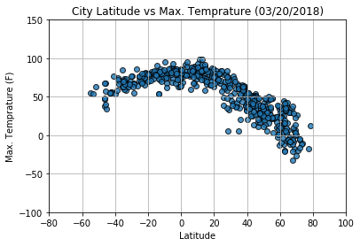
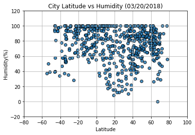
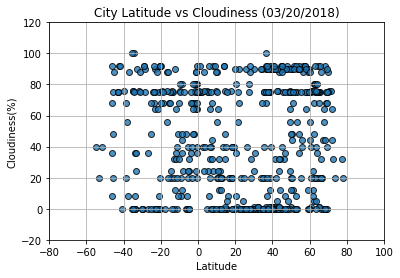
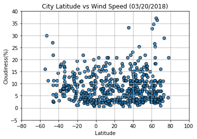

#### Observations

1) The tempeature drops as we move north of the equator. Cities closer/south of the equator are hotter

2) The wind speed gradually increases as we move away from the equator

3) Cities closer to the quator are more humid compared to the cities which are away (Humidity decreases as we move away from the equator)


```python
#import libraries

import requests
import json
from citipy import citipy
from random import uniform
import pandas as pd
from config import api_key
import time
import matplotlib.pyplot as plt
```

### Create a list for cities, country, latitude and longitude to hold the values from citypy


```python
city_list = []
country_list = []
latitude = []
longitude = [] 
count = 0

#Randomly generate the lalitude and longitudes to obtain 600 cities

while count <= 600:
    
    lat, long = uniform(-90,90), uniform(-180, 180)
    
    city = citipy.nearest_city(lat, long)
    country = city.country_code
    city = city.city_name
    
#If the city already exists in the list skip it and move to the next row

    if  (city in city_list and country in country_list):
        lat, long = 0, 0
    else:
        city_list.append(city)
        country_list.append(country)
        latitude.append(lat)
        longitude.append(long)
        count = count + 1

city_df = pd.DataFrame({"city":city_list,"country":country_list,"latitude":latitude,"longitude":longitude})

print("Nbr of Cities " + str(city_df["city"].count()))

city_df.head()
```

    Nbr of Cities 601
    


<div>
<style>
    .dataframe thead tr:only-child th {
        text-align: right;
    }

    .dataframe thead th {
        text-align: left;
    }

    .dataframe tbody tr th {
        vertical-align: top;
    }
</style>
<table border="1" class="dataframe">
  <thead>
    <tr style="text-align: right;">
      <th></th>
      <th>city</th>
      <th>country</th>
      <th>latitude</th>
      <th>longitude</th>
    </tr>
  </thead>
  <tbody>
    <tr>
      <th>0</th>
      <td>dikson</td>
      <td>ru</td>
      <td>82.156174</td>
      <td>81.024956</td>
    </tr>
    <tr>
      <th>1</th>
      <td>matara</td>
      <td>lk</td>
      <td>-0.151202</td>
      <td>80.966918</td>
    </tr>
    <tr>
      <th>2</th>
      <td>harper</td>
      <td>lr</td>
      <td>-0.472084</td>
      <td>-6.937262</td>
    </tr>
    <tr>
      <th>3</th>
      <td>busselton</td>
      <td>au</td>
      <td>-59.997898</td>
      <td>94.060863</td>
    </tr>
    <tr>
      <th>4</th>
      <td>puerto ayora</td>
      <td>ec</td>
      <td>-13.499661</td>
      <td>-108.423947</td>
    </tr>
  </tbody>
</table>
</div>


### Call the API and retreive the city weather. When calling the API add a delay of 1 second 


```python


base = "http://api.openweathermap.org/data/2.5/weather"
count = 0
weather_data = pd.DataFrame(columns=['City','Country','Latitude','Longitude','Max Temp','Cloudiness',
                                     'Humidity','Date','Wind Speed'])


for city in city_df["city"]:
    
    count = count + 1
    
    if count % 20 == 0:
        print(f"{count} nbr of records processed")
    
    params ={"appid":api_key, "q":city, "units":"imperial"}
    
    time.sleep(1)
    response=requests.get(base,params=params)
    print(f"{city}: {response.url}")
    response=response.json()    
    
    try:
        city_name = response["name"]
        clouds = response["clouds"]["all"]
        humidity= response["main"]['humidity']
        dt = response["dt"]
        latitude = response["coord"]['lat']
        longitude = response["coord"]['lon']
        temp = response["main"]['temp_max']
        speed= response["wind"]['speed']
        country = response["sys"]["country"]
        
        weather_data = weather_data.append({'City':city_name,'Cloudiness': clouds, 'Humidity': humidity, 'Date': dt,
                                            'Latitude':latitude,'Longitude':longitude,
                                            'Country':country,'Max Temp':temp,'Wind Speed':speed},ignore_index=True)
    except (ConnectionError, TimeoutError, KeyError) as err:
            message = response["message"] 
            print(f"Error Key {err} and Message is: {message} : {city}")
            
weather_data
```

    dikson: http://api.openweathermap.org/data/2.5/weather?appid=b83314894854b82a8ee7bc76ff0fb21c&q=dikson&units=imperial
    matara: http://api.openweathermap.org/data/2.5/weather?appid=b83314894854b82a8ee7bc76ff0fb21c&q=matara&units=imperial
    harper: http://api.openweathermap.org/data/2.5/weather?appid=b83314894854b82a8ee7bc76ff0fb21c&q=harper&units=imperial
    busselton: http://api.openweathermap.org/data/2.5/weather?appid=b83314894854b82a8ee7bc76ff0fb21c&q=busselton&units=imperial
    puerto ayora: http://api.openweathermap.org/data/2.5/weather?appid=b83314894854b82a8ee7bc76ff0fb21c&q=puerto+ayora&units=imperial
    albany: http://api.openweathermap.org/data/2.5/weather?appid=b83314894854b82a8ee7bc76ff0fb21c&q=albany&units=imperial
    bluff: http://api.openweathermap.org/data/2.5/weather?appid=b83314894854b82a8ee7bc76ff0fb21c&q=bluff&units=imperial
    atuona: http://api.openweathermap.org/data/2.5/weather?appid=b83314894854b82a8ee7bc76ff0fb21c&q=atuona&units=imperial
    kodiak: http://api.openweathermap.org/data/2.5/weather?appid=b83314894854b82a8ee7bc76ff0fb21c&q=kodiak&units=imperial
    faanui: http://api.openweathermap.org/data/2.5/weather?appid=b83314894854b82a8ee7bc76ff0fb21c&q=faanui&units=imperial
    voh: http://api.openweathermap.org/data/2.5/weather?appid=b83314894854b82a8ee7bc76ff0fb21c&q=voh&units=imperial
    black river: http://api.openweathermap.org/data/2.5/weather?appid=b83314894854b82a8ee7bc76ff0fb21c&q=black+river&units=imperial
    cherskiy: http://api.openweathermap.org/data/2.5/weather?appid=b83314894854b82a8ee7bc76ff0fb21c&q=cherskiy&units=imperial
    thompson: http://api.openweathermap.org/data/2.5/weather?appid=b83314894854b82a8ee7bc76ff0fb21c&q=thompson&units=imperial
    baykit: http://api.openweathermap.org/data/2.5/weather?appid=b83314894854b82a8ee7bc76ff0fb21c&q=baykit&units=imperial
    mantua: http://api.openweathermap.org/data/2.5/weather?appid=b83314894854b82a8ee7bc76ff0fb21c&q=mantua&units=imperial
    adrar: http://api.openweathermap.org/data/2.5/weather?appid=b83314894854b82a8ee7bc76ff0fb21c&q=adrar&units=imperial
    stratonion: http://api.openweathermap.org/data/2.5/weather?appid=b83314894854b82a8ee7bc76ff0fb21c&q=stratonion&units=imperial
    kanniyakumari: http://api.openweathermap.org/data/2.5/weather?appid=b83314894854b82a8ee7bc76ff0fb21c&q=kanniyakumari&units=imperial
    20 nbr of records processed
    eirunepe: http://api.openweathermap.org/data/2.5/weather?appid=b83314894854b82a8ee7bc76ff0fb21c&q=eirunepe&units=imperial
    rahatgarh: http://api.openweathermap.org/data/2.5/weather?appid=b83314894854b82a8ee7bc76ff0fb21c&q=rahatgarh&units=imperial
    khambhaliya: http://api.openweathermap.org/data/2.5/weather?appid=b83314894854b82a8ee7bc76ff0fb21c&q=khambhaliya&units=imperial
    naze: http://api.openweathermap.org/data/2.5/weather?appid=b83314894854b82a8ee7bc76ff0fb21c&q=naze&units=imperial
    tuktoyaktuk: http://api.openweathermap.org/data/2.5/weather?appid=b83314894854b82a8ee7bc76ff0fb21c&q=tuktoyaktuk&units=imperial
    butaritari: http://api.openweathermap.org/data/2.5/weather?appid=b83314894854b82a8ee7bc76ff0fb21c&q=butaritari&units=imperial
    ushuaia: http://api.openweathermap.org/data/2.5/weather?appid=b83314894854b82a8ee7bc76ff0fb21c&q=ushuaia&units=imperial
    westport: http://api.openweathermap.org/data/2.5/weather?appid=b83314894854b82a8ee7bc76ff0fb21c&q=westport&units=imperial
    rikitea: http://api.openweathermap.org/data/2.5/weather?appid=b83314894854b82a8ee7bc76ff0fb21c&q=rikitea&units=imperial
    qaanaaq: http://api.openweathermap.org/data/2.5/weather?appid=b83314894854b82a8ee7bc76ff0fb21c&q=qaanaaq&units=imperial
    nome: http://api.openweathermap.org/data/2.5/weather?appid=b83314894854b82a8ee7bc76ff0fb21c&q=nome&units=imperial
    arraial do cabo: http://api.openweathermap.org/data/2.5/weather?appid=b83314894854b82a8ee7bc76ff0fb21c&q=arraial+do+cabo&units=imperial
    punta arenas: http://api.openweathermap.org/data/2.5/weather?appid=b83314894854b82a8ee7bc76ff0fb21c&q=punta+arenas&units=imperial
    ahipara: http://api.openweathermap.org/data/2.5/weather?appid=b83314894854b82a8ee7bc76ff0fb21c&q=ahipara&units=imperial
    castro: http://api.openweathermap.org/data/2.5/weather?appid=b83314894854b82a8ee7bc76ff0fb21c&q=castro&units=imperial
    macaboboni: http://api.openweathermap.org/data/2.5/weather?appid=b83314894854b82a8ee7bc76ff0fb21c&q=macaboboni&units=imperial
    Error Key 'name' and Message is: city not found : macaboboni
    boa vista: http://api.openweathermap.org/data/2.5/weather?appid=b83314894854b82a8ee7bc76ff0fb21c&q=boa+vista&units=imperial
    sola: http://api.openweathermap.org/data/2.5/weather?appid=b83314894854b82a8ee7bc76ff0fb21c&q=sola&units=imperial
    tandil: http://api.openweathermap.org/data/2.5/weather?appid=b83314894854b82a8ee7bc76ff0fb21c&q=tandil&units=imperial
    saskylakh: http://api.openweathermap.org/data/2.5/weather?appid=b83314894854b82a8ee7bc76ff0fb21c&q=saskylakh&units=imperial
    40 nbr of records processed
    yeppoon: http://api.openweathermap.org/data/2.5/weather?appid=b83314894854b82a8ee7bc76ff0fb21c&q=yeppoon&units=imperial
    barentsburg: http://api.openweathermap.org/data/2.5/weather?appid=b83314894854b82a8ee7bc76ff0fb21c&q=barentsburg&units=imperial
    Error Key 'name' and Message is: city not found : barentsburg
    kupang: http://api.openweathermap.org/data/2.5/weather?appid=b83314894854b82a8ee7bc76ff0fb21c&q=kupang&units=imperial
    saleaula: http://api.openweathermap.org/data/2.5/weather?appid=b83314894854b82a8ee7bc76ff0fb21c&q=saleaula&units=imperial
    Error Key 'name' and Message is: city not found : saleaula
    chokurdakh: http://api.openweathermap.org/data/2.5/weather?appid=b83314894854b82a8ee7bc76ff0fb21c&q=chokurdakh&units=imperial
    gilgit: http://api.openweathermap.org/data/2.5/weather?appid=b83314894854b82a8ee7bc76ff0fb21c&q=gilgit&units=imperial
    mahebourg: http://api.openweathermap.org/data/2.5/weather?appid=b83314894854b82a8ee7bc76ff0fb21c&q=mahebourg&units=imperial
    hobart: http://api.openweathermap.org/data/2.5/weather?appid=b83314894854b82a8ee7bc76ff0fb21c&q=hobart&units=imperial
    nikolskoye: http://api.openweathermap.org/data/2.5/weather?appid=b83314894854b82a8ee7bc76ff0fb21c&q=nikolskoye&units=imperial
    illoqqortoormiut: http://api.openweathermap.org/data/2.5/weather?appid=b83314894854b82a8ee7bc76ff0fb21c&q=illoqqortoormiut&units=imperial
    Error Key 'name' and Message is: city not found : illoqqortoormiut
    taolanaro: http://api.openweathermap.org/data/2.5/weather?appid=b83314894854b82a8ee7bc76ff0fb21c&q=taolanaro&units=imperial
    Error Key 'name' and Message is: city not found : taolanaro
    bredasdorp: http://api.openweathermap.org/data/2.5/weather?appid=b83314894854b82a8ee7bc76ff0fb21c&q=bredasdorp&units=imperial
    saint george: http://api.openweathermap.org/data/2.5/weather?appid=b83314894854b82a8ee7bc76ff0fb21c&q=saint+george&units=imperial
    ancud: http://api.openweathermap.org/data/2.5/weather?appid=b83314894854b82a8ee7bc76ff0fb21c&q=ancud&units=imperial
    bilibino: http://api.openweathermap.org/data/2.5/weather?appid=b83314894854b82a8ee7bc76ff0fb21c&q=bilibino&units=imperial
    marawi: http://api.openweathermap.org/data/2.5/weather?appid=b83314894854b82a8ee7bc76ff0fb21c&q=marawi&units=imperial
    yellowknife: http://api.openweathermap.org/data/2.5/weather?appid=b83314894854b82a8ee7bc76ff0fb21c&q=yellowknife&units=imperial
    balkhash: http://api.openweathermap.org/data/2.5/weather?appid=b83314894854b82a8ee7bc76ff0fb21c&q=balkhash&units=imperial
    aykhal: http://api.openweathermap.org/data/2.5/weather?appid=b83314894854b82a8ee7bc76ff0fb21c&q=aykhal&units=imperial
    bubaque: http://api.openweathermap.org/data/2.5/weather?appid=b83314894854b82a8ee7bc76ff0fb21c&q=bubaque&units=imperial
    60 nbr of records processed
    pevek: http://api.openweathermap.org/data/2.5/weather?appid=b83314894854b82a8ee7bc76ff0fb21c&q=pevek&units=imperial
    kapaa: http://api.openweathermap.org/data/2.5/weather?appid=b83314894854b82a8ee7bc76ff0fb21c&q=kapaa&units=imperial
    izhevskoye: http://api.openweathermap.org/data/2.5/weather?appid=b83314894854b82a8ee7bc76ff0fb21c&q=izhevskoye&units=imperial
    mataura: http://api.openweathermap.org/data/2.5/weather?appid=b83314894854b82a8ee7bc76ff0fb21c&q=mataura&units=imperial
    iquique: http://api.openweathermap.org/data/2.5/weather?appid=b83314894854b82a8ee7bc76ff0fb21c&q=iquique&units=imperial
    ozu: http://api.openweathermap.org/data/2.5/weather?appid=b83314894854b82a8ee7bc76ff0fb21c&q=ozu&units=imperial
    belushya guba: http://api.openweathermap.org/data/2.5/weather?appid=b83314894854b82a8ee7bc76ff0fb21c&q=belushya+guba&units=imperial
    Error Key 'name' and Message is: city not found : belushya guba
    praya: http://api.openweathermap.org/data/2.5/weather?appid=b83314894854b82a8ee7bc76ff0fb21c&q=praya&units=imperial
    tasiilaq: http://api.openweathermap.org/data/2.5/weather?appid=b83314894854b82a8ee7bc76ff0fb21c&q=tasiilaq&units=imperial
    jamestown: http://api.openweathermap.org/data/2.5/weather?appid=b83314894854b82a8ee7bc76ff0fb21c&q=jamestown&units=imperial
    upernavik: http://api.openweathermap.org/data/2.5/weather?appid=b83314894854b82a8ee7bc76ff0fb21c&q=upernavik&units=imperial
    vaini: http://api.openweathermap.org/data/2.5/weather?appid=b83314894854b82a8ee7bc76ff0fb21c&q=vaini&units=imperial
    los llanos de aridane: http://api.openweathermap.org/data/2.5/weather?appid=b83314894854b82a8ee7bc76ff0fb21c&q=los+llanos+de+aridane&units=imperial
    mys shmidta: http://api.openweathermap.org/data/2.5/weather?appid=b83314894854b82a8ee7bc76ff0fb21c&q=mys+shmidta&units=imperial
    Error Key 'name' and Message is: city not found : mys shmidta
    kruisfontein: http://api.openweathermap.org/data/2.5/weather?appid=b83314894854b82a8ee7bc76ff0fb21c&q=kruisfontein&units=imperial
    tigil: http://api.openweathermap.org/data/2.5/weather?appid=b83314894854b82a8ee7bc76ff0fb21c&q=tigil&units=imperial
    kilis: http://api.openweathermap.org/data/2.5/weather?appid=b83314894854b82a8ee7bc76ff0fb21c&q=kilis&units=imperial
    dwarka: http://api.openweathermap.org/data/2.5/weather?appid=b83314894854b82a8ee7bc76ff0fb21c&q=dwarka&units=imperial
    hithadhoo: http://api.openweathermap.org/data/2.5/weather?appid=b83314894854b82a8ee7bc76ff0fb21c&q=hithadhoo&units=imperial
    tiksi: http://api.openweathermap.org/data/2.5/weather?appid=b83314894854b82a8ee7bc76ff0fb21c&q=tiksi&units=imperial
    80 nbr of records processed
    severo-kurilsk: http://api.openweathermap.org/data/2.5/weather?appid=b83314894854b82a8ee7bc76ff0fb21c&q=severo-kurilsk&units=imperial
    port alfred: http://api.openweathermap.org/data/2.5/weather?appid=b83314894854b82a8ee7bc76ff0fb21c&q=port+alfred&units=imperial
    santa maria: http://api.openweathermap.org/data/2.5/weather?appid=b83314894854b82a8ee7bc76ff0fb21c&q=santa+maria&units=imperial
    avarua: http://api.openweathermap.org/data/2.5/weather?appid=b83314894854b82a8ee7bc76ff0fb21c&q=avarua&units=imperial
    okhotsk: http://api.openweathermap.org/data/2.5/weather?appid=b83314894854b82a8ee7bc76ff0fb21c&q=okhotsk&units=imperial
    rincon: http://api.openweathermap.org/data/2.5/weather?appid=b83314894854b82a8ee7bc76ff0fb21c&q=rincon&units=imperial
    cidreira: http://api.openweathermap.org/data/2.5/weather?appid=b83314894854b82a8ee7bc76ff0fb21c&q=cidreira&units=imperial
    vaitupu: http://api.openweathermap.org/data/2.5/weather?appid=b83314894854b82a8ee7bc76ff0fb21c&q=vaitupu&units=imperial
    Error Key 'name' and Message is: city not found : vaitupu
    ponta do sol: http://api.openweathermap.org/data/2.5/weather?appid=b83314894854b82a8ee7bc76ff0fb21c&q=ponta+do+sol&units=imperial
    sakaiminato: http://api.openweathermap.org/data/2.5/weather?appid=b83314894854b82a8ee7bc76ff0fb21c&q=sakaiminato&units=imperial
    beloha: http://api.openweathermap.org/data/2.5/weather?appid=b83314894854b82a8ee7bc76ff0fb21c&q=beloha&units=imperial
    cayenne: http://api.openweathermap.org/data/2.5/weather?appid=b83314894854b82a8ee7bc76ff0fb21c&q=cayenne&units=imperial
    hermanus: http://api.openweathermap.org/data/2.5/weather?appid=b83314894854b82a8ee7bc76ff0fb21c&q=hermanus&units=imperial
    hami: http://api.openweathermap.org/data/2.5/weather?appid=b83314894854b82a8ee7bc76ff0fb21c&q=hami&units=imperial
    kaitangata: http://api.openweathermap.org/data/2.5/weather?appid=b83314894854b82a8ee7bc76ff0fb21c&q=kaitangata&units=imperial
    east london: http://api.openweathermap.org/data/2.5/weather?appid=b83314894854b82a8ee7bc76ff0fb21c&q=east+london&units=imperial
    sistranda: http://api.openweathermap.org/data/2.5/weather?appid=b83314894854b82a8ee7bc76ff0fb21c&q=sistranda&units=imperial
    esperance: http://api.openweathermap.org/data/2.5/weather?appid=b83314894854b82a8ee7bc76ff0fb21c&q=esperance&units=imperial
    kalat: http://api.openweathermap.org/data/2.5/weather?appid=b83314894854b82a8ee7bc76ff0fb21c&q=kalat&units=imperial
    ahuimanu: http://api.openweathermap.org/data/2.5/weather?appid=b83314894854b82a8ee7bc76ff0fb21c&q=ahuimanu&units=imperial
    100 nbr of records processed
    barrow: http://api.openweathermap.org/data/2.5/weather?appid=b83314894854b82a8ee7bc76ff0fb21c&q=barrow&units=imperial
    arkhipo-osipovka: http://api.openweathermap.org/data/2.5/weather?appid=b83314894854b82a8ee7bc76ff0fb21c&q=arkhipo-osipovka&units=imperial
    pacific grove: http://api.openweathermap.org/data/2.5/weather?appid=b83314894854b82a8ee7bc76ff0fb21c&q=pacific+grove&units=imperial
    othonoi: http://api.openweathermap.org/data/2.5/weather?appid=b83314894854b82a8ee7bc76ff0fb21c&q=othonoi&units=imperial
    Error Key 'name' and Message is: city not found : othonoi
    nortelandia: http://api.openweathermap.org/data/2.5/weather?appid=b83314894854b82a8ee7bc76ff0fb21c&q=nortelandia&units=imperial
    chapais: http://api.openweathermap.org/data/2.5/weather?appid=b83314894854b82a8ee7bc76ff0fb21c&q=chapais&units=imperial
    bethel: http://api.openweathermap.org/data/2.5/weather?appid=b83314894854b82a8ee7bc76ff0fb21c&q=bethel&units=imperial
    kristiansund: http://api.openweathermap.org/data/2.5/weather?appid=b83314894854b82a8ee7bc76ff0fb21c&q=kristiansund&units=imperial
    kahului: http://api.openweathermap.org/data/2.5/weather?appid=b83314894854b82a8ee7bc76ff0fb21c&q=kahului&units=imperial
    siocon: http://api.openweathermap.org/data/2.5/weather?appid=b83314894854b82a8ee7bc76ff0fb21c&q=siocon&units=imperial
    san quintin: http://api.openweathermap.org/data/2.5/weather?appid=b83314894854b82a8ee7bc76ff0fb21c&q=san+quintin&units=imperial
    cape town: http://api.openweathermap.org/data/2.5/weather?appid=b83314894854b82a8ee7bc76ff0fb21c&q=cape+town&units=imperial
    havre-saint-pierre: http://api.openweathermap.org/data/2.5/weather?appid=b83314894854b82a8ee7bc76ff0fb21c&q=havre-saint-pierre&units=imperial
    derzhavinsk: http://api.openweathermap.org/data/2.5/weather?appid=b83314894854b82a8ee7bc76ff0fb21c&q=derzhavinsk&units=imperial
    fengrun: http://api.openweathermap.org/data/2.5/weather?appid=b83314894854b82a8ee7bc76ff0fb21c&q=fengrun&units=imperial
    berdigestyakh: http://api.openweathermap.org/data/2.5/weather?appid=b83314894854b82a8ee7bc76ff0fb21c&q=berdigestyakh&units=imperial
    pangnirtung: http://api.openweathermap.org/data/2.5/weather?appid=b83314894854b82a8ee7bc76ff0fb21c&q=pangnirtung&units=imperial
    norman wells: http://api.openweathermap.org/data/2.5/weather?appid=b83314894854b82a8ee7bc76ff0fb21c&q=norman+wells&units=imperial
    kearney: http://api.openweathermap.org/data/2.5/weather?appid=b83314894854b82a8ee7bc76ff0fb21c&q=kearney&units=imperial
    bathsheba: http://api.openweathermap.org/data/2.5/weather?appid=b83314894854b82a8ee7bc76ff0fb21c&q=bathsheba&units=imperial
    120 nbr of records processed
    klaksvik: http://api.openweathermap.org/data/2.5/weather?appid=b83314894854b82a8ee7bc76ff0fb21c&q=klaksvik&units=imperial
    qasigiannguit: http://api.openweathermap.org/data/2.5/weather?appid=b83314894854b82a8ee7bc76ff0fb21c&q=qasigiannguit&units=imperial
    develi: http://api.openweathermap.org/data/2.5/weather?appid=b83314894854b82a8ee7bc76ff0fb21c&q=develi&units=imperial
    plackovci: http://api.openweathermap.org/data/2.5/weather?appid=b83314894854b82a8ee7bc76ff0fb21c&q=plackovci&units=imperial
    Error Key 'name' and Message is: city not found : plackovci
    ushtobe: http://api.openweathermap.org/data/2.5/weather?appid=b83314894854b82a8ee7bc76ff0fb21c&q=ushtobe&units=imperial
    macaubas: http://api.openweathermap.org/data/2.5/weather?appid=b83314894854b82a8ee7bc76ff0fb21c&q=macaubas&units=imperial
    saint-augustin: http://api.openweathermap.org/data/2.5/weather?appid=b83314894854b82a8ee7bc76ff0fb21c&q=saint-augustin&units=imperial
    haftoni: http://api.openweathermap.org/data/2.5/weather?appid=b83314894854b82a8ee7bc76ff0fb21c&q=haftoni&units=imperial
    ciudad bolivar: http://api.openweathermap.org/data/2.5/weather?appid=b83314894854b82a8ee7bc76ff0fb21c&q=ciudad+bolivar&units=imperial
    lazarev: http://api.openweathermap.org/data/2.5/weather?appid=b83314894854b82a8ee7bc76ff0fb21c&q=lazarev&units=imperial
    morada nova: http://api.openweathermap.org/data/2.5/weather?appid=b83314894854b82a8ee7bc76ff0fb21c&q=morada+nova&units=imperial
    coquimbo: http://api.openweathermap.org/data/2.5/weather?appid=b83314894854b82a8ee7bc76ff0fb21c&q=coquimbo&units=imperial
    lusambo: http://api.openweathermap.org/data/2.5/weather?appid=b83314894854b82a8ee7bc76ff0fb21c&q=lusambo&units=imperial
    lebu: http://api.openweathermap.org/data/2.5/weather?appid=b83314894854b82a8ee7bc76ff0fb21c&q=lebu&units=imperial
    tuatapere: http://api.openweathermap.org/data/2.5/weather?appid=b83314894854b82a8ee7bc76ff0fb21c&q=tuatapere&units=imperial
    shenjiamen: http://api.openweathermap.org/data/2.5/weather?appid=b83314894854b82a8ee7bc76ff0fb21c&q=shenjiamen&units=imperial
    comodoro rivadavia: http://api.openweathermap.org/data/2.5/weather?appid=b83314894854b82a8ee7bc76ff0fb21c&q=comodoro+rivadavia&units=imperial
    glomfjord: http://api.openweathermap.org/data/2.5/weather?appid=b83314894854b82a8ee7bc76ff0fb21c&q=glomfjord&units=imperial
    novaya zaimka: http://api.openweathermap.org/data/2.5/weather?appid=b83314894854b82a8ee7bc76ff0fb21c&q=novaya+zaimka&units=imperial
    turayf: http://api.openweathermap.org/data/2.5/weather?appid=b83314894854b82a8ee7bc76ff0fb21c&q=turayf&units=imperial
    140 nbr of records processed
    magdagachi: http://api.openweathermap.org/data/2.5/weather?appid=b83314894854b82a8ee7bc76ff0fb21c&q=magdagachi&units=imperial
    zhanaozen: http://api.openweathermap.org/data/2.5/weather?appid=b83314894854b82a8ee7bc76ff0fb21c&q=zhanaozen&units=imperial
    eyl: http://api.openweathermap.org/data/2.5/weather?appid=b83314894854b82a8ee7bc76ff0fb21c&q=eyl&units=imperial
    sitka: http://api.openweathermap.org/data/2.5/weather?appid=b83314894854b82a8ee7bc76ff0fb21c&q=sitka&units=imperial
    high level: http://api.openweathermap.org/data/2.5/weather?appid=b83314894854b82a8ee7bc76ff0fb21c&q=high+level&units=imperial
    nanortalik: http://api.openweathermap.org/data/2.5/weather?appid=b83314894854b82a8ee7bc76ff0fb21c&q=nanortalik&units=imperial
    husavik: http://api.openweathermap.org/data/2.5/weather?appid=b83314894854b82a8ee7bc76ff0fb21c&q=husavik&units=imperial
    saldanha: http://api.openweathermap.org/data/2.5/weather?appid=b83314894854b82a8ee7bc76ff0fb21c&q=saldanha&units=imperial
    provideniya: http://api.openweathermap.org/data/2.5/weather?appid=b83314894854b82a8ee7bc76ff0fb21c&q=provideniya&units=imperial
    bobonong: http://api.openweathermap.org/data/2.5/weather?appid=b83314894854b82a8ee7bc76ff0fb21c&q=bobonong&units=imperial
    Error Key 'name' and Message is: city not found : bobonong
    hovd: http://api.openweathermap.org/data/2.5/weather?appid=b83314894854b82a8ee7bc76ff0fb21c&q=hovd&units=imperial
    narsaq: http://api.openweathermap.org/data/2.5/weather?appid=b83314894854b82a8ee7bc76ff0fb21c&q=narsaq&units=imperial
    egvekinot: http://api.openweathermap.org/data/2.5/weather?appid=b83314894854b82a8ee7bc76ff0fb21c&q=egvekinot&units=imperial
    te anau: http://api.openweathermap.org/data/2.5/weather?appid=b83314894854b82a8ee7bc76ff0fb21c&q=te+anau&units=imperial
    mehran: http://api.openweathermap.org/data/2.5/weather?appid=b83314894854b82a8ee7bc76ff0fb21c&q=mehran&units=imperial
    lompoc: http://api.openweathermap.org/data/2.5/weather?appid=b83314894854b82a8ee7bc76ff0fb21c&q=lompoc&units=imperial
    aloleng: http://api.openweathermap.org/data/2.5/weather?appid=b83314894854b82a8ee7bc76ff0fb21c&q=aloleng&units=imperial
    attawapiskat: http://api.openweathermap.org/data/2.5/weather?appid=b83314894854b82a8ee7bc76ff0fb21c&q=attawapiskat&units=imperial
    Error Key 'name' and Message is: city not found : attawapiskat
    hilo: http://api.openweathermap.org/data/2.5/weather?appid=b83314894854b82a8ee7bc76ff0fb21c&q=hilo&units=imperial
    victoria: http://api.openweathermap.org/data/2.5/weather?appid=b83314894854b82a8ee7bc76ff0fb21c&q=victoria&units=imperial
    160 nbr of records processed
    lavrentiya: http://api.openweathermap.org/data/2.5/weather?appid=b83314894854b82a8ee7bc76ff0fb21c&q=lavrentiya&units=imperial
    caravelas: http://api.openweathermap.org/data/2.5/weather?appid=b83314894854b82a8ee7bc76ff0fb21c&q=caravelas&units=imperial
    salalah: http://api.openweathermap.org/data/2.5/weather?appid=b83314894854b82a8ee7bc76ff0fb21c&q=salalah&units=imperial
    mackay: http://api.openweathermap.org/data/2.5/weather?appid=b83314894854b82a8ee7bc76ff0fb21c&q=mackay&units=imperial
    sorland: http://api.openweathermap.org/data/2.5/weather?appid=b83314894854b82a8ee7bc76ff0fb21c&q=sorland&units=imperial
    vostok: http://api.openweathermap.org/data/2.5/weather?appid=b83314894854b82a8ee7bc76ff0fb21c&q=vostok&units=imperial
    hambantota: http://api.openweathermap.org/data/2.5/weather?appid=b83314894854b82a8ee7bc76ff0fb21c&q=hambantota&units=imperial
    komsomolskiy: http://api.openweathermap.org/data/2.5/weather?appid=b83314894854b82a8ee7bc76ff0fb21c&q=komsomolskiy&units=imperial
    uk: http://api.openweathermap.org/data/2.5/weather?appid=b83314894854b82a8ee7bc76ff0fb21c&q=uk&units=imperial
    Error Key 'name' and Message is: city not found : uk
    kuche: http://api.openweathermap.org/data/2.5/weather?appid=b83314894854b82a8ee7bc76ff0fb21c&q=kuche&units=imperial
    Error Key 'name' and Message is: city not found : kuche
    khatanga: http://api.openweathermap.org/data/2.5/weather?appid=b83314894854b82a8ee7bc76ff0fb21c&q=khatanga&units=imperial
    saint-philippe: http://api.openweathermap.org/data/2.5/weather?appid=b83314894854b82a8ee7bc76ff0fb21c&q=saint-philippe&units=imperial
    la asuncion: http://api.openweathermap.org/data/2.5/weather?appid=b83314894854b82a8ee7bc76ff0fb21c&q=la+asuncion&units=imperial
    lukovetskiy: http://api.openweathermap.org/data/2.5/weather?appid=b83314894854b82a8ee7bc76ff0fb21c&q=lukovetskiy&units=imperial
    hasaki: http://api.openweathermap.org/data/2.5/weather?appid=b83314894854b82a8ee7bc76ff0fb21c&q=hasaki&units=imperial
    samarai: http://api.openweathermap.org/data/2.5/weather?appid=b83314894854b82a8ee7bc76ff0fb21c&q=samarai&units=imperial
    mayo: http://api.openweathermap.org/data/2.5/weather?appid=b83314894854b82a8ee7bc76ff0fb21c&q=mayo&units=imperial
    medzilaborce: http://api.openweathermap.org/data/2.5/weather?appid=b83314894854b82a8ee7bc76ff0fb21c&q=medzilaborce&units=imperial
    merauke: http://api.openweathermap.org/data/2.5/weather?appid=b83314894854b82a8ee7bc76ff0fb21c&q=merauke&units=imperial
    grindavik: http://api.openweathermap.org/data/2.5/weather?appid=b83314894854b82a8ee7bc76ff0fb21c&q=grindavik&units=imperial
    180 nbr of records processed
    swellendam: http://api.openweathermap.org/data/2.5/weather?appid=b83314894854b82a8ee7bc76ff0fb21c&q=swellendam&units=imperial
    kansay: http://api.openweathermap.org/data/2.5/weather?appid=b83314894854b82a8ee7bc76ff0fb21c&q=kansay&units=imperial
    Error Key 'name' and Message is: city not found : kansay
    coihaique: http://api.openweathermap.org/data/2.5/weather?appid=b83314894854b82a8ee7bc76ff0fb21c&q=coihaique&units=imperial
    salinopolis: http://api.openweathermap.org/data/2.5/weather?appid=b83314894854b82a8ee7bc76ff0fb21c&q=salinopolis&units=imperial
    palana: http://api.openweathermap.org/data/2.5/weather?appid=b83314894854b82a8ee7bc76ff0fb21c&q=palana&units=imperial
    leningradskiy: http://api.openweathermap.org/data/2.5/weather?appid=b83314894854b82a8ee7bc76ff0fb21c&q=leningradskiy&units=imperial
    voznesenye: http://api.openweathermap.org/data/2.5/weather?appid=b83314894854b82a8ee7bc76ff0fb21c&q=voznesenye&units=imperial
    matagami: http://api.openweathermap.org/data/2.5/weather?appid=b83314894854b82a8ee7bc76ff0fb21c&q=matagami&units=imperial
    asfi: http://api.openweathermap.org/data/2.5/weather?appid=b83314894854b82a8ee7bc76ff0fb21c&q=asfi&units=imperial
    Error Key 'name' and Message is: city not found : asfi
    isangel: http://api.openweathermap.org/data/2.5/weather?appid=b83314894854b82a8ee7bc76ff0fb21c&q=isangel&units=imperial
    wyndham: http://api.openweathermap.org/data/2.5/weather?appid=b83314894854b82a8ee7bc76ff0fb21c&q=wyndham&units=imperial
    new norfolk: http://api.openweathermap.org/data/2.5/weather?appid=b83314894854b82a8ee7bc76ff0fb21c&q=new+norfolk&units=imperial
    boo: http://api.openweathermap.org/data/2.5/weather?appid=b83314894854b82a8ee7bc76ff0fb21c&q=boo&units=imperial
    dali: http://api.openweathermap.org/data/2.5/weather?appid=b83314894854b82a8ee7bc76ff0fb21c&q=dali&units=imperial
    phan thiet: http://api.openweathermap.org/data/2.5/weather?appid=b83314894854b82a8ee7bc76ff0fb21c&q=phan+thiet&units=imperial
    ostersund: http://api.openweathermap.org/data/2.5/weather?appid=b83314894854b82a8ee7bc76ff0fb21c&q=ostersund&units=imperial
    vernon: http://api.openweathermap.org/data/2.5/weather?appid=b83314894854b82a8ee7bc76ff0fb21c&q=vernon&units=imperial
    yatou: http://api.openweathermap.org/data/2.5/weather?appid=b83314894854b82a8ee7bc76ff0fb21c&q=yatou&units=imperial
    selma: http://api.openweathermap.org/data/2.5/weather?appid=b83314894854b82a8ee7bc76ff0fb21c&q=selma&units=imperial
    elbrus: http://api.openweathermap.org/data/2.5/weather?appid=b83314894854b82a8ee7bc76ff0fb21c&q=elbrus&units=imperial
    200 nbr of records processed
    san jeronimo: http://api.openweathermap.org/data/2.5/weather?appid=b83314894854b82a8ee7bc76ff0fb21c&q=san+jeronimo&units=imperial
    port blair: http://api.openweathermap.org/data/2.5/weather?appid=b83314894854b82a8ee7bc76ff0fb21c&q=port+blair&units=imperial
    sulangan: http://api.openweathermap.org/data/2.5/weather?appid=b83314894854b82a8ee7bc76ff0fb21c&q=sulangan&units=imperial
    alta floresta: http://api.openweathermap.org/data/2.5/weather?appid=b83314894854b82a8ee7bc76ff0fb21c&q=alta+floresta&units=imperial
    lincoln: http://api.openweathermap.org/data/2.5/weather?appid=b83314894854b82a8ee7bc76ff0fb21c&q=lincoln&units=imperial
    kloulklubed: http://api.openweathermap.org/data/2.5/weather?appid=b83314894854b82a8ee7bc76ff0fb21c&q=kloulklubed&units=imperial
    necochea: http://api.openweathermap.org/data/2.5/weather?appid=b83314894854b82a8ee7bc76ff0fb21c&q=necochea&units=imperial
    akdepe: http://api.openweathermap.org/data/2.5/weather?appid=b83314894854b82a8ee7bc76ff0fb21c&q=akdepe&units=imperial
    andenes: http://api.openweathermap.org/data/2.5/weather?appid=b83314894854b82a8ee7bc76ff0fb21c&q=andenes&units=imperial
    Error Key 'name' and Message is: city not found : andenes
    wuda: http://api.openweathermap.org/data/2.5/weather?appid=b83314894854b82a8ee7bc76ff0fb21c&q=wuda&units=imperial
    louisbourg: http://api.openweathermap.org/data/2.5/weather?appid=b83314894854b82a8ee7bc76ff0fb21c&q=louisbourg&units=imperial
    Error Key 'name' and Message is: city not found : louisbourg
    lorengau: http://api.openweathermap.org/data/2.5/weather?appid=b83314894854b82a8ee7bc76ff0fb21c&q=lorengau&units=imperial
    montepuez: http://api.openweathermap.org/data/2.5/weather?appid=b83314894854b82a8ee7bc76ff0fb21c&q=montepuez&units=imperial
    ojitlan: http://api.openweathermap.org/data/2.5/weather?appid=b83314894854b82a8ee7bc76ff0fb21c&q=ojitlan&units=imperial
    Error Key 'name' and Message is: city not found : ojitlan
    shakiso: http://api.openweathermap.org/data/2.5/weather?appid=b83314894854b82a8ee7bc76ff0fb21c&q=shakiso&units=imperial
    mar del plata: http://api.openweathermap.org/data/2.5/weather?appid=b83314894854b82a8ee7bc76ff0fb21c&q=mar+del+plata&units=imperial
    georgetown: http://api.openweathermap.org/data/2.5/weather?appid=b83314894854b82a8ee7bc76ff0fb21c&q=georgetown&units=imperial
    chlorakas: http://api.openweathermap.org/data/2.5/weather?appid=b83314894854b82a8ee7bc76ff0fb21c&q=chlorakas&units=imperial
    Error Key 'name' and Message is: city not found : chlorakas
    tres palos: http://api.openweathermap.org/data/2.5/weather?appid=b83314894854b82a8ee7bc76ff0fb21c&q=tres+palos&units=imperial
    zhanatas: http://api.openweathermap.org/data/2.5/weather?appid=b83314894854b82a8ee7bc76ff0fb21c&q=zhanatas&units=imperial
    Error Key 'name' and Message is: city not found : zhanatas
    220 nbr of records processed
    sentyabrskiy: http://api.openweathermap.org/data/2.5/weather?appid=b83314894854b82a8ee7bc76ff0fb21c&q=sentyabrskiy&units=imperial
    Error Key 'name' and Message is: city not found : sentyabrskiy
    tezu: http://api.openweathermap.org/data/2.5/weather?appid=b83314894854b82a8ee7bc76ff0fb21c&q=tezu&units=imperial
    henties bay: http://api.openweathermap.org/data/2.5/weather?appid=b83314894854b82a8ee7bc76ff0fb21c&q=henties+bay&units=imperial
    praia da vitoria: http://api.openweathermap.org/data/2.5/weather?appid=b83314894854b82a8ee7bc76ff0fb21c&q=praia+da+vitoria&units=imperial
    platanos: http://api.openweathermap.org/data/2.5/weather?appid=b83314894854b82a8ee7bc76ff0fb21c&q=platanos&units=imperial
    vohringen: http://api.openweathermap.org/data/2.5/weather?appid=b83314894854b82a8ee7bc76ff0fb21c&q=vohringen&units=imperial
    santa cruz: http://api.openweathermap.org/data/2.5/weather?appid=b83314894854b82a8ee7bc76ff0fb21c&q=santa+cruz&units=imperial
    wewak: http://api.openweathermap.org/data/2.5/weather?appid=b83314894854b82a8ee7bc76ff0fb21c&q=wewak&units=imperial
    sabang: http://api.openweathermap.org/data/2.5/weather?appid=b83314894854b82a8ee7bc76ff0fb21c&q=sabang&units=imperial
    iqaluit: http://api.openweathermap.org/data/2.5/weather?appid=b83314894854b82a8ee7bc76ff0fb21c&q=iqaluit&units=imperial
    nizhneyansk: http://api.openweathermap.org/data/2.5/weather?appid=b83314894854b82a8ee7bc76ff0fb21c&q=nizhneyansk&units=imperial
    Error Key 'name' and Message is: city not found : nizhneyansk
    tianmen: http://api.openweathermap.org/data/2.5/weather?appid=b83314894854b82a8ee7bc76ff0fb21c&q=tianmen&units=imperial
    bambous virieux: http://api.openweathermap.org/data/2.5/weather?appid=b83314894854b82a8ee7bc76ff0fb21c&q=bambous+virieux&units=imperial
    dakoro: http://api.openweathermap.org/data/2.5/weather?appid=b83314894854b82a8ee7bc76ff0fb21c&q=dakoro&units=imperial
    irece: http://api.openweathermap.org/data/2.5/weather?appid=b83314894854b82a8ee7bc76ff0fb21c&q=irece&units=imperial
    tsihombe: http://api.openweathermap.org/data/2.5/weather?appid=b83314894854b82a8ee7bc76ff0fb21c&q=tsihombe&units=imperial
    Error Key 'name' and Message is: city not found : tsihombe
    eureka: http://api.openweathermap.org/data/2.5/weather?appid=b83314894854b82a8ee7bc76ff0fb21c&q=eureka&units=imperial
    itoman: http://api.openweathermap.org/data/2.5/weather?appid=b83314894854b82a8ee7bc76ff0fb21c&q=itoman&units=imperial
    mount gambier: http://api.openweathermap.org/data/2.5/weather?appid=b83314894854b82a8ee7bc76ff0fb21c&q=mount+gambier&units=imperial
    srednekolymsk: http://api.openweathermap.org/data/2.5/weather?appid=b83314894854b82a8ee7bc76ff0fb21c&q=srednekolymsk&units=imperial
    240 nbr of records processed
    bra: http://api.openweathermap.org/data/2.5/weather?appid=b83314894854b82a8ee7bc76ff0fb21c&q=bra&units=imperial
    camana: http://api.openweathermap.org/data/2.5/weather?appid=b83314894854b82a8ee7bc76ff0fb21c&q=camana&units=imperial
    Error Key 'name' and Message is: city not found : camana
    whitehorse: http://api.openweathermap.org/data/2.5/weather?appid=b83314894854b82a8ee7bc76ff0fb21c&q=whitehorse&units=imperial
    dukat: http://api.openweathermap.org/data/2.5/weather?appid=b83314894854b82a8ee7bc76ff0fb21c&q=dukat&units=imperial
    airai: http://api.openweathermap.org/data/2.5/weather?appid=b83314894854b82a8ee7bc76ff0fb21c&q=airai&units=imperial
    mitsamiouli: http://api.openweathermap.org/data/2.5/weather?appid=b83314894854b82a8ee7bc76ff0fb21c&q=mitsamiouli&units=imperial
    kismayo: http://api.openweathermap.org/data/2.5/weather?appid=b83314894854b82a8ee7bc76ff0fb21c&q=kismayo&units=imperial
    Error Key 'name' and Message is: city not found : kismayo
    port elizabeth: http://api.openweathermap.org/data/2.5/weather?appid=b83314894854b82a8ee7bc76ff0fb21c&q=port+elizabeth&units=imperial
    paamiut: http://api.openweathermap.org/data/2.5/weather?appid=b83314894854b82a8ee7bc76ff0fb21c&q=paamiut&units=imperial
    hanover: http://api.openweathermap.org/data/2.5/weather?appid=b83314894854b82a8ee7bc76ff0fb21c&q=hanover&units=imperial
    touros: http://api.openweathermap.org/data/2.5/weather?appid=b83314894854b82a8ee7bc76ff0fb21c&q=touros&units=imperial
    dajal: http://api.openweathermap.org/data/2.5/weather?appid=b83314894854b82a8ee7bc76ff0fb21c&q=dajal&units=imperial
    mildura: http://api.openweathermap.org/data/2.5/weather?appid=b83314894854b82a8ee7bc76ff0fb21c&q=mildura&units=imperial
    markova: http://api.openweathermap.org/data/2.5/weather?appid=b83314894854b82a8ee7bc76ff0fb21c&q=markova&units=imperial
    maringa: http://api.openweathermap.org/data/2.5/weather?appid=b83314894854b82a8ee7bc76ff0fb21c&q=maringa&units=imperial
    college: http://api.openweathermap.org/data/2.5/weather?appid=b83314894854b82a8ee7bc76ff0fb21c&q=college&units=imperial
    biltine: http://api.openweathermap.org/data/2.5/weather?appid=b83314894854b82a8ee7bc76ff0fb21c&q=biltine&units=imperial
    woodward: http://api.openweathermap.org/data/2.5/weather?appid=b83314894854b82a8ee7bc76ff0fb21c&q=woodward&units=imperial
    fort nelson: http://api.openweathermap.org/data/2.5/weather?appid=b83314894854b82a8ee7bc76ff0fb21c&q=fort+nelson&units=imperial
    souillac: http://api.openweathermap.org/data/2.5/weather?appid=b83314894854b82a8ee7bc76ff0fb21c&q=souillac&units=imperial
    260 nbr of records processed
    alcaniz: http://api.openweathermap.org/data/2.5/weather?appid=b83314894854b82a8ee7bc76ff0fb21c&q=alcaniz&units=imperial
    vestmannaeyjar: http://api.openweathermap.org/data/2.5/weather?appid=b83314894854b82a8ee7bc76ff0fb21c&q=vestmannaeyjar&units=imperial
    alyangula: http://api.openweathermap.org/data/2.5/weather?appid=b83314894854b82a8ee7bc76ff0fb21c&q=alyangula&units=imperial
    guiglo: http://api.openweathermap.org/data/2.5/weather?appid=b83314894854b82a8ee7bc76ff0fb21c&q=guiglo&units=imperial
    cururupu: http://api.openweathermap.org/data/2.5/weather?appid=b83314894854b82a8ee7bc76ff0fb21c&q=cururupu&units=imperial
    hendek: http://api.openweathermap.org/data/2.5/weather?appid=b83314894854b82a8ee7bc76ff0fb21c&q=hendek&units=imperial
    alofi: http://api.openweathermap.org/data/2.5/weather?appid=b83314894854b82a8ee7bc76ff0fb21c&q=alofi&units=imperial
    itambe: http://api.openweathermap.org/data/2.5/weather?appid=b83314894854b82a8ee7bc76ff0fb21c&q=itambe&units=imperial
    viedma: http://api.openweathermap.org/data/2.5/weather?appid=b83314894854b82a8ee7bc76ff0fb21c&q=viedma&units=imperial
    saint-louis: http://api.openweathermap.org/data/2.5/weather?appid=b83314894854b82a8ee7bc76ff0fb21c&q=saint-louis&units=imperial
    joaima: http://api.openweathermap.org/data/2.5/weather?appid=b83314894854b82a8ee7bc76ff0fb21c&q=joaima&units=imperial
    dimitrovgrad: http://api.openweathermap.org/data/2.5/weather?appid=b83314894854b82a8ee7bc76ff0fb21c&q=dimitrovgrad&units=imperial
    yarim: http://api.openweathermap.org/data/2.5/weather?appid=b83314894854b82a8ee7bc76ff0fb21c&q=yarim&units=imperial
    magistralnyy: http://api.openweathermap.org/data/2.5/weather?appid=b83314894854b82a8ee7bc76ff0fb21c&q=magistralnyy&units=imperial
    souris: http://api.openweathermap.org/data/2.5/weather?appid=b83314894854b82a8ee7bc76ff0fb21c&q=souris&units=imperial
    tazovskiy: http://api.openweathermap.org/data/2.5/weather?appid=b83314894854b82a8ee7bc76ff0fb21c&q=tazovskiy&units=imperial
    kieta: http://api.openweathermap.org/data/2.5/weather?appid=b83314894854b82a8ee7bc76ff0fb21c&q=kieta&units=imperial
    yenagoa: http://api.openweathermap.org/data/2.5/weather?appid=b83314894854b82a8ee7bc76ff0fb21c&q=yenagoa&units=imperial
    fomboni: http://api.openweathermap.org/data/2.5/weather?appid=b83314894854b82a8ee7bc76ff0fb21c&q=fomboni&units=imperial
    bershet: http://api.openweathermap.org/data/2.5/weather?appid=b83314894854b82a8ee7bc76ff0fb21c&q=bershet&units=imperial
    280 nbr of records processed
    hofn: http://api.openweathermap.org/data/2.5/weather?appid=b83314894854b82a8ee7bc76ff0fb21c&q=hofn&units=imperial
    katherine: http://api.openweathermap.org/data/2.5/weather?appid=b83314894854b82a8ee7bc76ff0fb21c&q=katherine&units=imperial
    vanavara: http://api.openweathermap.org/data/2.5/weather?appid=b83314894854b82a8ee7bc76ff0fb21c&q=vanavara&units=imperial
    tevriz: http://api.openweathermap.org/data/2.5/weather?appid=b83314894854b82a8ee7bc76ff0fb21c&q=tevriz&units=imperial
    khasan: http://api.openweathermap.org/data/2.5/weather?appid=b83314894854b82a8ee7bc76ff0fb21c&q=khasan&units=imperial
    lakatoro: http://api.openweathermap.org/data/2.5/weather?appid=b83314894854b82a8ee7bc76ff0fb21c&q=lakatoro&units=imperial
    carnarvon: http://api.openweathermap.org/data/2.5/weather?appid=b83314894854b82a8ee7bc76ff0fb21c&q=carnarvon&units=imperial
    port lincoln: http://api.openweathermap.org/data/2.5/weather?appid=b83314894854b82a8ee7bc76ff0fb21c&q=port+lincoln&units=imperial
    roald: http://api.openweathermap.org/data/2.5/weather?appid=b83314894854b82a8ee7bc76ff0fb21c&q=roald&units=imperial
    byron bay: http://api.openweathermap.org/data/2.5/weather?appid=b83314894854b82a8ee7bc76ff0fb21c&q=byron+bay&units=imperial
    karratha: http://api.openweathermap.org/data/2.5/weather?appid=b83314894854b82a8ee7bc76ff0fb21c&q=karratha&units=imperial
    yerbogachen: http://api.openweathermap.org/data/2.5/weather?appid=b83314894854b82a8ee7bc76ff0fb21c&q=yerbogachen&units=imperial
    moron: http://api.openweathermap.org/data/2.5/weather?appid=b83314894854b82a8ee7bc76ff0fb21c&q=moron&units=imperial
    constitucion: http://api.openweathermap.org/data/2.5/weather?appid=b83314894854b82a8ee7bc76ff0fb21c&q=constitucion&units=imperial
    skjervoy: http://api.openweathermap.org/data/2.5/weather?appid=b83314894854b82a8ee7bc76ff0fb21c&q=skjervoy&units=imperial
    carutapera: http://api.openweathermap.org/data/2.5/weather?appid=b83314894854b82a8ee7bc76ff0fb21c&q=carutapera&units=imperial
    ilulissat: http://api.openweathermap.org/data/2.5/weather?appid=b83314894854b82a8ee7bc76ff0fb21c&q=ilulissat&units=imperial
    rockford: http://api.openweathermap.org/data/2.5/weather?appid=b83314894854b82a8ee7bc76ff0fb21c&q=rockford&units=imperial
    cagdianao: http://api.openweathermap.org/data/2.5/weather?appid=b83314894854b82a8ee7bc76ff0fb21c&q=cagdianao&units=imperial
    buluang: http://api.openweathermap.org/data/2.5/weather?appid=b83314894854b82a8ee7bc76ff0fb21c&q=buluang&units=imperial
    300 nbr of records processed
    mount isa: http://api.openweathermap.org/data/2.5/weather?appid=b83314894854b82a8ee7bc76ff0fb21c&q=mount+isa&units=imperial
    tura: http://api.openweathermap.org/data/2.5/weather?appid=b83314894854b82a8ee7bc76ff0fb21c&q=tura&units=imperial
    jutai: http://api.openweathermap.org/data/2.5/weather?appid=b83314894854b82a8ee7bc76ff0fb21c&q=jutai&units=imperial
    zonalnaya stantsiya: http://api.openweathermap.org/data/2.5/weather?appid=b83314894854b82a8ee7bc76ff0fb21c&q=zonalnaya+stantsiya&units=imperial
    sorvag: http://api.openweathermap.org/data/2.5/weather?appid=b83314894854b82a8ee7bc76ff0fb21c&q=sorvag&units=imperial
    Error Key 'name' and Message is: city not found : sorvag
    vardo: http://api.openweathermap.org/data/2.5/weather?appid=b83314894854b82a8ee7bc76ff0fb21c&q=vardo&units=imperial
    buala: http://api.openweathermap.org/data/2.5/weather?appid=b83314894854b82a8ee7bc76ff0fb21c&q=buala&units=imperial
    luderitz: http://api.openweathermap.org/data/2.5/weather?appid=b83314894854b82a8ee7bc76ff0fb21c&q=luderitz&units=imperial
    cabinda: http://api.openweathermap.org/data/2.5/weather?appid=b83314894854b82a8ee7bc76ff0fb21c&q=cabinda&units=imperial
    kushima: http://api.openweathermap.org/data/2.5/weather?appid=b83314894854b82a8ee7bc76ff0fb21c&q=kushima&units=imperial
    santa rita do sapucai: http://api.openweathermap.org/data/2.5/weather?appid=b83314894854b82a8ee7bc76ff0fb21c&q=santa+rita+do+sapucai&units=imperial
    ende: http://api.openweathermap.org/data/2.5/weather?appid=b83314894854b82a8ee7bc76ff0fb21c&q=ende&units=imperial
    sitio novo do tocantins: http://api.openweathermap.org/data/2.5/weather?appid=b83314894854b82a8ee7bc76ff0fb21c&q=sitio+novo+do+tocantins&units=imperial
    Error Key 'name' and Message is: city not found : sitio novo do tocantins
    nantucket: http://api.openweathermap.org/data/2.5/weather?appid=b83314894854b82a8ee7bc76ff0fb21c&q=nantucket&units=imperial
    marovoay: http://api.openweathermap.org/data/2.5/weather?appid=b83314894854b82a8ee7bc76ff0fb21c&q=marovoay&units=imperial
    tara: http://api.openweathermap.org/data/2.5/weather?appid=b83314894854b82a8ee7bc76ff0fb21c&q=tara&units=imperial
    dutse: http://api.openweathermap.org/data/2.5/weather?appid=b83314894854b82a8ee7bc76ff0fb21c&q=dutse&units=imperial
    batemans bay: http://api.openweathermap.org/data/2.5/weather?appid=b83314894854b82a8ee7bc76ff0fb21c&q=batemans+bay&units=imperial
    burica: http://api.openweathermap.org/data/2.5/weather?appid=b83314894854b82a8ee7bc76ff0fb21c&q=burica&units=imperial
    Error Key 'name' and Message is: city not found : burica
    florissant: http://api.openweathermap.org/data/2.5/weather?appid=b83314894854b82a8ee7bc76ff0fb21c&q=florissant&units=imperial
    320 nbr of records processed
    beringovskiy: http://api.openweathermap.org/data/2.5/weather?appid=b83314894854b82a8ee7bc76ff0fb21c&q=beringovskiy&units=imperial
    robertsport: http://api.openweathermap.org/data/2.5/weather?appid=b83314894854b82a8ee7bc76ff0fb21c&q=robertsport&units=imperial
    amderma: http://api.openweathermap.org/data/2.5/weather?appid=b83314894854b82a8ee7bc76ff0fb21c&q=amderma&units=imperial
    Error Key 'name' and Message is: city not found : amderma
    centralia: http://api.openweathermap.org/data/2.5/weather?appid=b83314894854b82a8ee7bc76ff0fb21c&q=centralia&units=imperial
    padang: http://api.openweathermap.org/data/2.5/weather?appid=b83314894854b82a8ee7bc76ff0fb21c&q=padang&units=imperial
    suntar: http://api.openweathermap.org/data/2.5/weather?appid=b83314894854b82a8ee7bc76ff0fb21c&q=suntar&units=imperial
    lhokseumawe: http://api.openweathermap.org/data/2.5/weather?appid=b83314894854b82a8ee7bc76ff0fb21c&q=lhokseumawe&units=imperial
    tiznit: http://api.openweathermap.org/data/2.5/weather?appid=b83314894854b82a8ee7bc76ff0fb21c&q=tiznit&units=imperial
    coahuayana: http://api.openweathermap.org/data/2.5/weather?appid=b83314894854b82a8ee7bc76ff0fb21c&q=coahuayana&units=imperial
    inhambane: http://api.openweathermap.org/data/2.5/weather?appid=b83314894854b82a8ee7bc76ff0fb21c&q=inhambane&units=imperial
    kilimatinde: http://api.openweathermap.org/data/2.5/weather?appid=b83314894854b82a8ee7bc76ff0fb21c&q=kilimatinde&units=imperial
    iquitos: http://api.openweathermap.org/data/2.5/weather?appid=b83314894854b82a8ee7bc76ff0fb21c&q=iquitos&units=imperial
    dzhusaly: http://api.openweathermap.org/data/2.5/weather?appid=b83314894854b82a8ee7bc76ff0fb21c&q=dzhusaly&units=imperial
    Error Key 'name' and Message is: city not found : dzhusaly
    hornepayne: http://api.openweathermap.org/data/2.5/weather?appid=b83314894854b82a8ee7bc76ff0fb21c&q=hornepayne&units=imperial
    the valley: http://api.openweathermap.org/data/2.5/weather?appid=b83314894854b82a8ee7bc76ff0fb21c&q=the+valley&units=imperial
    leirvik: http://api.openweathermap.org/data/2.5/weather?appid=b83314894854b82a8ee7bc76ff0fb21c&q=leirvik&units=imperial
    bereda: http://api.openweathermap.org/data/2.5/weather?appid=b83314894854b82a8ee7bc76ff0fb21c&q=bereda&units=imperial
    nabire: http://api.openweathermap.org/data/2.5/weather?appid=b83314894854b82a8ee7bc76ff0fb21c&q=nabire&units=imperial
    bukama: http://api.openweathermap.org/data/2.5/weather?appid=b83314894854b82a8ee7bc76ff0fb21c&q=bukama&units=imperial
    qui nhon: http://api.openweathermap.org/data/2.5/weather?appid=b83314894854b82a8ee7bc76ff0fb21c&q=qui+nhon&units=imperial
    Error Key 'name' and Message is: city not found : qui nhon
    340 nbr of records processed
    rio gallegos: http://api.openweathermap.org/data/2.5/weather?appid=b83314894854b82a8ee7bc76ff0fb21c&q=rio+gallegos&units=imperial
    gigmoto: http://api.openweathermap.org/data/2.5/weather?appid=b83314894854b82a8ee7bc76ff0fb21c&q=gigmoto&units=imperial
    sao filipe: http://api.openweathermap.org/data/2.5/weather?appid=b83314894854b82a8ee7bc76ff0fb21c&q=sao+filipe&units=imperial
    petropavlovskoye: http://api.openweathermap.org/data/2.5/weather?appid=b83314894854b82a8ee7bc76ff0fb21c&q=petropavlovskoye&units=imperial
    seymchan: http://api.openweathermap.org/data/2.5/weather?appid=b83314894854b82a8ee7bc76ff0fb21c&q=seymchan&units=imperial
    port hardy: http://api.openweathermap.org/data/2.5/weather?appid=b83314894854b82a8ee7bc76ff0fb21c&q=port+hardy&units=imperial
    biak: http://api.openweathermap.org/data/2.5/weather?appid=b83314894854b82a8ee7bc76ff0fb21c&q=biak&units=imperial
    otane: http://api.openweathermap.org/data/2.5/weather?appid=b83314894854b82a8ee7bc76ff0fb21c&q=otane&units=imperial
    micheweni: http://api.openweathermap.org/data/2.5/weather?appid=b83314894854b82a8ee7bc76ff0fb21c&q=micheweni&units=imperial
    ostrovnoy: http://api.openweathermap.org/data/2.5/weather?appid=b83314894854b82a8ee7bc76ff0fb21c&q=ostrovnoy&units=imperial
    toulepleu: http://api.openweathermap.org/data/2.5/weather?appid=b83314894854b82a8ee7bc76ff0fb21c&q=toulepleu&units=imperial
    Error Key 'name' and Message is: city not found : toulepleu
    mao: http://api.openweathermap.org/data/2.5/weather?appid=b83314894854b82a8ee7bc76ff0fb21c&q=mao&units=imperial
    yakima: http://api.openweathermap.org/data/2.5/weather?appid=b83314894854b82a8ee7bc76ff0fb21c&q=yakima&units=imperial
    roma: http://api.openweathermap.org/data/2.5/weather?appid=b83314894854b82a8ee7bc76ff0fb21c&q=roma&units=imperial
    margate: http://api.openweathermap.org/data/2.5/weather?appid=b83314894854b82a8ee7bc76ff0fb21c&q=margate&units=imperial
    omsukchan: http://api.openweathermap.org/data/2.5/weather?appid=b83314894854b82a8ee7bc76ff0fb21c&q=omsukchan&units=imperial
    kavieng: http://api.openweathermap.org/data/2.5/weather?appid=b83314894854b82a8ee7bc76ff0fb21c&q=kavieng&units=imperial
    marsh harbour: http://api.openweathermap.org/data/2.5/weather?appid=b83314894854b82a8ee7bc76ff0fb21c&q=marsh+harbour&units=imperial
    richards bay: http://api.openweathermap.org/data/2.5/weather?appid=b83314894854b82a8ee7bc76ff0fb21c&q=richards+bay&units=imperial
    arkhara: http://api.openweathermap.org/data/2.5/weather?appid=b83314894854b82a8ee7bc76ff0fb21c&q=arkhara&units=imperial
    360 nbr of records processed
    torbay: http://api.openweathermap.org/data/2.5/weather?appid=b83314894854b82a8ee7bc76ff0fb21c&q=torbay&units=imperial
    hudson bay: http://api.openweathermap.org/data/2.5/weather?appid=b83314894854b82a8ee7bc76ff0fb21c&q=hudson+bay&units=imperial
    charters towers: http://api.openweathermap.org/data/2.5/weather?appid=b83314894854b82a8ee7bc76ff0fb21c&q=charters+towers&units=imperial
    monrovia: http://api.openweathermap.org/data/2.5/weather?appid=b83314894854b82a8ee7bc76ff0fb21c&q=monrovia&units=imperial
    berbera: http://api.openweathermap.org/data/2.5/weather?appid=b83314894854b82a8ee7bc76ff0fb21c&q=berbera&units=imperial
    Error Key 'name' and Message is: city not found : berbera
    coleraine: http://api.openweathermap.org/data/2.5/weather?appid=b83314894854b82a8ee7bc76ff0fb21c&q=coleraine&units=imperial
    pitimbu: http://api.openweathermap.org/data/2.5/weather?appid=b83314894854b82a8ee7bc76ff0fb21c&q=pitimbu&units=imperial
    dzilam gonzalez: http://api.openweathermap.org/data/2.5/weather?appid=b83314894854b82a8ee7bc76ff0fb21c&q=dzilam+gonzalez&units=imperial
    novopskov: http://api.openweathermap.org/data/2.5/weather?appid=b83314894854b82a8ee7bc76ff0fb21c&q=novopskov&units=imperial
    lethem: http://api.openweathermap.org/data/2.5/weather?appid=b83314894854b82a8ee7bc76ff0fb21c&q=lethem&units=imperial
    itacoatiara: http://api.openweathermap.org/data/2.5/weather?appid=b83314894854b82a8ee7bc76ff0fb21c&q=itacoatiara&units=imperial
    abeche: http://api.openweathermap.org/data/2.5/weather?appid=b83314894854b82a8ee7bc76ff0fb21c&q=abeche&units=imperial
    namatanai: http://api.openweathermap.org/data/2.5/weather?appid=b83314894854b82a8ee7bc76ff0fb21c&q=namatanai&units=imperial
    sholokhove: http://api.openweathermap.org/data/2.5/weather?appid=b83314894854b82a8ee7bc76ff0fb21c&q=sholokhove&units=imperial
    portalegre: http://api.openweathermap.org/data/2.5/weather?appid=b83314894854b82a8ee7bc76ff0fb21c&q=portalegre&units=imperial
    karoi: http://api.openweathermap.org/data/2.5/weather?appid=b83314894854b82a8ee7bc76ff0fb21c&q=karoi&units=imperial
    doctor pedro p. pena: http://api.openweathermap.org/data/2.5/weather?appid=b83314894854b82a8ee7bc76ff0fb21c&q=doctor+pedro+p.+pena&units=imperial
    Error Key 'name' and Message is: city not found : doctor pedro p. pena
    yulara: http://api.openweathermap.org/data/2.5/weather?appid=b83314894854b82a8ee7bc76ff0fb21c&q=yulara&units=imperial
    shieli: http://api.openweathermap.org/data/2.5/weather?appid=b83314894854b82a8ee7bc76ff0fb21c&q=shieli&units=imperial
    katsuura: http://api.openweathermap.org/data/2.5/weather?appid=b83314894854b82a8ee7bc76ff0fb21c&q=katsuura&units=imperial
    380 nbr of records processed
    bulandshahr: http://api.openweathermap.org/data/2.5/weather?appid=b83314894854b82a8ee7bc76ff0fb21c&q=bulandshahr&units=imperial
    kuching: http://api.openweathermap.org/data/2.5/weather?appid=b83314894854b82a8ee7bc76ff0fb21c&q=kuching&units=imperial
    tayoltita: http://api.openweathermap.org/data/2.5/weather?appid=b83314894854b82a8ee7bc76ff0fb21c&q=tayoltita&units=imperial
    dingle: http://api.openweathermap.org/data/2.5/weather?appid=b83314894854b82a8ee7bc76ff0fb21c&q=dingle&units=imperial
    malakal: http://api.openweathermap.org/data/2.5/weather?appid=b83314894854b82a8ee7bc76ff0fb21c&q=malakal&units=imperial
    Error Key 'name' and Message is: city not found : malakal
    acuna: http://api.openweathermap.org/data/2.5/weather?appid=b83314894854b82a8ee7bc76ff0fb21c&q=acuna&units=imperial
    Error Key 'name' and Message is: city not found : acuna
    san patricio: http://api.openweathermap.org/data/2.5/weather?appid=b83314894854b82a8ee7bc76ff0fb21c&q=san+patricio&units=imperial
    kirensk: http://api.openweathermap.org/data/2.5/weather?appid=b83314894854b82a8ee7bc76ff0fb21c&q=kirensk&units=imperial
    monywa: http://api.openweathermap.org/data/2.5/weather?appid=b83314894854b82a8ee7bc76ff0fb21c&q=monywa&units=imperial
    asau: http://api.openweathermap.org/data/2.5/weather?appid=b83314894854b82a8ee7bc76ff0fb21c&q=asau&units=imperial
    Error Key 'name' and Message is: city not found : asau
    palu: http://api.openweathermap.org/data/2.5/weather?appid=b83314894854b82a8ee7bc76ff0fb21c&q=palu&units=imperial
    kimberley: http://api.openweathermap.org/data/2.5/weather?appid=b83314894854b82a8ee7bc76ff0fb21c&q=kimberley&units=imperial
    rochegda: http://api.openweathermap.org/data/2.5/weather?appid=b83314894854b82a8ee7bc76ff0fb21c&q=rochegda&units=imperial
    samana: http://api.openweathermap.org/data/2.5/weather?appid=b83314894854b82a8ee7bc76ff0fb21c&q=samana&units=imperial
    kutum: http://api.openweathermap.org/data/2.5/weather?appid=b83314894854b82a8ee7bc76ff0fb21c&q=kutum&units=imperial
    zhuhai: http://api.openweathermap.org/data/2.5/weather?appid=b83314894854b82a8ee7bc76ff0fb21c&q=zhuhai&units=imperial
    matamoros: http://api.openweathermap.org/data/2.5/weather?appid=b83314894854b82a8ee7bc76ff0fb21c&q=matamoros&units=imperial
    fairbanks: http://api.openweathermap.org/data/2.5/weather?appid=b83314894854b82a8ee7bc76ff0fb21c&q=fairbanks&units=imperial
    sri aman: http://api.openweathermap.org/data/2.5/weather?appid=b83314894854b82a8ee7bc76ff0fb21c&q=sri+aman&units=imperial
    mocambique: http://api.openweathermap.org/data/2.5/weather?appid=b83314894854b82a8ee7bc76ff0fb21c&q=mocambique&units=imperial
    Error Key 'name' and Message is: city not found : mocambique
    400 nbr of records processed
    jesus de otoro: http://api.openweathermap.org/data/2.5/weather?appid=b83314894854b82a8ee7bc76ff0fb21c&q=jesus+de+otoro&units=imperial
    ribeira grande: http://api.openweathermap.org/data/2.5/weather?appid=b83314894854b82a8ee7bc76ff0fb21c&q=ribeira+grande&units=imperial
    halalo: http://api.openweathermap.org/data/2.5/weather?appid=b83314894854b82a8ee7bc76ff0fb21c&q=halalo&units=imperial
    Error Key 'name' and Message is: city not found : halalo
    marcona: http://api.openweathermap.org/data/2.5/weather?appid=b83314894854b82a8ee7bc76ff0fb21c&q=marcona&units=imperial
    Error Key 'name' and Message is: city not found : marcona
    guerrero: http://api.openweathermap.org/data/2.5/weather?appid=b83314894854b82a8ee7bc76ff0fb21c&q=guerrero&units=imperial
    dawlatabad: http://api.openweathermap.org/data/2.5/weather?appid=b83314894854b82a8ee7bc76ff0fb21c&q=dawlatabad&units=imperial
    bengkulu: http://api.openweathermap.org/data/2.5/weather?appid=b83314894854b82a8ee7bc76ff0fb21c&q=bengkulu&units=imperial
    Error Key 'name' and Message is: city not found : bengkulu
    santa isabel do rio negro: http://api.openweathermap.org/data/2.5/weather?appid=b83314894854b82a8ee7bc76ff0fb21c&q=santa+isabel+do+rio+negro&units=imperial
    longyearbyen: http://api.openweathermap.org/data/2.5/weather?appid=b83314894854b82a8ee7bc76ff0fb21c&q=longyearbyen&units=imperial
    fukue: http://api.openweathermap.org/data/2.5/weather?appid=b83314894854b82a8ee7bc76ff0fb21c&q=fukue&units=imperial
    rocha: http://api.openweathermap.org/data/2.5/weather?appid=b83314894854b82a8ee7bc76ff0fb21c&q=rocha&units=imperial
    nhulunbuy: http://api.openweathermap.org/data/2.5/weather?appid=b83314894854b82a8ee7bc76ff0fb21c&q=nhulunbuy&units=imperial
    fortuna: http://api.openweathermap.org/data/2.5/weather?appid=b83314894854b82a8ee7bc76ff0fb21c&q=fortuna&units=imperial
    portland: http://api.openweathermap.org/data/2.5/weather?appid=b83314894854b82a8ee7bc76ff0fb21c&q=portland&units=imperial
    lucapa: http://api.openweathermap.org/data/2.5/weather?appid=b83314894854b82a8ee7bc76ff0fb21c&q=lucapa&units=imperial
    dunedin: http://api.openweathermap.org/data/2.5/weather?appid=b83314894854b82a8ee7bc76ff0fb21c&q=dunedin&units=imperial
    laguna: http://api.openweathermap.org/data/2.5/weather?appid=b83314894854b82a8ee7bc76ff0fb21c&q=laguna&units=imperial
    leshukonskoye: http://api.openweathermap.org/data/2.5/weather?appid=b83314894854b82a8ee7bc76ff0fb21c&q=leshukonskoye&units=imperial
    muros: http://api.openweathermap.org/data/2.5/weather?appid=b83314894854b82a8ee7bc76ff0fb21c&q=muros&units=imperial
    kautokeino: http://api.openweathermap.org/data/2.5/weather?appid=b83314894854b82a8ee7bc76ff0fb21c&q=kautokeino&units=imperial
    420 nbr of records processed
    recreio: http://api.openweathermap.org/data/2.5/weather?appid=b83314894854b82a8ee7bc76ff0fb21c&q=recreio&units=imperial
    olga: http://api.openweathermap.org/data/2.5/weather?appid=b83314894854b82a8ee7bc76ff0fb21c&q=olga&units=imperial
    chernyshevskiy: http://api.openweathermap.org/data/2.5/weather?appid=b83314894854b82a8ee7bc76ff0fb21c&q=chernyshevskiy&units=imperial
    singkang: http://api.openweathermap.org/data/2.5/weather?appid=b83314894854b82a8ee7bc76ff0fb21c&q=singkang&units=imperial
    moa: http://api.openweathermap.org/data/2.5/weather?appid=b83314894854b82a8ee7bc76ff0fb21c&q=moa&units=imperial
    aleksandrov gay: http://api.openweathermap.org/data/2.5/weather?appid=b83314894854b82a8ee7bc76ff0fb21c&q=aleksandrov+gay&units=imperial
    grand gaube: http://api.openweathermap.org/data/2.5/weather?appid=b83314894854b82a8ee7bc76ff0fb21c&q=grand+gaube&units=imperial
    muscat: http://api.openweathermap.org/data/2.5/weather?appid=b83314894854b82a8ee7bc76ff0fb21c&q=muscat&units=imperial
    bonthe: http://api.openweathermap.org/data/2.5/weather?appid=b83314894854b82a8ee7bc76ff0fb21c&q=bonthe&units=imperial
    saint anthony: http://api.openweathermap.org/data/2.5/weather?appid=b83314894854b82a8ee7bc76ff0fb21c&q=saint+anthony&units=imperial
    kaeo: http://api.openweathermap.org/data/2.5/weather?appid=b83314894854b82a8ee7bc76ff0fb21c&q=kaeo&units=imperial
    pribyslav: http://api.openweathermap.org/data/2.5/weather?appid=b83314894854b82a8ee7bc76ff0fb21c&q=pribyslav&units=imperial
    broken hill: http://api.openweathermap.org/data/2.5/weather?appid=b83314894854b82a8ee7bc76ff0fb21c&q=broken+hill&units=imperial
    tawang: http://api.openweathermap.org/data/2.5/weather?appid=b83314894854b82a8ee7bc76ff0fb21c&q=tawang&units=imperial
    barreirinha: http://api.openweathermap.org/data/2.5/weather?appid=b83314894854b82a8ee7bc76ff0fb21c&q=barreirinha&units=imperial
    riyadh: http://api.openweathermap.org/data/2.5/weather?appid=b83314894854b82a8ee7bc76ff0fb21c&q=riyadh&units=imperial
    jiazi: http://api.openweathermap.org/data/2.5/weather?appid=b83314894854b82a8ee7bc76ff0fb21c&q=jiazi&units=imperial
    erenhot: http://api.openweathermap.org/data/2.5/weather?appid=b83314894854b82a8ee7bc76ff0fb21c&q=erenhot&units=imperial
    ola: http://api.openweathermap.org/data/2.5/weather?appid=b83314894854b82a8ee7bc76ff0fb21c&q=ola&units=imperial
    kargil: http://api.openweathermap.org/data/2.5/weather?appid=b83314894854b82a8ee7bc76ff0fb21c&q=kargil&units=imperial
    440 nbr of records processed
    korla: http://api.openweathermap.org/data/2.5/weather?appid=b83314894854b82a8ee7bc76ff0fb21c&q=korla&units=imperial
    Error Key 'name' and Message is: city not found : korla
    general pico: http://api.openweathermap.org/data/2.5/weather?appid=b83314894854b82a8ee7bc76ff0fb21c&q=general+pico&units=imperial
    cabo san lucas: http://api.openweathermap.org/data/2.5/weather?appid=b83314894854b82a8ee7bc76ff0fb21c&q=cabo+san+lucas&units=imperial
    karaul: http://api.openweathermap.org/data/2.5/weather?appid=b83314894854b82a8ee7bc76ff0fb21c&q=karaul&units=imperial
    Error Key 'name' and Message is: city not found : karaul
    clarksburg: http://api.openweathermap.org/data/2.5/weather?appid=b83314894854b82a8ee7bc76ff0fb21c&q=clarksburg&units=imperial
    chuguyevka: http://api.openweathermap.org/data/2.5/weather?appid=b83314894854b82a8ee7bc76ff0fb21c&q=chuguyevka&units=imperial
    lamar: http://api.openweathermap.org/data/2.5/weather?appid=b83314894854b82a8ee7bc76ff0fb21c&q=lamar&units=imperial
    greenwood: http://api.openweathermap.org/data/2.5/weather?appid=b83314894854b82a8ee7bc76ff0fb21c&q=greenwood&units=imperial
    port-gentil: http://api.openweathermap.org/data/2.5/weather?appid=b83314894854b82a8ee7bc76ff0fb21c&q=port-gentil&units=imperial
    chuy: http://api.openweathermap.org/data/2.5/weather?appid=b83314894854b82a8ee7bc76ff0fb21c&q=chuy&units=imperial
    hualmay: http://api.openweathermap.org/data/2.5/weather?appid=b83314894854b82a8ee7bc76ff0fb21c&q=hualmay&units=imperial
    lukuledi: http://api.openweathermap.org/data/2.5/weather?appid=b83314894854b82a8ee7bc76ff0fb21c&q=lukuledi&units=imperial
    juneau: http://api.openweathermap.org/data/2.5/weather?appid=b83314894854b82a8ee7bc76ff0fb21c&q=juneau&units=imperial
    araouane: http://api.openweathermap.org/data/2.5/weather?appid=b83314894854b82a8ee7bc76ff0fb21c&q=araouane&units=imperial
    tarakan: http://api.openweathermap.org/data/2.5/weather?appid=b83314894854b82a8ee7bc76ff0fb21c&q=tarakan&units=imperial
    sioux lookout: http://api.openweathermap.org/data/2.5/weather?appid=b83314894854b82a8ee7bc76ff0fb21c&q=sioux+lookout&units=imperial
    mouila: http://api.openweathermap.org/data/2.5/weather?appid=b83314894854b82a8ee7bc76ff0fb21c&q=mouila&units=imperial
    lagoa: http://api.openweathermap.org/data/2.5/weather?appid=b83314894854b82a8ee7bc76ff0fb21c&q=lagoa&units=imperial
    east wenatchee bench: http://api.openweathermap.org/data/2.5/weather?appid=b83314894854b82a8ee7bc76ff0fb21c&q=east+wenatchee+bench&units=imperial
    ambovombe: http://api.openweathermap.org/data/2.5/weather?appid=b83314894854b82a8ee7bc76ff0fb21c&q=ambovombe&units=imperial
    460 nbr of records processed
    pechenga: http://api.openweathermap.org/data/2.5/weather?appid=b83314894854b82a8ee7bc76ff0fb21c&q=pechenga&units=imperial
    bria: http://api.openweathermap.org/data/2.5/weather?appid=b83314894854b82a8ee7bc76ff0fb21c&q=bria&units=imperial
    karasjok: http://api.openweathermap.org/data/2.5/weather?appid=b83314894854b82a8ee7bc76ff0fb21c&q=karasjok&units=imperial
    larreynaga: http://api.openweathermap.org/data/2.5/weather?appid=b83314894854b82a8ee7bc76ff0fb21c&q=larreynaga&units=imperial
    honiara: http://api.openweathermap.org/data/2.5/weather?appid=b83314894854b82a8ee7bc76ff0fb21c&q=honiara&units=imperial
    guerrero negro: http://api.openweathermap.org/data/2.5/weather?appid=b83314894854b82a8ee7bc76ff0fb21c&q=guerrero+negro&units=imperial
    khuzdar: http://api.openweathermap.org/data/2.5/weather?appid=b83314894854b82a8ee7bc76ff0fb21c&q=khuzdar&units=imperial
    codrington: http://api.openweathermap.org/data/2.5/weather?appid=b83314894854b82a8ee7bc76ff0fb21c&q=codrington&units=imperial
    pomabamba: http://api.openweathermap.org/data/2.5/weather?appid=b83314894854b82a8ee7bc76ff0fb21c&q=pomabamba&units=imperial
    kulhudhuffushi: http://api.openweathermap.org/data/2.5/weather?appid=b83314894854b82a8ee7bc76ff0fb21c&q=kulhudhuffushi&units=imperial
    burns lake: http://api.openweathermap.org/data/2.5/weather?appid=b83314894854b82a8ee7bc76ff0fb21c&q=burns+lake&units=imperial
    palabuhanratu: http://api.openweathermap.org/data/2.5/weather?appid=b83314894854b82a8ee7bc76ff0fb21c&q=palabuhanratu&units=imperial
    Error Key 'name' and Message is: city not found : palabuhanratu
    verkhoyansk: http://api.openweathermap.org/data/2.5/weather?appid=b83314894854b82a8ee7bc76ff0fb21c&q=verkhoyansk&units=imperial
    puerto madero: http://api.openweathermap.org/data/2.5/weather?appid=b83314894854b82a8ee7bc76ff0fb21c&q=puerto+madero&units=imperial
    nishihara: http://api.openweathermap.org/data/2.5/weather?appid=b83314894854b82a8ee7bc76ff0fb21c&q=nishihara&units=imperial
    sug-aksy: http://api.openweathermap.org/data/2.5/weather?appid=b83314894854b82a8ee7bc76ff0fb21c&q=sug-aksy&units=imperial
    Error Key 'name' and Message is: city not found : sug-aksy
    malwan: http://api.openweathermap.org/data/2.5/weather?appid=b83314894854b82a8ee7bc76ff0fb21c&q=malwan&units=imperial
    Error Key 'name' and Message is: city not found : malwan
    tumannyy: http://api.openweathermap.org/data/2.5/weather?appid=b83314894854b82a8ee7bc76ff0fb21c&q=tumannyy&units=imperial
    Error Key 'name' and Message is: city not found : tumannyy
    sao gabriel da cachoeira: http://api.openweathermap.org/data/2.5/weather?appid=b83314894854b82a8ee7bc76ff0fb21c&q=sao+gabriel+da+cachoeira&units=imperial
    talara: http://api.openweathermap.org/data/2.5/weather?appid=b83314894854b82a8ee7bc76ff0fb21c&q=talara&units=imperial
    480 nbr of records processed
    boende: http://api.openweathermap.org/data/2.5/weather?appid=b83314894854b82a8ee7bc76ff0fb21c&q=boende&units=imperial
    blyth: http://api.openweathermap.org/data/2.5/weather?appid=b83314894854b82a8ee7bc76ff0fb21c&q=blyth&units=imperial
    karpogory: http://api.openweathermap.org/data/2.5/weather?appid=b83314894854b82a8ee7bc76ff0fb21c&q=karpogory&units=imperial
    fairfield: http://api.openweathermap.org/data/2.5/weather?appid=b83314894854b82a8ee7bc76ff0fb21c&q=fairfield&units=imperial
    umzimvubu: http://api.openweathermap.org/data/2.5/weather?appid=b83314894854b82a8ee7bc76ff0fb21c&q=umzimvubu&units=imperial
    Error Key 'name' and Message is: city not found : umzimvubu
    alihe: http://api.openweathermap.org/data/2.5/weather?appid=b83314894854b82a8ee7bc76ff0fb21c&q=alihe&units=imperial
    uray: http://api.openweathermap.org/data/2.5/weather?appid=b83314894854b82a8ee7bc76ff0fb21c&q=uray&units=imperial
    emerald: http://api.openweathermap.org/data/2.5/weather?appid=b83314894854b82a8ee7bc76ff0fb21c&q=emerald&units=imperial
    maningrida: http://api.openweathermap.org/data/2.5/weather?appid=b83314894854b82a8ee7bc76ff0fb21c&q=maningrida&units=imperial
    petropavlovsk-kamchatskiy: http://api.openweathermap.org/data/2.5/weather?appid=b83314894854b82a8ee7bc76ff0fb21c&q=petropavlovsk-kamchatskiy&units=imperial
    muroto: http://api.openweathermap.org/data/2.5/weather?appid=b83314894854b82a8ee7bc76ff0fb21c&q=muroto&units=imperial
    tawkar: http://api.openweathermap.org/data/2.5/weather?appid=b83314894854b82a8ee7bc76ff0fb21c&q=tawkar&units=imperial
    Error Key 'name' and Message is: city not found : tawkar
    ust-kamchatsk: http://api.openweathermap.org/data/2.5/weather?appid=b83314894854b82a8ee7bc76ff0fb21c&q=ust-kamchatsk&units=imperial
    Error Key 'name' and Message is: city not found : ust-kamchatsk
    lima: http://api.openweathermap.org/data/2.5/weather?appid=b83314894854b82a8ee7bc76ff0fb21c&q=lima&units=imperial
    thunder bay: http://api.openweathermap.org/data/2.5/weather?appid=b83314894854b82a8ee7bc76ff0fb21c&q=thunder+bay&units=imperial
    somerville: http://api.openweathermap.org/data/2.5/weather?appid=b83314894854b82a8ee7bc76ff0fb21c&q=somerville&units=imperial
    moerai: http://api.openweathermap.org/data/2.5/weather?appid=b83314894854b82a8ee7bc76ff0fb21c&q=moerai&units=imperial
    manta: http://api.openweathermap.org/data/2.5/weather?appid=b83314894854b82a8ee7bc76ff0fb21c&q=manta&units=imperial
    lanigan: http://api.openweathermap.org/data/2.5/weather?appid=b83314894854b82a8ee7bc76ff0fb21c&q=lanigan&units=imperial
    shreveport: http://api.openweathermap.org/data/2.5/weather?appid=b83314894854b82a8ee7bc76ff0fb21c&q=shreveport&units=imperial
    500 nbr of records processed
    talnakh: http://api.openweathermap.org/data/2.5/weather?appid=b83314894854b82a8ee7bc76ff0fb21c&q=talnakh&units=imperial
    verkhnyaya inta: http://api.openweathermap.org/data/2.5/weather?appid=b83314894854b82a8ee7bc76ff0fb21c&q=verkhnyaya+inta&units=imperial
    gorom-gorom: http://api.openweathermap.org/data/2.5/weather?appid=b83314894854b82a8ee7bc76ff0fb21c&q=gorom-gorom&units=imperial
    lata: http://api.openweathermap.org/data/2.5/weather?appid=b83314894854b82a8ee7bc76ff0fb21c&q=lata&units=imperial
    yilan: http://api.openweathermap.org/data/2.5/weather?appid=b83314894854b82a8ee7bc76ff0fb21c&q=yilan&units=imperial
    kidal: http://api.openweathermap.org/data/2.5/weather?appid=b83314894854b82a8ee7bc76ff0fb21c&q=kidal&units=imperial
    meyungs: http://api.openweathermap.org/data/2.5/weather?appid=b83314894854b82a8ee7bc76ff0fb21c&q=meyungs&units=imperial
    Error Key 'name' and Message is: city not found : meyungs
    uyutne: http://api.openweathermap.org/data/2.5/weather?appid=b83314894854b82a8ee7bc76ff0fb21c&q=uyutne&units=imperial
    bay city: http://api.openweathermap.org/data/2.5/weather?appid=b83314894854b82a8ee7bc76ff0fb21c&q=bay+city&units=imperial
    gorno-chuyskiy: http://api.openweathermap.org/data/2.5/weather?appid=b83314894854b82a8ee7bc76ff0fb21c&q=gorno-chuyskiy&units=imperial
    Error Key 'name' and Message is: city not found : gorno-chuyskiy
    lasa: http://api.openweathermap.org/data/2.5/weather?appid=b83314894854b82a8ee7bc76ff0fb21c&q=lasa&units=imperial
    goderich: http://api.openweathermap.org/data/2.5/weather?appid=b83314894854b82a8ee7bc76ff0fb21c&q=goderich&units=imperial
    inta: http://api.openweathermap.org/data/2.5/weather?appid=b83314894854b82a8ee7bc76ff0fb21c&q=inta&units=imperial
    odda: http://api.openweathermap.org/data/2.5/weather?appid=b83314894854b82a8ee7bc76ff0fb21c&q=odda&units=imperial
    chegdomyn: http://api.openweathermap.org/data/2.5/weather?appid=b83314894854b82a8ee7bc76ff0fb21c&q=chegdomyn&units=imperial
    virarajendrapet: http://api.openweathermap.org/data/2.5/weather?appid=b83314894854b82a8ee7bc76ff0fb21c&q=virarajendrapet&units=imperial
    neiafu: http://api.openweathermap.org/data/2.5/weather?appid=b83314894854b82a8ee7bc76ff0fb21c&q=neiafu&units=imperial
    curillo: http://api.openweathermap.org/data/2.5/weather?appid=b83314894854b82a8ee7bc76ff0fb21c&q=curillo&units=imperial
    alanya: http://api.openweathermap.org/data/2.5/weather?appid=b83314894854b82a8ee7bc76ff0fb21c&q=alanya&units=imperial
    plettenberg bay: http://api.openweathermap.org/data/2.5/weather?appid=b83314894854b82a8ee7bc76ff0fb21c&q=plettenberg+bay&units=imperial
    520 nbr of records processed
    tyrma: http://api.openweathermap.org/data/2.5/weather?appid=b83314894854b82a8ee7bc76ff0fb21c&q=tyrma&units=imperial
    miri: http://api.openweathermap.org/data/2.5/weather?appid=b83314894854b82a8ee7bc76ff0fb21c&q=miri&units=imperial
    vilyuysk: http://api.openweathermap.org/data/2.5/weather?appid=b83314894854b82a8ee7bc76ff0fb21c&q=vilyuysk&units=imperial
    rolim de moura: http://api.openweathermap.org/data/2.5/weather?appid=b83314894854b82a8ee7bc76ff0fb21c&q=rolim+de+moura&units=imperial
    Error Key 'name' and Message is: city not found : rolim de moura
    piacabucu: http://api.openweathermap.org/data/2.5/weather?appid=b83314894854b82a8ee7bc76ff0fb21c&q=piacabucu&units=imperial
    hay river: http://api.openweathermap.org/data/2.5/weather?appid=b83314894854b82a8ee7bc76ff0fb21c&q=hay+river&units=imperial
    baraboo: http://api.openweathermap.org/data/2.5/weather?appid=b83314894854b82a8ee7bc76ff0fb21c&q=baraboo&units=imperial
    tessalit: http://api.openweathermap.org/data/2.5/weather?appid=b83314894854b82a8ee7bc76ff0fb21c&q=tessalit&units=imperial
    bairiki: http://api.openweathermap.org/data/2.5/weather?appid=b83314894854b82a8ee7bc76ff0fb21c&q=bairiki&units=imperial
    Error Key 'name' and Message is: city not found : bairiki
    olafsvik: http://api.openweathermap.org/data/2.5/weather?appid=b83314894854b82a8ee7bc76ff0fb21c&q=olafsvik&units=imperial
    Error Key 'name' and Message is: city not found : olafsvik
    geraldton: http://api.openweathermap.org/data/2.5/weather?appid=b83314894854b82a8ee7bc76ff0fb21c&q=geraldton&units=imperial
    saravan: http://api.openweathermap.org/data/2.5/weather?appid=b83314894854b82a8ee7bc76ff0fb21c&q=saravan&units=imperial
    faya: http://api.openweathermap.org/data/2.5/weather?appid=b83314894854b82a8ee7bc76ff0fb21c&q=faya&units=imperial
    bagenalstown: http://api.openweathermap.org/data/2.5/weather?appid=b83314894854b82a8ee7bc76ff0fb21c&q=bagenalstown&units=imperial
    tam ky: http://api.openweathermap.org/data/2.5/weather?appid=b83314894854b82a8ee7bc76ff0fb21c&q=tam+ky&units=imperial
    yumen: http://api.openweathermap.org/data/2.5/weather?appid=b83314894854b82a8ee7bc76ff0fb21c&q=yumen&units=imperial
    boueni: http://api.openweathermap.org/data/2.5/weather?appid=b83314894854b82a8ee7bc76ff0fb21c&q=boueni&units=imperial
    verkhnevilyuysk: http://api.openweathermap.org/data/2.5/weather?appid=b83314894854b82a8ee7bc76ff0fb21c&q=verkhnevilyuysk&units=imperial
    taoudenni: http://api.openweathermap.org/data/2.5/weather?appid=b83314894854b82a8ee7bc76ff0fb21c&q=taoudenni&units=imperial
    ornskoldsvik: http://api.openweathermap.org/data/2.5/weather?appid=b83314894854b82a8ee7bc76ff0fb21c&q=ornskoldsvik&units=imperial
    540 nbr of records processed
    thinadhoo: http://api.openweathermap.org/data/2.5/weather?appid=b83314894854b82a8ee7bc76ff0fb21c&q=thinadhoo&units=imperial
    camargo: http://api.openweathermap.org/data/2.5/weather?appid=b83314894854b82a8ee7bc76ff0fb21c&q=camargo&units=imperial
    kupino: http://api.openweathermap.org/data/2.5/weather?appid=b83314894854b82a8ee7bc76ff0fb21c&q=kupino&units=imperial
    beisfjord: http://api.openweathermap.org/data/2.5/weather?appid=b83314894854b82a8ee7bc76ff0fb21c&q=beisfjord&units=imperial
    yomitan: http://api.openweathermap.org/data/2.5/weather?appid=b83314894854b82a8ee7bc76ff0fb21c&q=yomitan&units=imperial
    Error Key 'name' and Message is: city not found : yomitan
    xiuyan: http://api.openweathermap.org/data/2.5/weather?appid=b83314894854b82a8ee7bc76ff0fb21c&q=xiuyan&units=imperial
    bristol: http://api.openweathermap.org/data/2.5/weather?appid=b83314894854b82a8ee7bc76ff0fb21c&q=bristol&units=imperial
    poum: http://api.openweathermap.org/data/2.5/weather?appid=b83314894854b82a8ee7bc76ff0fb21c&q=poum&units=imperial
    chervonohryhorivka: http://api.openweathermap.org/data/2.5/weather?appid=b83314894854b82a8ee7bc76ff0fb21c&q=chervonohryhorivka&units=imperial
    mamallapuram: http://api.openweathermap.org/data/2.5/weather?appid=b83314894854b82a8ee7bc76ff0fb21c&q=mamallapuram&units=imperial
    pisco: http://api.openweathermap.org/data/2.5/weather?appid=b83314894854b82a8ee7bc76ff0fb21c&q=pisco&units=imperial
    mizpe ramon: http://api.openweathermap.org/data/2.5/weather?appid=b83314894854b82a8ee7bc76ff0fb21c&q=mizpe+ramon&units=imperial
    Error Key 'name' and Message is: city not found : mizpe ramon
    luganville: http://api.openweathermap.org/data/2.5/weather?appid=b83314894854b82a8ee7bc76ff0fb21c&q=luganville&units=imperial
    ngukurr: http://api.openweathermap.org/data/2.5/weather?appid=b83314894854b82a8ee7bc76ff0fb21c&q=ngukurr&units=imperial
    Error Key 'name' and Message is: city not found : ngukurr
    la ronge: http://api.openweathermap.org/data/2.5/weather?appid=b83314894854b82a8ee7bc76ff0fb21c&q=la+ronge&units=imperial
    tonj: http://api.openweathermap.org/data/2.5/weather?appid=b83314894854b82a8ee7bc76ff0fb21c&q=tonj&units=imperial
    Error Key 'name' and Message is: city not found : tonj
    ballina: http://api.openweathermap.org/data/2.5/weather?appid=b83314894854b82a8ee7bc76ff0fb21c&q=ballina&units=imperial
    san cristobal: http://api.openweathermap.org/data/2.5/weather?appid=b83314894854b82a8ee7bc76ff0fb21c&q=san+cristobal&units=imperial
    loa janan: http://api.openweathermap.org/data/2.5/weather?appid=b83314894854b82a8ee7bc76ff0fb21c&q=loa+janan&units=imperial
    toora-khem: http://api.openweathermap.org/data/2.5/weather?appid=b83314894854b82a8ee7bc76ff0fb21c&q=toora-khem&units=imperial
    560 nbr of records processed
    gouyave: http://api.openweathermap.org/data/2.5/weather?appid=b83314894854b82a8ee7bc76ff0fb21c&q=gouyave&units=imperial
    khonuu: http://api.openweathermap.org/data/2.5/weather?appid=b83314894854b82a8ee7bc76ff0fb21c&q=khonuu&units=imperial
    Error Key 'name' and Message is: city not found : khonuu
    javanrud: http://api.openweathermap.org/data/2.5/weather?appid=b83314894854b82a8ee7bc76ff0fb21c&q=javanrud&units=imperial
    itupiranga: http://api.openweathermap.org/data/2.5/weather?appid=b83314894854b82a8ee7bc76ff0fb21c&q=itupiranga&units=imperial
    puerto escondido: http://api.openweathermap.org/data/2.5/weather?appid=b83314894854b82a8ee7bc76ff0fb21c&q=puerto+escondido&units=imperial
    mendota: http://api.openweathermap.org/data/2.5/weather?appid=b83314894854b82a8ee7bc76ff0fb21c&q=mendota&units=imperial
    assiniboia: http://api.openweathermap.org/data/2.5/weather?appid=b83314894854b82a8ee7bc76ff0fb21c&q=assiniboia&units=imperial
    mwinilunga: http://api.openweathermap.org/data/2.5/weather?appid=b83314894854b82a8ee7bc76ff0fb21c&q=mwinilunga&units=imperial
    utiroa: http://api.openweathermap.org/data/2.5/weather?appid=b83314894854b82a8ee7bc76ff0fb21c&q=utiroa&units=imperial
    Error Key 'name' and Message is: city not found : utiroa
    amapa: http://api.openweathermap.org/data/2.5/weather?appid=b83314894854b82a8ee7bc76ff0fb21c&q=amapa&units=imperial
    porto novo: http://api.openweathermap.org/data/2.5/weather?appid=b83314894854b82a8ee7bc76ff0fb21c&q=porto+novo&units=imperial
    soyo: http://api.openweathermap.org/data/2.5/weather?appid=b83314894854b82a8ee7bc76ff0fb21c&q=soyo&units=imperial
    aguas verdes: http://api.openweathermap.org/data/2.5/weather?appid=b83314894854b82a8ee7bc76ff0fb21c&q=aguas+verdes&units=imperial
    fremont: http://api.openweathermap.org/data/2.5/weather?appid=b83314894854b82a8ee7bc76ff0fb21c&q=fremont&units=imperial
    nanao: http://api.openweathermap.org/data/2.5/weather?appid=b83314894854b82a8ee7bc76ff0fb21c&q=nanao&units=imperial
    quatre cocos: http://api.openweathermap.org/data/2.5/weather?appid=b83314894854b82a8ee7bc76ff0fb21c&q=quatre+cocos&units=imperial
    kedougou: http://api.openweathermap.org/data/2.5/weather?appid=b83314894854b82a8ee7bc76ff0fb21c&q=kedougou&units=imperial
    wattegama: http://api.openweathermap.org/data/2.5/weather?appid=b83314894854b82a8ee7bc76ff0fb21c&q=wattegama&units=imperial
    palmer: http://api.openweathermap.org/data/2.5/weather?appid=b83314894854b82a8ee7bc76ff0fb21c&q=palmer&units=imperial
    nautla: http://api.openweathermap.org/data/2.5/weather?appid=b83314894854b82a8ee7bc76ff0fb21c&q=nautla&units=imperial
    580 nbr of records processed
    vanimo: http://api.openweathermap.org/data/2.5/weather?appid=b83314894854b82a8ee7bc76ff0fb21c&q=vanimo&units=imperial
    port macquarie: http://api.openweathermap.org/data/2.5/weather?appid=b83314894854b82a8ee7bc76ff0fb21c&q=port+macquarie&units=imperial
    sorong: http://api.openweathermap.org/data/2.5/weather?appid=b83314894854b82a8ee7bc76ff0fb21c&q=sorong&units=imperial
    gamba: http://api.openweathermap.org/data/2.5/weather?appid=b83314894854b82a8ee7bc76ff0fb21c&q=gamba&units=imperial
    dahanu: http://api.openweathermap.org/data/2.5/weather?appid=b83314894854b82a8ee7bc76ff0fb21c&q=dahanu&units=imperial
    talavera de la reina: http://api.openweathermap.org/data/2.5/weather?appid=b83314894854b82a8ee7bc76ff0fb21c&q=talavera+de+la+reina&units=imperial
    walldurn: http://api.openweathermap.org/data/2.5/weather?appid=b83314894854b82a8ee7bc76ff0fb21c&q=walldurn&units=imperial
    helong: http://api.openweathermap.org/data/2.5/weather?appid=b83314894854b82a8ee7bc76ff0fb21c&q=helong&units=imperial
    gisborne: http://api.openweathermap.org/data/2.5/weather?appid=b83314894854b82a8ee7bc76ff0fb21c&q=gisborne&units=imperial
    cabra: http://api.openweathermap.org/data/2.5/weather?appid=b83314894854b82a8ee7bc76ff0fb21c&q=cabra&units=imperial
    djambala: http://api.openweathermap.org/data/2.5/weather?appid=b83314894854b82a8ee7bc76ff0fb21c&q=djambala&units=imperial
    bandarbeyla: http://api.openweathermap.org/data/2.5/weather?appid=b83314894854b82a8ee7bc76ff0fb21c&q=bandarbeyla&units=imperial
    namibe: http://api.openweathermap.org/data/2.5/weather?appid=b83314894854b82a8ee7bc76ff0fb21c&q=namibe&units=imperial
    callaguip: http://api.openweathermap.org/data/2.5/weather?appid=b83314894854b82a8ee7bc76ff0fb21c&q=callaguip&units=imperial
    jiroft: http://api.openweathermap.org/data/2.5/weather?appid=b83314894854b82a8ee7bc76ff0fb21c&q=jiroft&units=imperial
    Error Key 'name' and Message is: city not found : jiroft
    vila franca do campo: http://api.openweathermap.org/data/2.5/weather?appid=b83314894854b82a8ee7bc76ff0fb21c&q=vila+franca+do+campo&units=imperial
    raga: http://api.openweathermap.org/data/2.5/weather?appid=b83314894854b82a8ee7bc76ff0fb21c&q=raga&units=imperial
    Error Key 'name' and Message is: city not found : raga
    baculin: http://api.openweathermap.org/data/2.5/weather?appid=b83314894854b82a8ee7bc76ff0fb21c&q=baculin&units=imperial
    beernem: http://api.openweathermap.org/data/2.5/weather?appid=b83314894854b82a8ee7bc76ff0fb21c&q=beernem&units=imperial
    shuangyashan: http://api.openweathermap.org/data/2.5/weather?appid=b83314894854b82a8ee7bc76ff0fb21c&q=shuangyashan&units=imperial
    600 nbr of records processed
    ust-kulom: http://api.openweathermap.org/data/2.5/weather?appid=b83314894854b82a8ee7bc76ff0fb21c&q=ust-kulom&units=imperial
    ayan: http://api.openweathermap.org/data/2.5/weather?appid=b83314894854b82a8ee7bc76ff0fb21c&q=ayan&units=imperial
    


<div>
<style>
    .dataframe thead tr:only-child th {
        text-align: right;
    }

    .dataframe thead th {
        text-align: left;
    }

    .dataframe tbody tr th {
        vertical-align: top;
    }
</style>
<table border="1" class="dataframe">
  <thead>
    <tr style="text-align: right;">
      <th></th>
      <th>City</th>
      <th>Country</th>
      <th>Latitude</th>
      <th>Longitude</th>
      <th>Max Temp</th>
      <th>Cloudiness</th>
      <th>Humidity</th>
      <th>Date</th>
      <th>Wind Speed</th>
    </tr>
  </thead>
  <tbody>
    <tr>
      <th>0</th>
      <td>Dikson</td>
      <td>RU</td>
      <td>73.51</td>
      <td>80.55</td>
      <td>-10.55</td>
      <td>20</td>
      <td>90</td>
      <td>1521738319</td>
      <td>28.90</td>
    </tr>
    <tr>
      <th>1</th>
      <td>Matara</td>
      <td>PE</td>
      <td>-13.74</td>
      <td>-72.90</td>
      <td>53.60</td>
      <td>75</td>
      <td>62</td>
      <td>1521738000</td>
      <td>4.70</td>
    </tr>
    <tr>
      <th>2</th>
      <td>Harper</td>
      <td>US</td>
      <td>30.30</td>
      <td>-99.24</td>
      <td>66.20</td>
      <td>90</td>
      <td>68</td>
      <td>1521737460</td>
      <td>12.75</td>
    </tr>
    <tr>
      <th>3</th>
      <td>Busselton</td>
      <td>AU</td>
      <td>-33.64</td>
      <td>115.35</td>
      <td>66.14</td>
      <td>36</td>
      <td>100</td>
      <td>1521738491</td>
      <td>16.60</td>
    </tr>
    <tr>
      <th>4</th>
      <td>Puerto Ayora</td>
      <td>EC</td>
      <td>-0.74</td>
      <td>-90.35</td>
      <td>84.20</td>
      <td>20</td>
      <td>66</td>
      <td>1521738000</td>
      <td>13.87</td>
    </tr>
    <tr>
      <th>5</th>
      <td>Albany</td>
      <td>US</td>
      <td>42.65</td>
      <td>-73.75</td>
      <td>39.20</td>
      <td>1</td>
      <td>48</td>
      <td>1521737100</td>
      <td>13.87</td>
    </tr>
    <tr>
      <th>6</th>
      <td>Bluff</td>
      <td>AU</td>
      <td>-23.58</td>
      <td>149.07</td>
      <td>68.39</td>
      <td>68</td>
      <td>88</td>
      <td>1521738495</td>
      <td>13.35</td>
    </tr>
    <tr>
      <th>7</th>
      <td>Atuona</td>
      <td>PF</td>
      <td>-9.80</td>
      <td>-139.03</td>
      <td>81.89</td>
      <td>76</td>
      <td>99</td>
      <td>1521738496</td>
      <td>16.71</td>
    </tr>
    <tr>
      <th>8</th>
      <td>Kodiak</td>
      <td>US</td>
      <td>39.95</td>
      <td>-94.76</td>
      <td>53.60</td>
      <td>1</td>
      <td>50</td>
      <td>1521733980</td>
      <td>13.87</td>
    </tr>
    <tr>
      <th>9</th>
      <td>Faanui</td>
      <td>PF</td>
      <td>-16.48</td>
      <td>-151.75</td>
      <td>82.52</td>
      <td>56</td>
      <td>99</td>
      <td>1521738499</td>
      <td>10.89</td>
    </tr>
    <tr>
      <th>10</th>
      <td>Voh</td>
      <td>NC</td>
      <td>-20.95</td>
      <td>164.69</td>
      <td>77.84</td>
      <td>0</td>
      <td>99</td>
      <td>1521738500</td>
      <td>12.46</td>
    </tr>
    <tr>
      <th>11</th>
      <td>Black River</td>
      <td>JM</td>
      <td>18.03</td>
      <td>-77.85</td>
      <td>84.20</td>
      <td>40</td>
      <td>74</td>
      <td>1521738000</td>
      <td>9.17</td>
    </tr>
    <tr>
      <th>12</th>
      <td>Cherskiy</td>
      <td>RU</td>
      <td>68.75</td>
      <td>161.30</td>
      <td>-17.48</td>
      <td>68</td>
      <td>51</td>
      <td>1521738503</td>
      <td>4.74</td>
    </tr>
    <tr>
      <th>13</th>
      <td>Thompson</td>
      <td>CA</td>
      <td>55.74</td>
      <td>-97.86</td>
      <td>3.20</td>
      <td>40</td>
      <td>65</td>
      <td>1521734400</td>
      <td>12.75</td>
    </tr>
    <tr>
      <th>14</th>
      <td>Baykit</td>
      <td>RU</td>
      <td>61.68</td>
      <td>96.39</td>
      <td>9.62</td>
      <td>24</td>
      <td>72</td>
      <td>1521738511</td>
      <td>4.74</td>
    </tr>
    <tr>
      <th>15</th>
      <td>Mantua</td>
      <td>IT</td>
      <td>45.16</td>
      <td>10.79</td>
      <td>50.00</td>
      <td>0</td>
      <td>39</td>
      <td>1521735600</td>
      <td>6.93</td>
    </tr>
    <tr>
      <th>16</th>
      <td>Adrar</td>
      <td>DZ</td>
      <td>27.87</td>
      <td>-0.29</td>
      <td>66.20</td>
      <td>0</td>
      <td>14</td>
      <td>1521734400</td>
      <td>18.34</td>
    </tr>
    <tr>
      <th>17</th>
      <td>Stratonion</td>
      <td>GR</td>
      <td>40.51</td>
      <td>23.82</td>
      <td>42.56</td>
      <td>92</td>
      <td>100</td>
      <td>1521738511</td>
      <td>10.78</td>
    </tr>
    <tr>
      <th>18</th>
      <td>Kanniyakumari</td>
      <td>IN</td>
      <td>8.08</td>
      <td>77.57</td>
      <td>84.05</td>
      <td>0</td>
      <td>98</td>
      <td>1521738512</td>
      <td>17.27</td>
    </tr>
    <tr>
      <th>19</th>
      <td>Eirunepe</td>
      <td>BR</td>
      <td>-6.66</td>
      <td>-69.87</td>
      <td>87.47</td>
      <td>48</td>
      <td>71</td>
      <td>1521738513</td>
      <td>2.73</td>
    </tr>
    <tr>
      <th>20</th>
      <td>Rahatgarh</td>
      <td>IN</td>
      <td>23.79</td>
      <td>78.42</td>
      <td>67.40</td>
      <td>0</td>
      <td>38</td>
      <td>1521738515</td>
      <td>8.77</td>
    </tr>
    <tr>
      <th>21</th>
      <td>Khambhaliya</td>
      <td>IN</td>
      <td>22.21</td>
      <td>69.65</td>
      <td>72.71</td>
      <td>0</td>
      <td>80</td>
      <td>1521738516</td>
      <td>9.66</td>
    </tr>
    <tr>
      <th>22</th>
      <td>Naze</td>
      <td>NG</td>
      <td>5.43</td>
      <td>7.07</td>
      <td>77.00</td>
      <td>75</td>
      <td>94</td>
      <td>1521734400</td>
      <td>11.41</td>
    </tr>
    <tr>
      <th>23</th>
      <td>Tuktoyaktuk</td>
      <td>CA</td>
      <td>69.44</td>
      <td>-133.03</td>
      <td>-0.41</td>
      <td>40</td>
      <td>76</td>
      <td>1521734400</td>
      <td>9.17</td>
    </tr>
    <tr>
      <th>24</th>
      <td>Butaritari</td>
      <td>KI</td>
      <td>3.07</td>
      <td>172.79</td>
      <td>82.97</td>
      <td>88</td>
      <td>98</td>
      <td>1521738324</td>
      <td>17.16</td>
    </tr>
    <tr>
      <th>25</th>
      <td>Ushuaia</td>
      <td>AR</td>
      <td>-54.81</td>
      <td>-68.31</td>
      <td>55.40</td>
      <td>40</td>
      <td>37</td>
      <td>1521734400</td>
      <td>16.11</td>
    </tr>
    <tr>
      <th>26</th>
      <td>Westport</td>
      <td>IE</td>
      <td>53.80</td>
      <td>-9.52</td>
      <td>46.40</td>
      <td>90</td>
      <td>100</td>
      <td>1521736200</td>
      <td>17.22</td>
    </tr>
    <tr>
      <th>27</th>
      <td>Rikitea</td>
      <td>PF</td>
      <td>-23.12</td>
      <td>-134.97</td>
      <td>77.75</td>
      <td>64</td>
      <td>100</td>
      <td>1521738524</td>
      <td>14.25</td>
    </tr>
    <tr>
      <th>28</th>
      <td>Qaanaaq</td>
      <td>GL</td>
      <td>77.48</td>
      <td>-69.36</td>
      <td>-17.93</td>
      <td>32</td>
      <td>100</td>
      <td>1521738525</td>
      <td>4.29</td>
    </tr>
    <tr>
      <th>29</th>
      <td>Nome</td>
      <td>US</td>
      <td>30.04</td>
      <td>-94.42</td>
      <td>71.60</td>
      <td>1</td>
      <td>46</td>
      <td>1521736500</td>
      <td>11.41</td>
    </tr>
    <tr>
      <th>...</th>
      <td>...</td>
      <td>...</td>
      <td>...</td>
      <td>...</td>
      <td>...</td>
      <td>...</td>
      <td>...</td>
      <td>...</td>
      <td>...</td>
    </tr>
    <tr>
      <th>507</th>
      <td>Porto Novo</td>
      <td>BR</td>
      <td>-23.68</td>
      <td>-45.44</td>
      <td>80.60</td>
      <td>75</td>
      <td>65</td>
      <td>1521738000</td>
      <td>6.93</td>
    </tr>
    <tr>
      <th>508</th>
      <td>Soyo</td>
      <td>AO</td>
      <td>-6.13</td>
      <td>12.37</td>
      <td>81.26</td>
      <td>8</td>
      <td>84</td>
      <td>1521739313</td>
      <td>5.64</td>
    </tr>
    <tr>
      <th>509</th>
      <td>Aguas Verdes</td>
      <td>EC</td>
      <td>-3.48</td>
      <td>-80.25</td>
      <td>84.20</td>
      <td>40</td>
      <td>62</td>
      <td>1521738000</td>
      <td>14.99</td>
    </tr>
    <tr>
      <th>510</th>
      <td>Fremont</td>
      <td>US</td>
      <td>37.55</td>
      <td>-121.99</td>
      <td>60.80</td>
      <td>90</td>
      <td>87</td>
      <td>1521738360</td>
      <td>9.78</td>
    </tr>
    <tr>
      <th>511</th>
      <td>Nanao</td>
      <td>JP</td>
      <td>37.05</td>
      <td>136.95</td>
      <td>43.82</td>
      <td>92</td>
      <td>100</td>
      <td>1521739317</td>
      <td>9.66</td>
    </tr>
    <tr>
      <th>512</th>
      <td>Quatre Cocos</td>
      <td>MU</td>
      <td>-20.21</td>
      <td>57.76</td>
      <td>78.83</td>
      <td>92</td>
      <td>90</td>
      <td>1521739319</td>
      <td>9.66</td>
    </tr>
    <tr>
      <th>513</th>
      <td>Kedougou</td>
      <td>SN</td>
      <td>12.56</td>
      <td>-12.19</td>
      <td>98.72</td>
      <td>0</td>
      <td>17</td>
      <td>1521739320</td>
      <td>6.31</td>
    </tr>
    <tr>
      <th>514</th>
      <td>Wattegama</td>
      <td>LK</td>
      <td>7.35</td>
      <td>80.68</td>
      <td>67.85</td>
      <td>32</td>
      <td>93</td>
      <td>1521739322</td>
      <td>2.28</td>
    </tr>
    <tr>
      <th>515</th>
      <td>Palmer</td>
      <td>AU</td>
      <td>-34.85</td>
      <td>139.16</td>
      <td>69.80</td>
      <td>0</td>
      <td>60</td>
      <td>1521738000</td>
      <td>9.17</td>
    </tr>
    <tr>
      <th>516</th>
      <td>Nautla</td>
      <td>MX</td>
      <td>20.22</td>
      <td>-96.78</td>
      <td>76.94</td>
      <td>80</td>
      <td>99</td>
      <td>1521739328</td>
      <td>10.78</td>
    </tr>
    <tr>
      <th>517</th>
      <td>Vanimo</td>
      <td>PG</td>
      <td>-2.67</td>
      <td>141.30</td>
      <td>80.27</td>
      <td>48</td>
      <td>100</td>
      <td>1521739329</td>
      <td>19.95</td>
    </tr>
    <tr>
      <th>518</th>
      <td>Port Macquarie</td>
      <td>AU</td>
      <td>-31.43</td>
      <td>152.91</td>
      <td>66.20</td>
      <td>75</td>
      <td>93</td>
      <td>1521738000</td>
      <td>6.93</td>
    </tr>
    <tr>
      <th>519</th>
      <td>Sorong</td>
      <td>ID</td>
      <td>-0.86</td>
      <td>131.25</td>
      <td>74.69</td>
      <td>88</td>
      <td>100</td>
      <td>1521739332</td>
      <td>11.23</td>
    </tr>
    <tr>
      <th>520</th>
      <td>Gamba</td>
      <td>CN</td>
      <td>28.28</td>
      <td>88.52</td>
      <td>5.39</td>
      <td>32</td>
      <td>74</td>
      <td>1521739333</td>
      <td>2.17</td>
    </tr>
    <tr>
      <th>521</th>
      <td>Dahanu</td>
      <td>IN</td>
      <td>19.97</td>
      <td>72.73</td>
      <td>75.41</td>
      <td>0</td>
      <td>100</td>
      <td>1521739335</td>
      <td>11.68</td>
    </tr>
    <tr>
      <th>522</th>
      <td>Talavera de la Reina</td>
      <td>ES</td>
      <td>39.96</td>
      <td>-4.83</td>
      <td>46.52</td>
      <td>0</td>
      <td>62</td>
      <td>1521739336</td>
      <td>3.06</td>
    </tr>
    <tr>
      <th>523</th>
      <td>Walldurn</td>
      <td>DE</td>
      <td>49.58</td>
      <td>9.37</td>
      <td>37.40</td>
      <td>75</td>
      <td>100</td>
      <td>1521737400</td>
      <td>4.70</td>
    </tr>
    <tr>
      <th>524</th>
      <td>Helong</td>
      <td>CN</td>
      <td>25.94</td>
      <td>116.13</td>
      <td>38.42</td>
      <td>0</td>
      <td>79</td>
      <td>1521739339</td>
      <td>2.28</td>
    </tr>
    <tr>
      <th>525</th>
      <td>Gisborne</td>
      <td>NZ</td>
      <td>-38.66</td>
      <td>178.02</td>
      <td>57.86</td>
      <td>20</td>
      <td>78</td>
      <td>1521739340</td>
      <td>7.20</td>
    </tr>
    <tr>
      <th>526</th>
      <td>Cabra</td>
      <td>ES</td>
      <td>37.47</td>
      <td>-4.43</td>
      <td>59.00</td>
      <td>0</td>
      <td>41</td>
      <td>1521738000</td>
      <td>10.29</td>
    </tr>
    <tr>
      <th>527</th>
      <td>Djambala</td>
      <td>CG</td>
      <td>-2.55</td>
      <td>14.76</td>
      <td>72.26</td>
      <td>80</td>
      <td>96</td>
      <td>1521739343</td>
      <td>1.16</td>
    </tr>
    <tr>
      <th>528</th>
      <td>Bandarbeyla</td>
      <td>SO</td>
      <td>9.49</td>
      <td>50.81</td>
      <td>78.47</td>
      <td>0</td>
      <td>100</td>
      <td>1521739344</td>
      <td>6.42</td>
    </tr>
    <tr>
      <th>529</th>
      <td>Namibe</td>
      <td>AO</td>
      <td>-15.19</td>
      <td>12.15</td>
      <td>78.47</td>
      <td>68</td>
      <td>100</td>
      <td>1521739345</td>
      <td>11.01</td>
    </tr>
    <tr>
      <th>530</th>
      <td>Callaguip</td>
      <td>PH</td>
      <td>18.07</td>
      <td>120.49</td>
      <td>65.15</td>
      <td>0</td>
      <td>100</td>
      <td>1521739347</td>
      <td>7.20</td>
    </tr>
    <tr>
      <th>531</th>
      <td>Vila Franca do Campo</td>
      <td>PT</td>
      <td>37.72</td>
      <td>-25.43</td>
      <td>62.60</td>
      <td>75</td>
      <td>93</td>
      <td>1521738000</td>
      <td>10.29</td>
    </tr>
    <tr>
      <th>532</th>
      <td>Baculin</td>
      <td>PH</td>
      <td>7.45</td>
      <td>126.58</td>
      <td>75.77</td>
      <td>44</td>
      <td>100</td>
      <td>1521739352</td>
      <td>8.10</td>
    </tr>
    <tr>
      <th>533</th>
      <td>Beernem</td>
      <td>BE</td>
      <td>51.14</td>
      <td>3.33</td>
      <td>48.20</td>
      <td>75</td>
      <td>87</td>
      <td>1521738000</td>
      <td>13.87</td>
    </tr>
    <tr>
      <th>534</th>
      <td>Shuangyashan</td>
      <td>CN</td>
      <td>46.64</td>
      <td>131.15</td>
      <td>20.06</td>
      <td>0</td>
      <td>70</td>
      <td>1521739355</td>
      <td>1.39</td>
    </tr>
    <tr>
      <th>535</th>
      <td>Ust-Kulom</td>
      <td>RU</td>
      <td>61.69</td>
      <td>53.69</td>
      <td>-3.08</td>
      <td>8</td>
      <td>61</td>
      <td>1521739356</td>
      <td>4.41</td>
    </tr>
    <tr>
      <th>536</th>
      <td>Ayan</td>
      <td>TR</td>
      <td>40.67</td>
      <td>33.60</td>
      <td>54.89</td>
      <td>92</td>
      <td>42</td>
      <td>1521739165</td>
      <td>9.22</td>
    </tr>
  </tbody>
</table>
<p>537 rows  9 columns</p>
</div>


### Build a scatter plot for Latitude vs Temperature Plot


```python


plt.scatter(weather_data["Latitude"],
            weather_data["Max Temp"],
            edgecolor="black", linewidths=1, marker="o",
            alpha=0.8
         )

# Incorporate the other graph properties
plt.title("City Latitude vs Max. Temprature (03/20/2018)")
plt.ylabel("Max. Temprature (F)")
plt.xlabel("Latitude")
plt.grid(True)
plt.xlim([-80, 100])
plt.ylim([-100, 150])

# Save the figure
plt.savefig("Latitude vs Temperature Plot.png",bbox_inches="tight")

# Show plot
plt.show()
```





### Build a scatter plot for Latitude vs Humidity Plot


```python


plt.scatter(weather_data["Latitude"],
            weather_data["Humidity"],
            edgecolor="black", linewidths=1, marker="o",
            alpha=0.8
         )

# Incorporate the other graph properties
plt.title("City Latitude vs Humidity (03/20/2018)")
plt.ylabel("Humidity(%)")
plt.xlabel("Latitude")
plt.grid(True)
plt.xlim([-80, 100])
plt.ylim([-20, 120])

# Save the figure
plt.savefig("Latitude vs Humidity Plot.png",bbox_inches="tight")

# Show plot
plt.show()
```





### Build a scatter plot for Latitude vs Cloudiness Plot


```python


plt.scatter(weather_data["Latitude"],
            weather_data["Cloudiness"],
            edgecolor="black", linewidths=1, marker="o",
            alpha=0.8
         )

# Incorporate the other graph properties
plt.title("City Latitude vs Cloudiness (03/20/2018)")
plt.ylabel("Cloudiness(%)")
plt.xlabel("Latitude")
plt.grid(True)
plt.xlim([-80, 100])
plt.ylim([-20, 120])

# Save the figure
plt.savefig("Latitude vs Cloudiness Plot.png",bbox_inches="tight")

# Show plot
plt.show()
```





### Build a scatter plot for Latitude vs Wind Speed Plot


```python


plt.scatter(weather_data["Latitude"],
            weather_data["Wind Speed"],
            edgecolor="black", linewidths=1, marker="o",
            alpha=0.8
         )

# Incorporate the other graph properties
plt.title("City Latitude vs Wind Speed (03/20/2018)")
plt.ylabel("Cloudiness(%)")
plt.xlabel("Latitude")
plt.grid(True)
plt.xlim([-80, 100])
plt.ylim([-5, 40])

# Save the figure
plt.savefig("Latitude vs Wind Speed Plot.png",bbox_inches="tight")

# Show plot
plt.show()
```




