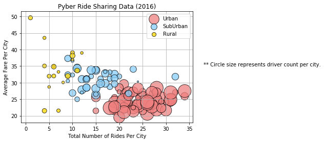
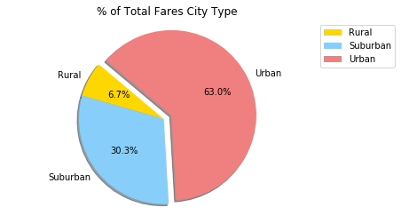
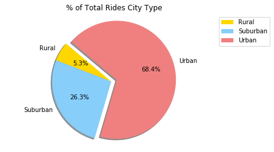
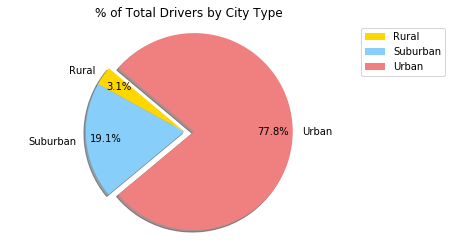

Observation Trends
1) Urban population are highest users of Pyber in terms nbr of rides and fares around 60%

2) Rural population pay more compared to urban and sub urban population

3) Rural population has less nbr of drivers compared to suburban and urban cities


```python
import pandas as pd
import matplotlib.pyplot as plt
import numpy as np
```


```python
city_file = "raw_data/city_data.csv"
ride_file = "raw_data/ride_data.csv"

city_df_orig = pd.read_csv(city_file, low_memory=False)
ride_df = pd.read_csv(ride_file, low_memory=False)
city_df_orig.count()
```


    city            126
    driver_count    126
    type            126
    dtype: int64


```python
city_df=(city_df_orig.groupby(['city','type']).sum())
city_df.reset_index(inplace=True)
city_df.head()
```


<div>
<style>
    .dataframe thead tr:only-child th {
        text-align: right;
    }

    .dataframe thead th {
        text-align: left;
    }

    .dataframe tbody tr th {
        vertical-align: top;
    }
</style>
<table border="1" class="dataframe">
  <thead>
    <tr style="text-align: right;">
      <th></th>
      <th>city</th>
      <th>type</th>
      <th>driver_count</th>
    </tr>
  </thead>
  <tbody>
    <tr>
      <th>0</th>
      <td>Alvarezhaven</td>
      <td>Urban</td>
      <td>21</td>
    </tr>
    <tr>
      <th>1</th>
      <td>Alyssaberg</td>
      <td>Urban</td>
      <td>67</td>
    </tr>
    <tr>
      <th>2</th>
      <td>Anitamouth</td>
      <td>Suburban</td>
      <td>16</td>
    </tr>
    <tr>
      <th>3</th>
      <td>Antoniomouth</td>
      <td>Urban</td>
      <td>21</td>
    </tr>
    <tr>
      <th>4</th>
      <td>Aprilchester</td>
      <td>Urban</td>
      <td>49</td>
    </tr>
  </tbody>
</table>
</div>


```python
ride_df.head()
```


<div>
<style>
    .dataframe thead tr:only-child th {
        text-align: right;
    }

    .dataframe thead th {
        text-align: left;
    }

    .dataframe tbody tr th {
        vertical-align: top;
    }
</style>
<table border="1" class="dataframe">
  <thead>
    <tr style="text-align: right;">
      <th></th>
      <th>city</th>
      <th>date</th>
      <th>fare</th>
      <th>ride_id</th>
    </tr>
  </thead>
  <tbody>
    <tr>
      <th>0</th>
      <td>Sarabury</td>
      <td>2016-01-16 13:49:27</td>
      <td>38.35</td>
      <td>5403689035038</td>
    </tr>
    <tr>
      <th>1</th>
      <td>South Roy</td>
      <td>2016-01-02 18:42:34</td>
      <td>17.49</td>
      <td>4036272335942</td>
    </tr>
    <tr>
      <th>2</th>
      <td>Wiseborough</td>
      <td>2016-01-21 17:35:29</td>
      <td>44.18</td>
      <td>3645042422587</td>
    </tr>
    <tr>
      <th>3</th>
      <td>Spencertown</td>
      <td>2016-07-31 14:53:22</td>
      <td>6.87</td>
      <td>2242596575892</td>
    </tr>
    <tr>
      <th>4</th>
      <td>Nguyenbury</td>
      <td>2016-07-09 04:42:44</td>
      <td>6.28</td>
      <td>1543057793673</td>
    </tr>
  </tbody>
</table>
</div>


```python
complete_data = pd.merge(ride_df, city_df, on=["city","city"], sort="city")
complete_data = complete_data.dropna(how="any")
complete_data.head()
```


<div>
<style>
    .dataframe thead tr:only-child th {
        text-align: right;
    }

    .dataframe thead th {
        text-align: left;
    }

    .dataframe tbody tr th {
        vertical-align: top;
    }
</style>
<table border="1" class="dataframe">
  <thead>
    <tr style="text-align: right;">
      <th></th>
      <th>city</th>
      <th>date</th>
      <th>fare</th>
      <th>ride_id</th>
      <th>type</th>
      <th>driver_count</th>
    </tr>
  </thead>
  <tbody>
    <tr>
      <th>0</th>
      <td>Alvarezhaven</td>
      <td>2016-04-18 20:51:29</td>
      <td>31.93</td>
      <td>4267015736324</td>
      <td>Urban</td>
      <td>21</td>
    </tr>
    <tr>
      <th>1</th>
      <td>Alvarezhaven</td>
      <td>2016-08-01 00:39:48</td>
      <td>6.42</td>
      <td>8394540350728</td>
      <td>Urban</td>
      <td>21</td>
    </tr>
    <tr>
      <th>2</th>
      <td>Alvarezhaven</td>
      <td>2016-09-01 22:57:12</td>
      <td>18.09</td>
      <td>1197329964911</td>
      <td>Urban</td>
      <td>21</td>
    </tr>
    <tr>
      <th>3</th>
      <td>Alvarezhaven</td>
      <td>2016-08-18 07:12:06</td>
      <td>20.74</td>
      <td>357421158941</td>
      <td>Urban</td>
      <td>21</td>
    </tr>
    <tr>
      <th>4</th>
      <td>Alvarezhaven</td>
      <td>2016-04-04 23:45:50</td>
      <td>14.25</td>
      <td>6431434271355</td>
      <td>Urban</td>
      <td>21</td>
    </tr>
  </tbody>
</table>
</div>


```python
average_fare_per_city = pd.DataFrame(complete_data.groupby("city")["fare"].mean())
average_fare_per_city.reset_index(inplace=True)

nbr_of_rides_per_city = pd.DataFrame(complete_data.groupby("city")["ride_id"].count())
nbr_of_rides_per_city.reset_index(inplace=True)

final_city_ride_data=pd.merge(average_fare_per_city,nbr_of_rides_per_city,on="city")

final_city_ride_data = pd.merge(final_city_ride_data,city_df,on="city")

final_city_ride_data = final_city_ride_data.rename(columns={"fare":"Average Fare","ride_id":"Nbr of Rides Per City",
                                                      "driver_count":"Driver Count","type":"Type","city":"City"})

final_pyber_analysis.head()
```


<div>
<style>
    .dataframe thead tr:only-child th {
        text-align: right;
    }

    .dataframe thead th {
        text-align: left;
    }

    .dataframe tbody tr th {
        vertical-align: top;
    }
</style>
<table border="1" class="dataframe">
  <thead>
    <tr style="text-align: right;">
      <th></th>
      <th>City</th>
      <th>Average Fare</th>
      <th>Nbr of Rides Per City</th>
      <th>Type</th>
      <th>Driver Count</th>
    </tr>
  </thead>
  <tbody>
    <tr>
      <th>0</th>
      <td>Alvarezhaven</td>
      <td>23.928710</td>
      <td>31</td>
      <td>Urban</td>
      <td>21</td>
    </tr>
    <tr>
      <th>1</th>
      <td>Alyssaberg</td>
      <td>20.609615</td>
      <td>26</td>
      <td>Urban</td>
      <td>67</td>
    </tr>
    <tr>
      <th>2</th>
      <td>Anitamouth</td>
      <td>37.315556</td>
      <td>9</td>
      <td>Suburban</td>
      <td>16</td>
    </tr>
    <tr>
      <th>3</th>
      <td>Antoniomouth</td>
      <td>23.625000</td>
      <td>22</td>
      <td>Urban</td>
      <td>21</td>
    </tr>
    <tr>
      <th>4</th>
      <td>Aprilchester</td>
      <td>21.981579</td>
      <td>19</td>
      <td>Urban</td>
      <td>49</td>
    </tr>
  </tbody>
</table>
</div>


```python
urban_df = final_city_ride_data[final_city_ride_data["Type"] == "Urban"]
suburban_df = final_city_ride_data[final_city_ride_data["Type"] == "Suburban"]
rural_df = final_city_ride_data[final_city_ride_data["Type"] == "Rural"]
```


```python
plt.scatter(urban_df["Nbr of Rides Per City"], urban_df["Average Fare"], 
            marker="o", facecolors="lightcoral", edgecolors="black",s=10*urban_df["Driver Count"], alpha=0.75,
           label = "Urban")

plt.scatter(suburban_df["Nbr of Rides Per City"], suburban_df["Average Fare"], 
            marker="o", facecolors="lightskyblue", edgecolors="black",s=10*suburban_df["Driver Count"], alpha=0.75,
            label = "SubUrban")

plt.scatter(rural_df["Nbr of Rides Per City"], rural_df["Average Fare"], 
            marker="o", facecolors="gold", edgecolors="black",s=10*rural_df["Driver Count"], alpha=0.75,label = "Rural")

plt.xlabel("Total Number of Rides Per City")
plt.ylabel("Average Fare Per City")
plt.title("Pyber Ride Sharing Data (2016)")
plt.legend(loc="best")
plt.grid()
plt.text(38, 35, "** Circle size represents driver count per city.")
plt.savefig("final_pyber_analysis.png")
plt.show()
```





```python
#Total Fares by City Type
#create a dataframe with fare and type
total_fare_city_type = complete_data.groupby("type")["fare"].sum()
total_fare_city_type
```


    type
    Rural        4255.09
    Suburban    19317.88
    Urban       40078.34
    Name: fare, dtype: float64


```python
explode =[ 0,0,0.1]
colors = ['gold', 'lightskyblue', 'lightcoral']
fare_city_type_pie = total_fare_city_type.plot(kind="pie",startangle=140,autopct="%1.1f%%",explode=explode,
                                         shadow=True,colors=colors,title="% of Total Fares City Type")
plt.axis('equal')
fare_city_type_pie.set_ylabel(" ")
plt.legend(bbox_to_anchor=(1, 1))
plt.savefig("Total_Fares_by_City_Type.png")
plt.show()
```





```python
#Total Rides by City Type
#create a dataframe with rides and type
total_ride_city_type = complete_data.groupby("type")["city"].count()
total_ride_city_type
```


    type
    Rural        125
    Suburban     625
    Urban       1625
    Name: city, dtype: int64


```python
explode =[ 0,0,0.1]
colors = ['gold', 'lightskyblue', 'lightcoral']
ride_city_type_pie = total_ride_city_type.plot(kind="pie",startangle=140,autopct="%1.1f%%",explode=explode,
                                         shadow=True,colors=colors,title="% of Total Rides City Type")
plt.axis('equal')
ride_city_type_pie.set_ylabel(" ")
plt.legend(bbox_to_anchor=(1, 1))
plt.savefig("Total_Rides_by_City_Type.png")
plt.show()

```





```python
#Total Rides by City Type
#create a dataframe with driver and type
total_driver_city_type = city_df.groupby(["type"])["driver_count"].sum()

total_driver_city_type
```


    type
    Rural        104
    Suburban     638
    Urban       2607
    Name: driver_count, dtype: int64


```python
explode =[ 0,0,0.1]
colors = ['gold', 'lightskyblue', 'lightcoral']

driver_city_type_pie = total_driver_city_type.plot(kind="pie",startangle=140,autopct="%1.1f%%",explode=explode,
                                         shadow=True,colors=colors,title="% of Total Drivers by City Type",pctdistance=0.80)
plt.axis('equal')
plt.legend(bbox_to_anchor=(1, 1))
driver_city_type_pie.set_ylabel(" ")
plt.savefig("Total_Drivers_by_City_Type.png")
plt.show()
```




