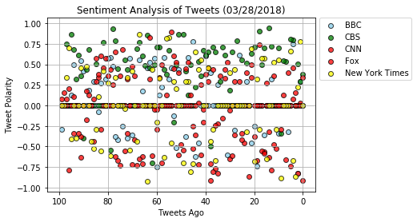
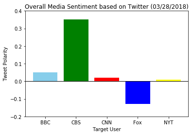

## Observations

##### 1) Tweets from CBS are well received compared to BBC, CNN, Fox News and New York Times
##### 2) Tweets from NY Times are most neutral
##### 3) Fox News Tweets are not well received by the users

#### import Dependencies and the config file. The config file consists of the api key as dictionary for calling Tweepy


```python
import tweepy
import json
import numpy as np
import vaderSentiment
import pandas as pd
import matplotlib.pyplot as plt
from config import api_key
from datetime import datetime

from vaderSentiment.vaderSentiment import SentimentIntensityAnalyzer
analyzer = SentimentIntensityAnalyzer()

# Setup Tweepy API Authentication

auth = tweepy.OAuthHandler(api_key["consumer_key"], api_key["consumer_secret"])
auth.set_access_token(api_key["access_token"], api_key["access_token_secret"])
api = tweepy.API(auth, parser=tweepy.parsers.JSONParser())
```

#### Define the target users and list for holding sentiments, tweets, timesteamp. Call the api usertimeline to retrieve 100 tweets


```python
# Target Search Term
target_terms = ["@BBC", "@CBS", "@CNN","@FoxNews", "@nytimes"]

# Lists for holding sentiments, tweets, timesteamp
compound_list = []
positive_list = []
negative_list = []
neutral_list = []
converted_time = []
tweet_text = []
target_list= []
count = []
tweet_analysis = {}

for target_user in target_terms:
   
    # Get all tweets from home feed
    public_tweets = api.user_timeline(target_user,count=100)

    for tweet in public_tweets:
        analysis=analyzer.polarity_scores(tweet["text"])
        compound_list.append(analysis["compound"])
        negative_list.append(analysis["neg"])
        neutral_list.append(analysis["neu"])
        positive_list.append(analysis["pos"])
        tweet_text.append(tweet["text"])
        target_list.append(target_user)
        converted_time.append(datetime.strptime(tweet["created_at"], "%a %b %d %H:%M:%S %z %Y"))
```

#### Create a dictionary consisting of user, tweet, timestamp and sentiment values


```python
tweet_analysis["user"] = target_list
tweet_analysis["tweet"] = tweet_text
tweet_analysis["created_at"] = converted_time
tweet_analysis["compound"] = compound_list
tweet_analysis["negative"] = negative_list
tweet_analysis["positive"] = positive_list
tweet_analysis["neutral"] = neutral_list
```

#### Populate the dictiona in dataframe and sort on TimeStamp, export it to CSV


```python
final_tweet_analysis=pd.DataFrame(tweet_analysis)
final_tweet_analysis = final_tweet_analysis.sort_values(["user","created_at"],ascending=[True, False])
final_tweet_analysis = final_tweet_analysis[["user","created_at","tweet","positive","negative","neutral","compound"]]

final_tweet_analysis.to_csv('final tweet analysis.csv', sep=',')


final_tweet_analysis.head()
```


<div>
<style>
    .dataframe thead tr:only-child th {
        text-align: right;
    }

    .dataframe thead th {
        text-align: left;
    }

    .dataframe tbody tr th {
        vertical-align: top;
    }
</style>
<table border="1" class="dataframe">
  <thead>
    <tr style="text-align: right;">
      <th></th>
      <th>user</th>
      <th>created_at</th>
      <th>tweet</th>
      <th>positive</th>
      <th>negative</th>
      <th>neutral</th>
      <th>compound</th>
    </tr>
  </thead>
  <tbody>
    <tr>
      <th>0</th>
      <td>@BBC</td>
      <td>2018-03-28 18:00:05+00:00</td>
      <td>🇮🇪 This 800-year-old hotel in Ireland is simpl...</td>
      <td>0.000</td>
      <td>0.000</td>
      <td>1.000</td>
      <td>0.0000</td>
    </tr>
    <tr>
      <th>1</th>
      <td>@BBC</td>
      <td>2018-03-28 17:00:12+00:00</td>
      <td>📚 'Words do not live in dictionaries. They liv...</td>
      <td>0.109</td>
      <td>0.000</td>
      <td>0.891</td>
      <td>0.2960</td>
    </tr>
    <tr>
      <th>2</th>
      <td>@BBC</td>
      <td>2018-03-28 16:30:00+00:00</td>
      <td>The government rates the global outbreak of a ...</td>
      <td>0.000</td>
      <td>0.312</td>
      <td>0.688</td>
      <td>-0.8225</td>
    </tr>
    <tr>
      <th>3</th>
      <td>@BBC</td>
      <td>2018-03-28 16:00:10+00:00</td>
      <td>Slacking off in Dubai. https://t.co/a3oSKIxfSK</td>
      <td>0.000</td>
      <td>0.000</td>
      <td>1.000</td>
      <td>0.0000</td>
    </tr>
    <tr>
      <th>4</th>
      <td>@BBC</td>
      <td>2018-03-28 15:35:27+00:00</td>
      <td>RT @BBCTheOneShow: The fantastic @george_ezra ...</td>
      <td>0.280</td>
      <td>0.000</td>
      <td>0.720</td>
      <td>0.7506</td>
    </tr>
  </tbody>
</table>
</div>


#### Create a dataframe for each user and count for the last 100 tweets


```python

bbc_df = final_tweet_analysis[final_tweet_analysis["user"] == "@BBC"]
cbs_df = final_tweet_analysis[final_tweet_analysis["user"] == "@CBS"]
cnn_df = final_tweet_analysis[final_tweet_analysis["user"] == "@CNN"]
fox_df = final_tweet_analysis[final_tweet_analysis["user"] == "@FoxNews"]
ny_df = final_tweet_analysis[final_tweet_analysis["user"] == "@nytimes"]

count = [count for count in range(100)]

```

#### Scatter plot for Sentiment Analysis of Tweets


```python
#Scatter plot for Urban

plt.scatter(count, bbc_df["compound"], 
            marker="o", facecolors="skyblue", edgecolors="black", alpha=0.75,
           label = "BBC")

plt.scatter(count, cbs_df["compound"], 
            marker="o", facecolors="green", edgecolors="black", alpha=0.75,
           label = "CBS")

plt.scatter(count, cnn_df["compound"], 
            marker="o", facecolors="red", edgecolors="black", alpha=0.75,
           label = "CNN")

plt.scatter(count, fox_df["compound"], 
            marker="o", facecolors="red", edgecolors="black", alpha=0.75,
           label = "Fox")

plt.scatter(count, ny_df["compound"], 
            marker="o", facecolors="yellow", edgecolors="black", alpha=0.75,
           label = "New York Times")

plt.xlim(105,-5)
plt.xlabel("Tweets Ago")
plt.ylabel("Tweet Polarity")
plt.title("Sentiment Analysis of Tweets (03/28/2018)")
plt.legend(loc='center left', bbox_to_anchor=(1,0.82))
plt.grid()
plt.savefig("sentiment_analysis_tweet.png",bbox_inches='tight')
plt.show()
```





#### Bar Chart Overall Media Sentiment based on Twitter


```python
mean_compoud = []

mean_compoud.append(round(bbc_df["compound"].mean(),2))
mean_compoud.append(round(cbs_df["compound"].mean(),2))
mean_compoud.append(round(cnn_df["compound"].mean(),2))
mean_compoud.append(round(fox_df["compound"].mean(),2))
mean_compoud.append(round(ny_df["compound"].mean(),2))

target_terms = ["BBC", "CBS", "CNN","Fox", "NYT"]
colors=["skyblue","green","red","blue","yellow"]

plt.bar(target_terms, mean_compoud, color=colors, align="center")

plt.ylim(-0.20, 0.4)
plt.xlabel("Target User")
plt.ylabel("Tweet Polarity")
plt.title("Overall Media Sentiment based on Twitter (03/28/2018)")
plt.savefig("overall_sentiment_analysis_tweet.png",bbox_inches='tight')
plt.axhline(0, color='black', lw=1)
plt.show()
```




